<div align="center">

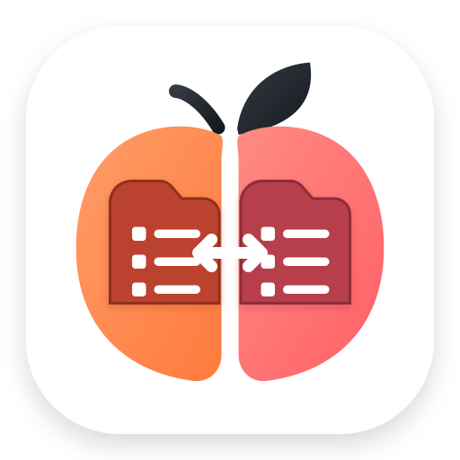

# Peach Commander 🍑

**A fast, native dual-pane file manager for macOS — for people who never stopped missing Total Commander.**

Two panels. Every key on the keyboard. Archives you walk into like folders. A viewer, an editor, FTP/SFTP, sync, multi-rename, a real plugin system — and a removable AI assistant when you want one.


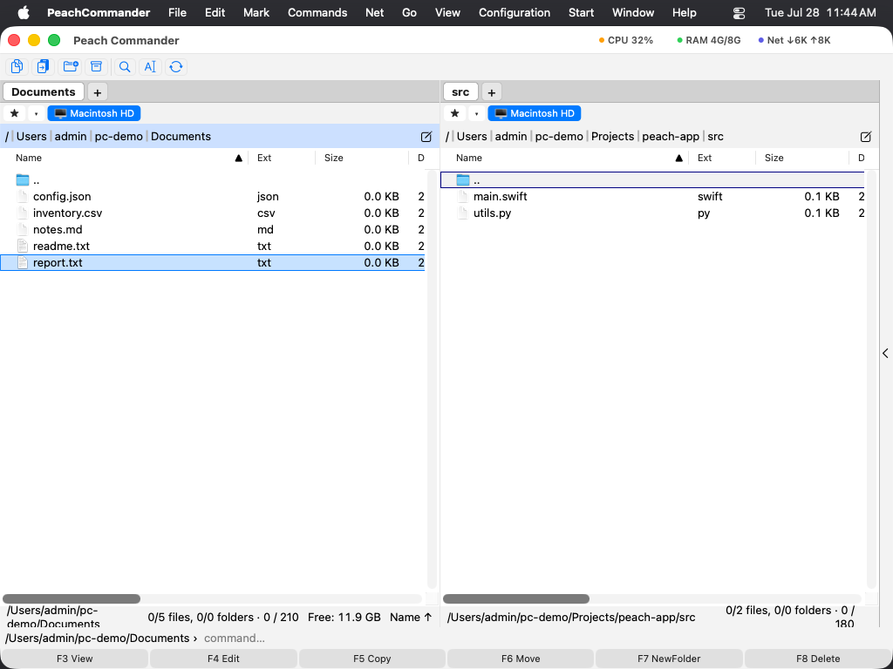

</div>

---

> [!NOTE]
> **Peach Commander is in beta.** It is under active development, it does a lot already, and it is genuinely useful day to day — but things are still moving. APIs (especially the plugin SDK) can change, some corners are rough, and feedback is very welcome. See [Known limitations](#-known-limitations) before filing a surprise as a bug.

## What it is

Peach Commander is a **native macOS dual-pane (orthodox) file manager**, inspired by Total Commander on Windows. It shows two folders side by side, so copying, moving, and comparing files is a matter of pointing one panel at the source and the other at the destination — hands on the keyboard, eyes on the files.

It is **not a clone that copies pixels**. It takes the concept that has worked for decades and interprets it properly for macOS: real AppKit, Quick Look, Finder Tags, the Share sheet, the Keychain — and then adds the tools a technical user actually reaches for every day.

**What it optimizes for:**

- ⚡️ **Speed** — bulk directory metadata reads, streaming views, clone-copy on APFS, and low memory use even on huge folders.
- 🎛️ **Efficiency** — everything reachable from the keyboard; two keyboard schemes (classic and Mac-native).
- 🍎 **Native** — a real Mac app, not a web view in a window.
- 🧰 **Power tools** — sync, multi-rename, checksums, split/combine, duplicate finder, hex editor, attributes & ACLs.
- 🧩 **Extensibility** — a plugin architecture that keeps the core small and the special features modular.

## Why it exists

I used Total Commander for years on Windows. On macOS I kept looking for something equivalent, and there are some genuinely cool projects out there — but every time, *something* was missing, and I kept quietly missing Total Commander.

So Peach Commander happened. It is built consistently from the point of view of a daily power user: the goal was never "look like Total Commander," it was "let me do the things I do all day, fast, without leaving the keyboard or the app." It integrates exactly the tools that would otherwise mean juggling five utilities.

It is also built with **modern, AI-assisted, agentic development workflows** — and, since AI is the hype of the moment, it is used both *while building the app* and *inside the app itself*. 😉

The goal for the text you're reading and the app you'll run is the same: no marketing fog, just something that earns its place in your Dock.

## ✨ Features

<table>
<tr><td width="50%" valign="top">

**Panels & navigation**
- Dual-pane layout with per-panel tabs
- View modes: details, brief, icons, gallery, tree
- Editable breadcrumb path bar, live drive bar
- Quick search & quick filter, natural sort
- Favorites / directory hotlist, workspaces
- Swap panels, target = source

**File operations**
- Copy / move / delete with a background transfer manager (F5/F6 can run in the background, with a speed limit)
- Clone-copy (`clonefile`) on the same volume
- Multi-rename tool with live preview
- Compare & synchronize directories
- Checksums, split/combine, encode/decode
- Duplicate finder, attributes & ACL editor
- Symlinks, hard links, aliases, comments

</td><td width="50%" valign="top">

**Archives & search**
- Walk into ZIP/TAR/… archives like folders
- Pack / unpack, in-place ZIP edit, AES encryption
- Full-text find: regex, hex, encoding-aware, in-archives, Spotlight, saved templates

**Viewers & editors**
- Lister: text, code (syntax highlighting), hex, image, media, web
- Editor with find/replace, symbol outline, minimap
- Hex editor, binary compare, diff viewer, log viewer

**Network & remote**
- FTP, FTPS (explicit/implicit), SFTP/SCP over SSH
- Connection manager, download-from-URL, SMB/AFP shares, WebDAV

**macOS integration**
- Quick Look, Share sheet, Open With, Finder Tags
- Spotlight metadata, "Open Terminal Here", trackpad swipe history
- AppleScript & Shortcuts automation

</td></tr>
</table>

🌍 **19 interface languages:** English, Deutsch, Français, 简体中文, Dansk, Nederlands, Italiano, 한국어, Norsk bokmål, Polski, Svenska, Slovenčina, Slovenščina, Español, Čeština, Українська, Magyar, Română, Русский — with a fully translated in-app Help Book in every one of them.

## 📸 Screenshots

### The two-panel workspace
Two folders, side by side, with tabs, the drive bar, the path bar, and the function-key bar. Light and dark.

<p>

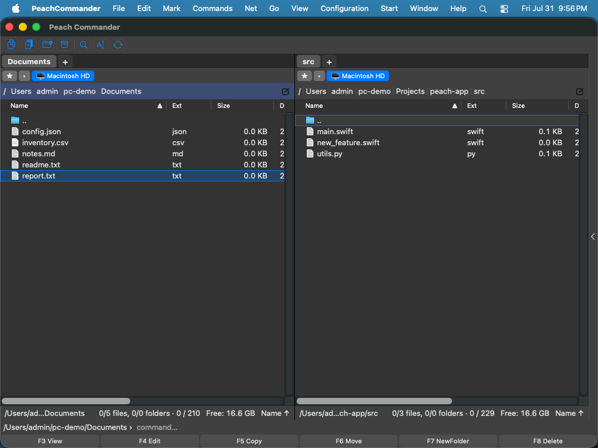
</p>

### View modes & sorting
The same folder as a details list, a brief multi-column list, an icon grid, and a thumbnail gallery.

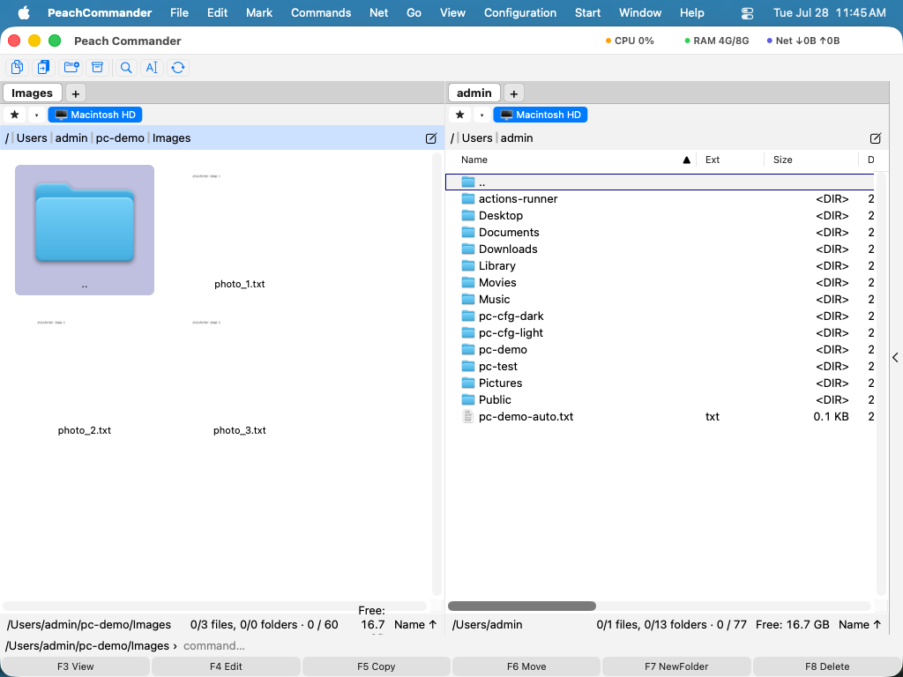

### Multi-rename tool
Describe the change once — a naming pattern, search-and-replace, numbering, case — and preview every result before anything is written.

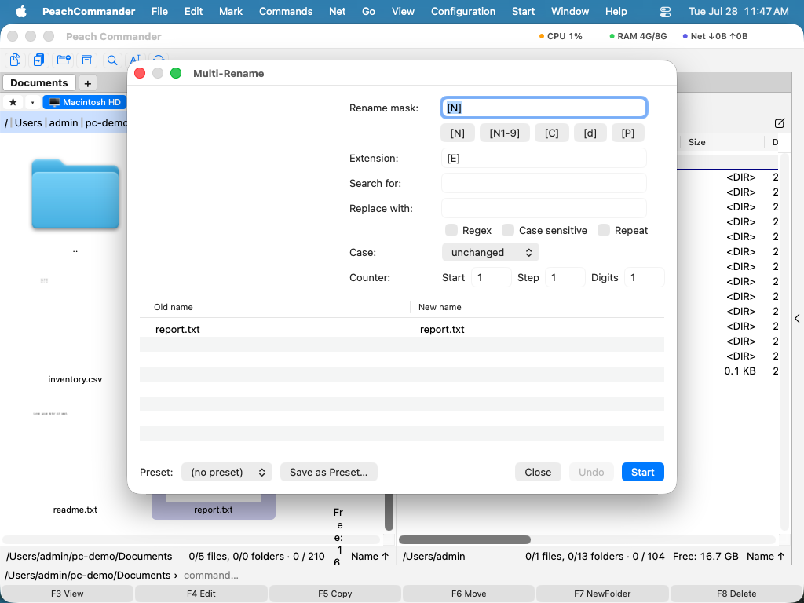

### Compare & synchronize
See exactly what differs between two folders and bring them back in step, with a per-file copy direction you stay in control of.

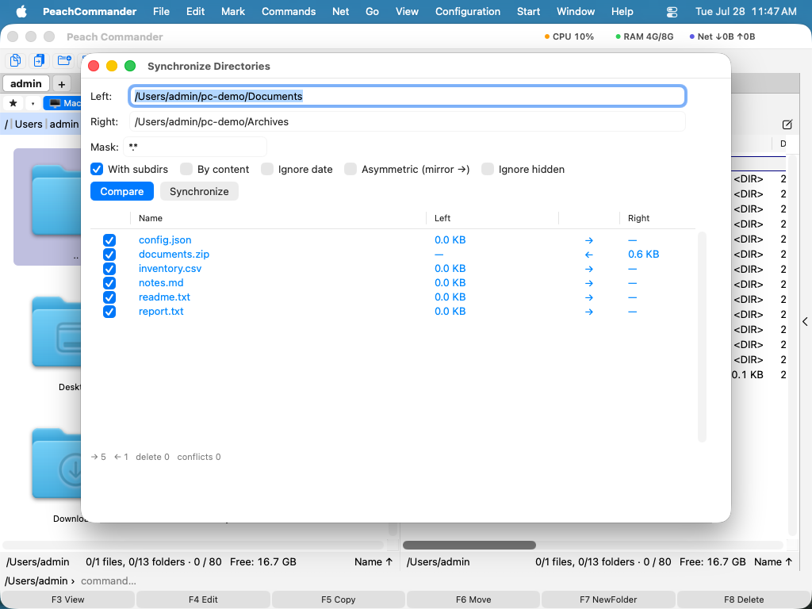

### Built-in viewer & editor
Look inside a file instantly — readable text, syntax-colored code, a raw hex dump, or a full-size image — or edit it with a symbol outline and minimap.

<p>
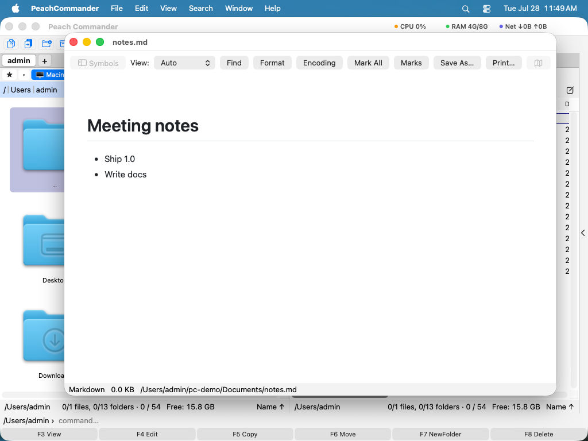
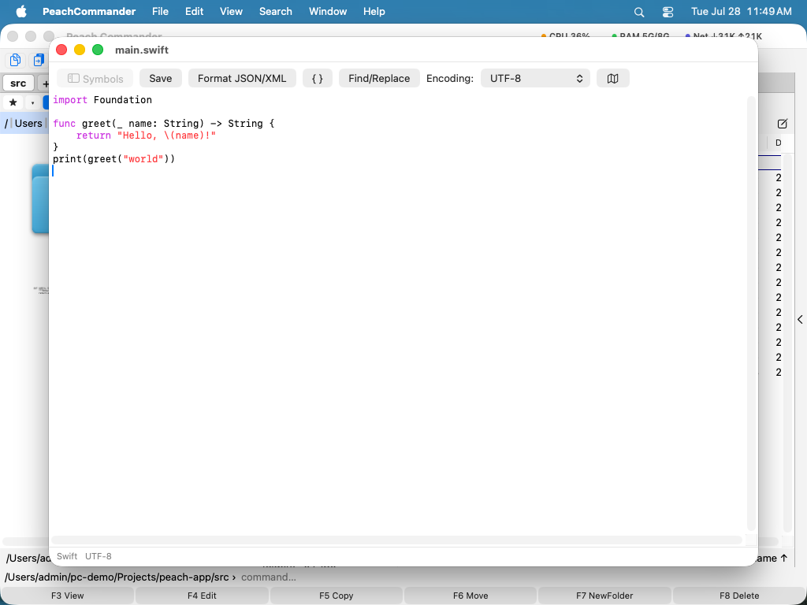
</p>

### FTP / SFTP
Browse remote servers as if they were ordinary folders; saved connections, passwords in the Keychain.

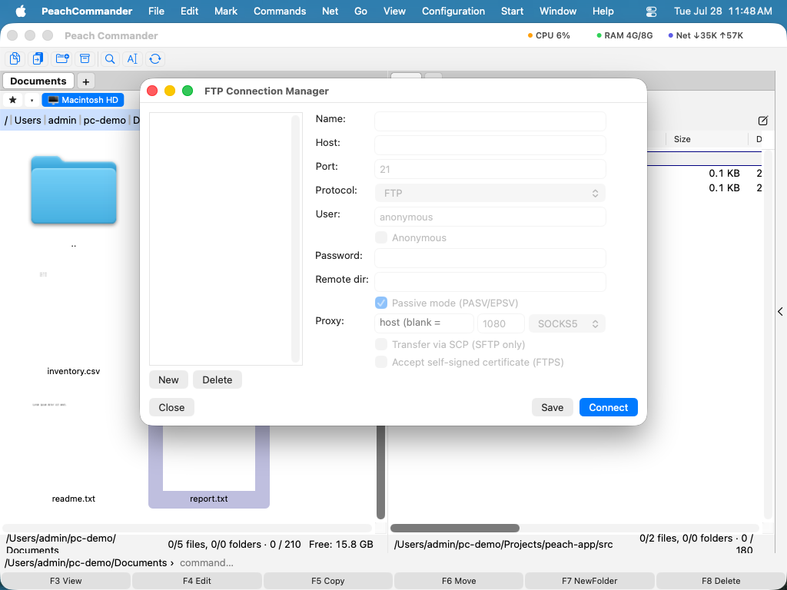

### Find files
Search by name, by content, by size and date — inside archives, with regex or Spotlight — and feed the results straight into a panel.

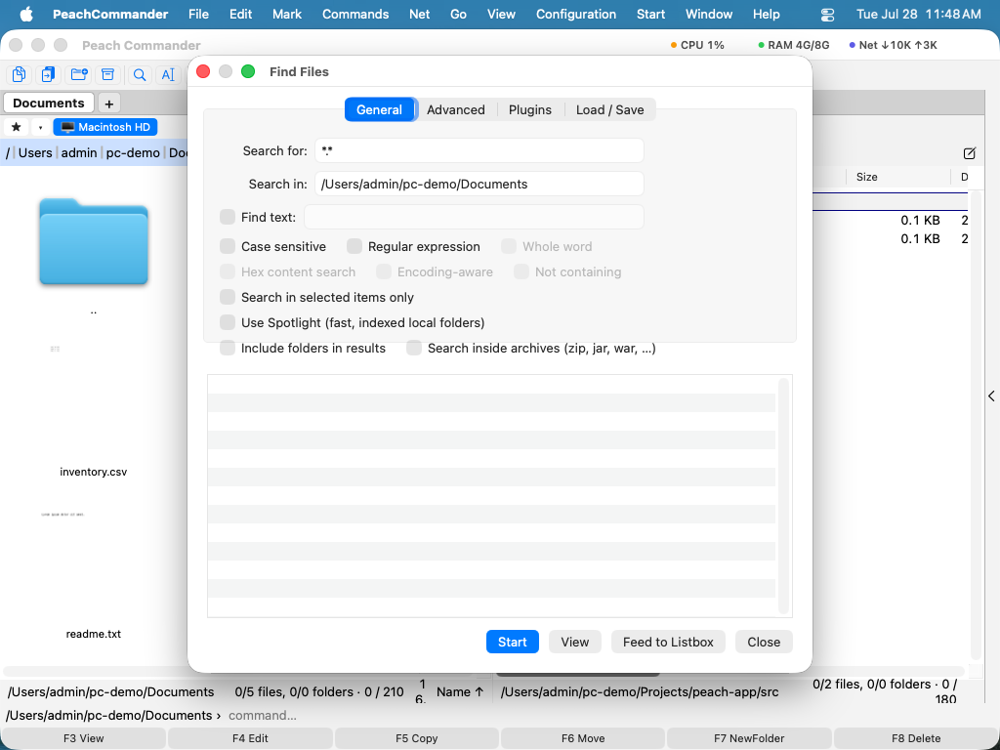

### Disk Map plugin
See at a glance what fills a folder or a whole volume, as a treemap or a sunburst, reconciled against free, purgeable, and hidden space.

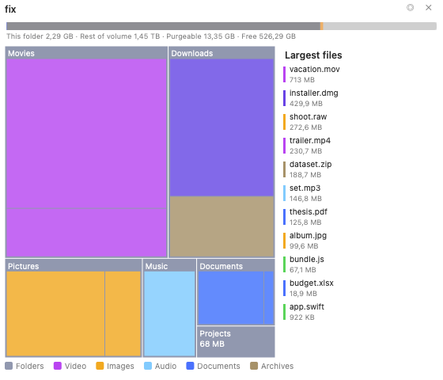

### Plugins & AI assistant
Enable, disable, install, or remove plugins from one window. The AI assistant is one of them.

<p>
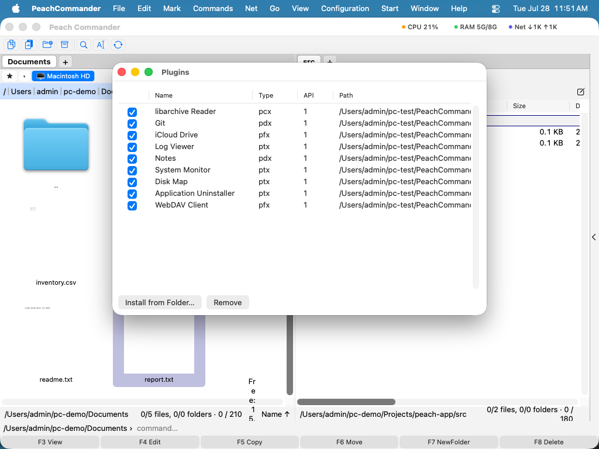
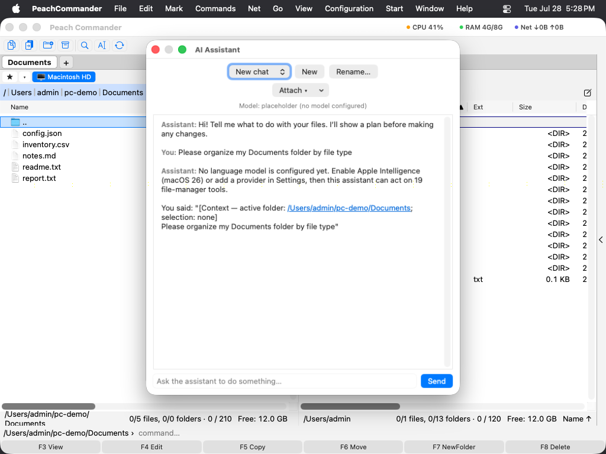
</p>

## 🧩 Plugin system

Peach Commander keeps the core small and pushes special-purpose features out into **plugins**. Several ship built in and can be turned on or off — or removed — from **Configuration ▸ Plugins…**:

| Plugin | What it adds |
|---|---|
| **Disk Map** | Treemap / sunburst space visualizer with a cleanup collector |
| **AI Assistant** | Optional, removable natural-language assistant (see below) |
| **Git** | Repository status shown right in the panel |
| **System Monitor** | Live CPU / memory / system activity |
| **Task Manager** | Running processes, browsable like files |
| **Uninstaller** | Find and remove apps *and* their leftovers |
| **WebDAV** | Mount and browse a WebDAV server as a folder |
| **iCloud** · **Notes** · **Log Viewer** | Quick iCloud Drive access · notes beside your files · tail log files |
| **CSV Lister** | F3 on a .csv/.tsv opens it as a sortable table, delimiter auto-detected |
| **Archive formats** · **AIColumn** | Extra archive types · AI-derived file column |

Internally there are **five plugin kinds** (`pcx`, `pfx`, `plx`, `pdx`, `ptx`) plus an orthogonal contrib ABI, designed in the spirit of Total Commander's WCX/WFX/WLX/WDX families. The porting story and a public **SDK** live under [`PluginSDK/`](PluginSDK/) and [`docs/content/plugins/`](docs/content/plugins/).

> [!NOTE]
> The plugin SDK is evolving. It is usable today, but the ABI may still change before 1.0.

## 🤖 AI integration (Alpha)

The **AI assistant is an optional, removable plugin** — not a bolted-on core feature. It helps you work with files in plain language: summarize or explain a document, suggest a better name, translate or proofread, turn data into a table, or tidy a folder — and it will **show you a plan and wait for your confirmation** before changing anything.

- Runs **on-device with Apple Intelligence** when available; can point at a cloud model if you configure one.
- Its API key lives in the **Keychain**, never in config files. No telemetry.
- Configured on one page: **Settings ▸ AI** (model, autonomy, optional local-only MCP server).
- Don't want it? Disable or remove it in **Configuration ▸ Plugins…** and it's gone.

## 🌍 Languages

The interface and the complete in-app Help Book are localized into **19 languages**. Switch under **Settings ▸ Language**. (Documentation screenshots stay in English to keep the doc set maintainable.)

## 🏗️ Architecture

A layered set of Swift modules keeps responsibilities separate and the file-listing/copy hot paths fast:

```
PCFoundation      core types, config, logging
PCVFS             virtual file system: local, archive, FTP/SFTP, plugin FS
PCOperations      copy / move / delete / transfer queue
PCArchive         archive read/write
PCNet             FTP / FTPS / SFTP
PCCommands        the cm_* command registry
PCAutomation      shared automation core (drives the app; used by AI + scripting)
PCPluginHost      plugin loading, sandboxing, ABI bridges
PCApp             the AppKit application
PluginSDK/        public headers + samples for third-party plugins
```

Performance rules and the module map are documented in [`docs/architecture/`](docs/architecture/); behavior specs live in [`docs/specs/`](docs/specs/); and the single-source-of-truth documentation system (Help Book + website + this README) is described in [`DOCUMENTATION.md`](DOCUMENTATION.md).

## 🚀 Installation & build

There is no signed download yet (see the beta note) — you build it from source.

**Requirements**
- macOS 13 (Ventura) or newer
- Xcode 16+
- [XcodeGen](https://github.com/yonaskolb/XcodeGen) (`brew install xcodegen`)
- libssh2 for SFTP (`brew install libssh2`)

**Build**

```bash
git clone https://github.com/<your-org>/peachcommander.git
cd peachcommander
xcodegen generate          # regenerate the .xcodeproj from project.yml
open PeachCommander.xcodeproj
# then Build & Run (⌘R) in Xcode
```

Or from the command line:

```bash
xcodegen generate
xcodebuild -scheme PeachCommander build
./Tools/make-dmg.sh        # optional: package a .dmg
```

**First run (unsigned build)**

Because the beta builds are not signed or notarized, Gatekeeper blocks the first launch. You only need to allow it once, but the way to do that depends on your macOS version:

- **macOS 15 Sequoia and later** — double-click once, dismiss the warning, then go to **System Settings ▸ Privacy & Security** and click **Open Anyway**. Apple removed the Control-click shortcut for unsigned software in macOS 15, so right-clicking no longer helps here.
- **macOS 13–14** — right-click the app ▸ **Open**, then confirm.

## 🧭 First steps

1. Click a panel (or press **Tab**) to make it active — only the active panel shows the cursor.
2. Arrow keys move; **Enter** opens a folder, archive, or file.
3. Point the other panel at your destination.
4. Select files (**Insert** / **Space**), then use the function keys: **F3** View · **F4** Edit · **F5** Copy · **F6** Move · **F7** New folder · **F8** Delete.
5. Press **F1** for the built-in Help Book, in your language.

Coming from Total Commander? Keep the keys you know (**Configuration ▸ Keyboard Scheme ▸ TC Classic**), or switch to Mac-style shortcuts (**macOS Native**).

## 🗺️ Roadmap

- Code signing + notarization — the release pipeline signs, notarizes and staples already; it needs a Developer ID certificate, and until one is configured every build comes out unsigned
- Sparkle auto-updates — the dependency is pinned, nothing is wired to it yet
- A plugin SDK stable enough for third parties — the headers and the reference are there and versioned (`PC_API_VERSION`), but the ABI is pre-1.0 and still expects additive change
- Deeper Total Commander feature parity (the master checklist lives in `docs/product/feature-inventory.md`)
- More archive formats and remote protocols — today FTP, SFTP and HTTP download
- Growing the AI assistant out of Alpha

## ⚠️ Known limitations

- On first launch macOS may ask whether the app may find devices on your local network. That prompt
  is Apple's wording for reading your Mac's own network interface counters, which is how the System
  Monitor plugin shows upload and download rates in the title bar. Nothing is searched for or
  connected to, and declining costs you only those two numbers.
- Not code-signed or notarized during the beta — macOS blocks the first launch until you allow it once (System Settings ▸ Privacy & Security on macOS 15+, right-click ▸ Open on macOS 13–14).
- Auto-update (Sparkle) is planned but not wired up yet.
- **Split (multi-part) archives** — `.z01`, `.zip.001` — can't be opened; join the parts first. (Splitting and combining *files* is a separate tool and works.)
- Some **very long absolute paths** may not be handled reliably; working closer to the top of the tree avoids it.
- **Remote locations and the inside of an archive** aren't watched for outside changes, because neither protocol offers a way to be told — **F2** / **Ctrl+R** re-reads them. Folders on this Mac update by themselves.

Full list: **Help ▸ Known limitations** inside the app.

## 🤝 Contributing

Pull requests, feature requests, bug reports, and discussions are all welcome — this is exactly the stage where feedback shapes the app.

Start with [`CONTRIBUTING.md`](CONTRIBUTING.md): how to build (Xcode 26+), run the tests, and the docs gates CI enforces.

- 🐛 **Bugs:** [open an issue](https://github.com/hkiam/PeachCommander/issues/new/choose) — the form asks for your macOS version and whether you're on Apple Silicon or Intel, which narrows a surprising number of problems down immediately.
- 💡 **Ideas:** feature requests and "the thing I miss from Total Commander is…" are gold.
- 🔒 **Security:** please report privately — see [`SECURITY.md`](SECURITY.md).
- 🔧 **Code:** [`CONVENTIONS.md`](CONVENTIONS.md) covers project layout and code style. (`WORKFLOW.md` is an operating protocol for AI-assisted sessions, not something a human contributor needs to follow.)

## 📄 Open source & credits

Peach Commander builds on excellent open-source work — **Sparkle**, **SwiftTreeSitter** / **Neon** / **tree-sitter** (syntax highlighting), **libssh2** + **OpenSSL** (SFTP), and others. Full attributions and license texts are in [`THIRD_PARTY_NOTICES.md`](THIRD_PARTY_NOTICES.md) and `Resources/Licenses/`.

Thank you to every author and contributor of those projects — and to the Total Commander tradition that made a tool like this worth missing.

**Project license:** Peach Commander is licensed under the **[Apache License 2.0](LICENSE)** — see [`NOTICE`](NOTICE) for the attribution notice. You may use, modify and redistribute it, including commercially, provided you keep the license and notice and state your changes; it comes with no warranty. The third-party components listed above remain under their own licenses.

The optional external tools the app can call (7-Zip/p7zip, The Unarchiver) are LGPL-licensed but are neither linked nor redistributed — they are found on `PATH` at runtime and run as separate processes.

## The name — Peach Commander 🍑

Years ago, *Windows Commander* became *Total Commander* after an unexpected branding conversation with Microsoft.

This project was born for macOS, so putting *Windows* in its name would have felt… confusing.

Apple already claimed one famous fruit, so we simply picked another.

**Peach Commander** was born. Sweet, fast, surprisingly capable, and loaded with more useful features than your daily vitamin intake.

<div align="center">

**Made for people who keep both hands on the keyboard.**

</div>
