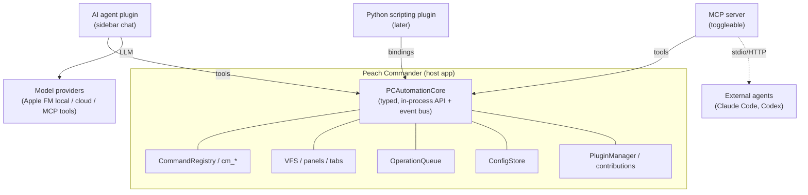

# AI/LLM agent plugin — architecture & plan (DRAFT for discussion)

Status: **planning only, not yet approved for implementation.** Derived from
`ki.md` and grounded in the current code. Open decisions are collected in §12 for
discussion before any code is written.

## 1. Goal

An **optional plugin** that adds a natural-language agent to Peach Commander: a
sidebar chat that can *drive* the file manager (and other plugins), answer
questions about the current context, run prefab and context-menu AI actions, and —
optionally — expose the same capabilities as an **MCP server** for external agents
(Claude Code, Codex). Disabled and empty by default; fully removable so **no AI
code or capability exists** when it is not installed.

Non-negotiables from `ki.md`:

- Plugin, optional, **off by default**, removable → zero AI surface without it.
- Default to **local** (Apple Intelligence / on-device); cloud models optional.
- Sessions (create/rename/persist history), parallel sessions, optional long-term
  memory (file or DB).
- Deep integration: current selection, active panel, tabs, directory tree, search
  results, file contents, plugins, internal commands, user actions; can change
  file-manager configuration.
- Extensive settings: models & parameters, prompts, skills.
- MCP: agent can **consume** external MCP servers; app can **expose** an MCP server
  (toggleable in settings).
- Security-conscious; prefer established libraries over bespoke code.
- Context-window management (size, compaction).
- Later stages: speech input/control; a separate Python scripting plugin on the
  same core.

## 2. The key architectural idea — an Automation Core

Rather than let the agent poke at UI, introduce one clean seam that **three**
consumers share:

**PCAutomationCore** is a new, versioned, typed Swift API that exposes the file
manager as *operations* and *events* — the "sauber architektonisch geplante Kern
für Scripting und Agenten" the brief asks for. Everything the agent/MCP/Python can
do goes through it, so capabilities, permissions, and auditing live in one place.

Today's `contrib.h` host services (`invokeCommand`, `getContext`, cursor/selection,
trash/delete, `openPath`, sidebar) are a good **subset** but insufficient. The Core
adds structured operations and, crucially, an **event stream** (which does not
exist yet as a unified bus).

### 2.1 Core capability surface (draft)

- **Context (read):** active/inactive panel path, selection, cursor, tabs,
  view/sort, drive list, current search results, config values.
- **Files (read):** list directory (via VFS, so archives/FTP too), stat, read file
  content (bounded, with encoding detection), checksum.
- **Actions (write, guarded):** copy/move/delete/mkdir/rename via `OperationQueue`
  (so progress, undo-to-Trash, and cancellation apply), pack/extract, set
  attributes.
- **Navigation:** open path, open in panel/tab, new tab, select by mask.
- **Commands:** run any `cm_*` by id (reusing `CommandRegistry`), list available
  commands with help (already catalogued — the agent can discover them).
- **Search:** run a `SearchQuery` and get structured results.
- **Config:** get/set config keys (typed; the same `Section.Key` space the settings
  UI uses).
- **Plugins:** enumerate enabled plugins and their contributed commands/columns.
- **Events (subscribe):** panel changed, selection changed, navigation, operation
  progress/finished, config changed, search results. (Needs a new `AsyncStream`
  event bus — see §7.)

Each operation is a small typed value (name + JSON-encodable args + result), which
maps 1:1 onto **LLM tool definitions** and **MCP tools** for free.

## 3. Plugin shape & OS requirements

- A **contribution/tool plugin** (`.ptxplugin` + `PCContributions`): a `sidebar`
  view (the chat), context-menu items ("Mit KI ▸ …"), and commands (prefab
  actions). It reaches the host through the existing bridge, **extended** with the
  Automation Core (a new host-services section, ABI-compatible append).
- **OS floor:** the plugin (for the local model) requires **macOS 26 + Apple
  Silicon** (Foundation Models). The host app stays at macOS 13; the plugin simply
  refuses to enable the local provider on older systems and offers cloud instead.
- Because plugins load in-process with library validation disabled, the agent code
  is trusted like any plugin — the security model (§9) matters.

## 4. Model providers

A `ModelProvider` protocol with pluggable back-ends; the session picks one.

- **Apple Foundation Models (default, local):** on-device LLM via the
  `FoundationModels` framework (macOS 26). Supports guided generation and
  **tool calling**, which maps directly onto the Core operations. Private, free, no
  key, offline. Limitation: a small (~on-device) model — great for summarize/
  rename/explain/extract and short agentic steps, weaker for long multi-step
  planning. Availability is capability-gated (`SystemLanguageModel.availability`).
- **Cloud (optional):** Anthropic, OpenAI, and OpenAI-compatible endpoints. Keys in
  the **Keychain** (via the existing `crypt` service), never in config files.
- **Local server (optional):** Ollama / LM Studio / llama.cpp via an
  OpenAI-compatible base URL — for users who want bigger local models than Apple FM.
- **MCP tools augment any provider:** external MCP servers add tools the model can
  call, orthogonal to which LLM is answering.

Recommendation to discuss (§12): **default to Apple FM local**, with a one-click,
clearly-labeled switch to a stronger model for heavy agentic tasks.

## 5. Sessions & memory

- **Sessions:** independent conversations, each with its own model choice, system
  prompt/skill, tool allow-list, and history. Create / rename / delete / switch;
  **parallel** sessions run concurrently (each an actor with its own task).
- **Persistence:** one file per session (JSON or SQLite). Start with JSON under the
  config root (`aichat/sessions/*.json`); move to SQLite if history search/scale
  demands it. Honors `-ConfigRoot` (test isolation) like every other plugin.
- **Long-term memory (optional):** an opt-in store the agent can read/write across
  sessions — start as a Markdown/JSON file ("project memory"), with a pluggable
  vector/DB back-end later for semantic recall. Explicit and inspectable.

## 6. Context-window management

- Build the prompt from a **budgeted context assembler**: system prompt + skill +
  a compact snapshot of the live context (paths/selection/tabs, not whole trees) +
  only the file slices the task needs (chunked, via `FileSlice`) + rolling history.
- **Compaction:** summarize older turns when the window fills (the same
  summarize-then-continue idea used elsewhere); show the user when it happens.
- Token accounting per provider; never silently drop context — surface it.

## 7. Events during processing

There is **no unified event bus today** (only scattered `AsyncStream`s in
ConfigStore/TransferQueue/operations and the view-only `PcNotifyView`). Professional
approach: add a single host **event bus** in the Automation Core — an `AsyncStream`
of typed `HostEvent`s (panel/selection/navigation/operation/config/search) that the
Core multiplexes to subscribers. The agent subscribes to react during long tasks
(e.g. wait for a copy to finish before the next step) and to keep its context
snapshot fresh. Existing per-subsystem streams feed into it rather than being
replaced.

## 8. MCP — client and server

- **Client:** the agent can register external MCP servers (config: command/URL +
  auth); their tools are merged into the tool set offered to the model. Use an
  established Swift MCP client library rather than hand-rolling the protocol.
- **Server:** an opt-in MCP **server** that exposes the Automation Core operations
  as MCP tools for external agents. Toggle in settings; **off by default**;
  localhost/stdio only unless explicitly opened; per-tool allow-list and the same
  permission model as the in-app agent (§9). This is the shared-core payoff: the
  MCP server is a thin adapter over `PCAutomationCore`, so in-app agent, MCP server,
  and the future Python plugin expose the *same* audited capabilities.

## 9. Security & safety (first-class)

- **Plan-then-confirm:** destructive actions (delete, overwrite, mass move) default
  to a **dry-run plan the user approves** before execution ("zeige mir vorher den
  Plan"). Per-session autonomy level: read-only / confirm-writes / autonomous.
  - The decision is made about the **action**, not about the tool that names it.
    `run_command` can invoke any `cm_*`, and several are exactly what the gated
    tools do — `cm_DeleteReal` deletes what `delete_permanently` deletes. Its
    capability was `.runCommand`, which is not one of the mutating ones, so the
    gate was bypassable by construction: measured, and the outcome was `ok` with
    nothing to approve. The host now classifies the command by its registry
    category, and a category it does not recognise counts as mutating, so a gap
    costs a confirmation rather than a deletion.
- **Capability allow-list per session/provider:** e.g. a cloud model may be denied
  file-content reads or deletes; local model may get more.
- **Secrets:** API keys and MCP credentials in the Keychain; never sent to models;
  never logged. File contents sent to *cloud* models only with explicit consent
  (clear indicator; local model has no such concern).
- **MCP server:** authenticated, localhost-bound by default, allow-listed tools,
  rate-limited; auditable log of every tool call.
- **Prefer libraries:** Foundation Models (Apple), a maintained MCP Swift SDK, and
  a maintained chat-UI approach over bespoke protocol/UI code — reduces attack
  surface and maintenance.
- **Auditability:** every Core action the agent takes is logged (what, args, by
  which session/provider) and undoable where possible (Trash over hard delete).

## 10. UI (sidebar chat)

- A `sidebar` contribution view: session switcher, message list, input with
  attachments (add the selection / a file / the current context to the query),
  model picker, a live "tools used / plan" area, and streaming responses.
- Context-menu "Mit KI ▸" (Summarize / Rename / Explain / Translate / Check /
  Extract / Make table / Find dates / Detect tasks / Detect risks) and prefab
  actions (semantic duplicates, security analysis, project documentation) are just
  **skills** = a named prompt + a tool allow-list, so they are configurable, not
  hard-coded.
- Reuse a maintained SwiftUI chat/markdown-rendering approach where sensible;
  embedded as an `NSView` via `PcMakeView`.

## 11. Phasing (each phase shippable, independently valuable)

0. **Automation Core + event bus** (host-side; no AI). Also unblocks scripting/MCP.
   Includes a versioned API and a permission/audit layer.
1. **MCP server** over the Core (toggleable) — immediately useful with Claude Code
   even before the in-app agent exists.
2. **Agent plugin MVP:** sidebar chat, one provider (Apple FM local), read-only +
   confirm-writes, single session, context snapshot + a handful of Core tools.
3. **Providers & sessions:** cloud/local-server providers, parallel sessions,
   persistence, model/param/prompt settings.
4. **Skills & context menu:** "Mit KI ▸", prefab actions, skill management.
5. **Memory & compaction:** long-term memory, context budgeting/compaction.
6. **Python scripting plugin** on the same Core (independent track).
7. **Speech** input/control (later).

## 12. Decisions (settled 2026-07-28)

1. **Model default:** ✅ **Local first** — Apple Foundation Models on-device by
   default (macOS 26 + Apple Silicon), one-click switch to cloud / larger local
   model for heavy agentic tasks; cloud degrade path on older macOS.
2. **Sequence:** ✅ **Automation Core first** (Phase 0) before any chat UI.
3. **MCP server:** ✅ **Early, right after the Core** (thin adapter; localhost/stdio;
   off by default) — usable with Claude Code/Codex before the in-app agent.
4. **Autonomy default:** ✅ **Confirm-writes** — reads free; destructive/write actions
   present a plan for approval first. Per-session read-only / autonomous opt-in.
5. Session/memory storage: start JSON-on-disk under the config root (honors
   `-ConfigRoot`), graduate to SQLite/vector only when needed.
6. Dependencies (MCP Swift SDK, chat UI): vet a small licence/maintenance-safe set
   before adopting (open sub-task, not blocking Phase 0).

### Original discussion notes

1. **Default local (Apple FM) vs. cloud-first.** Recommendation: local by default
   (privacy/cost/zero-config), with an obvious switch to a stronger model for heavy
   agentic tasks. Accept the macOS-26/Apple-Silicon floor for the local provider?
2. **Build the Automation Core first (Phase 0/1) even before the chat UI?** It is
   the reusable foundation for agent + MCP + Python and the cleanest sequencing.
3. **Session/memory storage:** start JSON-on-disk (simple, inspectable, honors
   `-ConfigRoot`) and graduate to SQLite/vector only when needed?
4. **MCP server scope for v1:** localhost/stdio + read-mostly tools first, writes
   behind the plan-then-confirm model?
5. **Autonomy model:** per-session read-only / confirm-writes / autonomous — is
   confirm-writes the right default?
6. **Dependencies:** which MCP Swift SDK and which chat-UI approach — vet a small
   set for licence/maintenance/security before adopting.

_Nothing here is implemented yet. Once the decisions in §12 are settled, Phase 0
(the Automation Core + event bus) is the first concrete work item._
