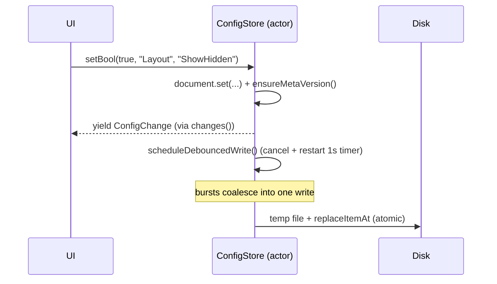

# Concurrency, persistence & errors

This page documents the runtime backbone shared by every feature: how work is
scheduled and cancelled (Swift concurrency), how a file operation is driven and
reported (the transfer queue), how settings are stored and broadcast
(`ConfigStore` + INI), how directory sizes are cached, how errors are typed and
resolved, how logging works, and how directory changes are (currently) detected.

Everything here lives below the UI: the engines are pure `Foundation` (no
AppKit), so they are unit-testable and reusable across `PCVFS`, `PCOperations`,
and the plugin host. The dependency rule is strict — these types depend only
*downward* toward `PCFoundation`.

## Concurrency model

The operation engine uses **Swift structured concurrency**: actors for shared
mutable state, `AsyncStream` for progress, and `Task` cancellation instead of
GCD. This is a binding decision — see **ADR-008** ("Swift Concurrency for the
operation engine; no GCD in new code"): *actors + structured concurrency;
cancellation via `Task`; progress via `AsyncStream`, coalesced to ≤ 30 UI
updates/s.*

Three actor/stream patterns recur throughout the codebase:

- **Actors guard mutable state.** `ConfigStore`, `OperationControl`, and
  `DirectorySizeCalculator` are all `actor`s. Callers `await` into them; the
  actor serializes access so no lock is needed for the state it owns.
- **`AsyncStream` carries progress and change events.** `ConfigStore.changes()`
  yields `ConfigChange` values; `TransferQueue.run(_:)` yields `OpEvent` values.
  A stream can have multiple independent subscribers (config) or a single
  consumer (a running transfer).
- **Cancellation is cooperative.** Long walks poll `Task.isCancelled`
  (`DirectorySizeCalculator.walk`); the operation engine additionally routes an
  explicit user cancel/pause through the `OperationControl` actor.

```mermaid
flowchart LR
  UI["PCApp (AppKit / @MainActor)"] -->|await set*| CS["ConfigStore (actor)"]
  CS -->|AsyncStream&lt;ConfigChange&gt;| UI
  UI -->|run kind| TQ["TransferQueue"]
  TQ -->|Task.detached| ENG["CopyEngine / MoveEngine / DeleteEngine"]
  ENG -->|checkpoint| OC["OperationControl (actor)"]
  UI -->|cancel / pause| OC
  ENG -->|OpProgress| TQ
  TQ -->|AsyncStream&lt;OpEvent&gt; (≤30 Hz)| UI
```

## The transfer queue

A file operation is run through
`PCOperations/TransferQueue.swift` (SPEC-004 §1). Despite the "queue" name it
drives **one** operation at a time and exposes it as a live event stream; the UI
runs several `TransferQueue`s concurrently and lists them in the transfer
manager.

### Operation kinds

`OperationKind` is the input:

```swift
public enum OperationKind: Sendable {
    case copy(items: [String], toDirectory: String, options: CopyOptions)
    case move(items: [String], toDirectory: String, options: CopyOptions)
    case trash(items: [String])
    case delete(items: [String])
    case custom(run: @Sendable (OperationControl,
                                @Sendable (OpProgress) -> Void) async throws -> [String])
}
```

`.custom` lets the app run an arbitrary async job (e.g. pack / unpack) through
the same machinery so it backgrounds, reports progress, and shows in the
transfer manager — throwing `OperationError.cancelled` reports a user cancel.

### plan → execute (→ verify)

Each engine follows a **plan then execute** shape, visible in `CopyEngine`:

1. **Plan.** `planTotals(_:)` walks the sources to compute `filesTotal` /
   `bytesTotal` up front, so progress has a denominator and the UI can show a
   real percentage and ETA.
2. **Execute.** The engine copies item-by-item. Each regular file tries
   `clonefile(2)` first (instant, copy-on-write, only on the same volume), then
   falls back to a chunked `read`/`write` loop, then restores metadata via
   `copyfile(3)` with `COPYFILE_METADATA`. Before each item and inside the copy
   loop it calls `await control.checkpoint()` (see below).
3. **Verify.** Optional and per-operation; `PCOperations/ChecksumEngine.swift`
   provides content hashing used by the compare/verify features. There is no
   unconditional post-copy re-read of every byte — verification is an explicit
   step, not part of the default copy path. *(Open question: whether a
   "verify after copy" option should be wired into `CopyOptions` is not yet
   decided.)*

`CopyOptions` controls the execute phase: `useCloneWhenPossible`,
`preserveMetadata`, `onlyNewer`, `chunkSize` (default 1 MiB), a
`maxBytesPerSecond` throughput ceiling (0 = unlimited), and an optional
`renameMask`.

### Coalesced progress (≤ 30 Hz)

Engines can emit progress far faster than a UI can usefully draw it. The stream
is throttled by `ProgressThrottle`, which drops progress events that arrive less
than `1/hz` apart (default **30 Hz**):

```swift
func emit(_ progress: OpProgress) {
    lock.lock(); defer { lock.unlock() }
    let now = Date()
    guard now.timeIntervalSince(lastEmit) >= minInterval else { return }   // coalesce
    lastEmit = now
    continuation.yield(.progress(progress))
}
```

Only `.progress` events are throttled; terminal events (`.completed`,
`.failed`, `.cancelled`) always go through. The heavy I/O runs in a
`Task.detached` so it never executes on the caller's actor (typically
`@MainActor`).

### Cancellation & pause

`OperationControl` is the shared actor the UI and the engine both hold:

```swift
public actor OperationControl {
    public func cancel() { cancelled = true }
    public func pause()  { paused = true }
    public func resume() { paused = false }

    /// Throws `.cancelled` if cancelled; otherwise blocks while paused.
    public func checkpoint() async throws {
        if cancelled { throw OperationError.cancelled }
        while paused {
            if cancelled { throw OperationError.cancelled }
            try? await Task.sleep(nanoseconds: 20_000_000)   // 20 ms
        }
    }
}
```

Cancellation has two paths that converge: calling `control.cancel()` directly,
or terminating the `AsyncStream` (its `onTermination` both calls
`control.cancel()` and cancels the detached `Task`). Pause is implemented as a
polling wait inside `checkpoint()`.

## Persistence: `ConfigStore` + INI

Settings live in **INI files** under
`~/Library/Application Support/PeachCommander/`, mediated by
`PCFoundation/ConfigStore.swift` (an `actor`). INI was chosen deliberately —
**ADR-007**: plain text is trivially diffable, scriptable, syncable, and
human/LLM-readable; key names follow `wincmd.ini` conventions where a 1:1
concept exists, keeping a future Total Commander config importer cheap.
`PCFoundation` ships its own small `INIDocument` parser, so there is no external
dependency and comments/ordering are preserved across writes.

**No `UserDefaults` is used for app config.** All persisted settings must flow
through a `ConfigStore` (the "mainConfig") so the `-ConfigRoot` /
`PEACHCMD_CONFIG_ROOT` override is honored and the user's real preferences
domain is never polluted.

### Config root resolution

`PCFoundation/ConfigPaths.swift` resolves the root and every well-known file URL
within it (`peachcmd.ini`, `session.ini`, `hotlist.ini`, `workspaces.ini`,
`plugins.ini`, `ftp-sites.ini`, …). Resolution order:

1. `-ConfigRoot <path>` launch argument
2. `PEACHCMD_CONFIG_ROOT` environment variable
3. `~/Library/Application Support/PeachCommander`

The resolved directory is created if missing. Engine code should receive paths
via `ConfigPaths` rather than hardcoding locations, so tests (F-277) can point
at an isolated temp directory — this is what makes config-isolated testing
possible.

### Read / write / broadcast

`ConfigStore` serves typed reads from an in-memory `INIDocument`
(`bool`/`int`/`double`/`string`, each with a default). Booleans are stored
canonically as `"1"`/`"0"` but reads also accept `true/false/yes/no`,
case-insensitively.

A write does three things atomically from the actor's perspective:

1. update the in-memory document (and lazily stamp `[meta] version=1` for future
   migrations),
2. **broadcast** a `ConfigChange { section, key }` to every subscriber of
   `changes()`, so the UI can live-bind to a setting, and
3. schedule a **debounced atomic write** to disk.



The debounce (default **1 s**) cancels any pending write and restarts the timer,
so a burst of changes collapses into a single I/O. Writes are atomic: serialize
to a `.tmp` sibling, then `replaceItemAt` (or `moveItem` when the target does
not yet exist). `flush()` forces an immediate write (e.g. on quit). If the file
on disk cannot be decoded as UTF-8 at load time it is moved aside to
`<name>.bak` and an empty document is used, so a corrupt config never blocks
startup.

### Secrets are never in INI

Passwords and key passphrases must live in the **macOS Keychain only**
(ADR-007). `PCFoundation/SecretStore.swift` is the abstraction:
`KeychainSecretStore` (generic-password items via `Security.framework`) in
production, and an in-memory implementation for tests so credential round-trips
run without touching the real Keychain. INI files (e.g. `ftp-sites.ini`) store
connection metadata but never the secret itself.

## Caching: directory sizes

`PCVFS/DirectorySizeCalculator.swift` (an `actor`) computes recursive directory
sizes (SPEC-002 §5, the "space on dir" feature) with a per-path cache. The cache
key validity is the directory's own **modification date**: a cache hit is reused
only if the stored mtime still matches the current one, so an out-of-band change
naturally invalidates the entry.

Notable properties, all safety-relevant:

- **Symlinks are never followed or counted** — this avoids cycles and prevents
  the walk from escaping the tree.
- **Cancellation returns a partial sum.** The manual-stack `walk` checks
  `Task.isCancelled` between pops and returns the bytes accumulated so far;
  **partial results are never cached**, so a later call redoes the full walk.
- **Batch mode with bounded concurrency.** `sizes(of:maxConcurrency:)` (default
  4) computes many directories in a `withTaskGroup`, launching no new work once
  the enclosing task is cancelled.
- **Explicit invalidation.** `invalidate(_:)` / `invalidateAll()` drop entries
  when a directory is known to have changed.

## Error handling

Errors are **typed enums**, translated to user-facing text only in `PCApp` — the
engine layer stays UI-agnostic.

### `VFSError` and errno mapping

`PCVFS/VFSError.swift` (SPEC-006 §1) is the VFS-layer error type. Its
`fromErrno(_:path:)` maps POSIX `errno` values into semantic cases:

```swift
case ENOENT:        return .notFound(path)
case EACCES, EPERM: return .permissionDenied(needsElevation: code == EPERM)
case EEXIST:        return .exists(path)
case ENOSPC:        return .noSpace
default:            return .underlying(code: code, message: String(cString: strerror(code)))
```

Other cases (`connectionLost(retryable:)`, `cancelled`, `unsupported`) carry the
extra bit the UI needs to decide whether to offer a retry or an elevation
prompt. `VFSError` is `Equatable`, which the conformance test battery relies on.

### `OperationError` and per-file resolvers

`PCOperations/OperationTypes.swift` defines `OperationError`
(`sourceNotFound`, `cannotCreateFile`, `readFailed`, `writeFailed`,
`renameFailed`, `aborted`, …) and the `OperationResolver` protocol, which
decouples *policy* (how to handle a conflict or error) from the engine:

```swift
public protocol OperationResolver: Sendable {
    func resolveOverwrite(source: FileFacts, target: FileFacts) async -> OverwriteDecision
    func resolveError(_ error: OperationError, path: String) async -> ErrorDecision
}
```

- When a target exists, the engine `await`s `resolveOverwrite` and acts on the
  `OverwriteDecision` (`.overwrite`, `.skip`, `.rename(String)`, `.append`,
  `.abort`).
- When a per-file error occurs, it `await`s `resolveError` and acts on the
  `ErrorDecision` (`.retry`, `.skip`, `.abort`).

The UI supplies an interactive resolver (the overwrite dialog);
`OverwriteAllResolver` and `SkipAllResolver` are non-interactive defaults for
scripts and tests. The blanket-choice logic ("all older", "all larger") and
auto-rename naming are pure functions in `PCOperations/OverwriteRules.swift`, so
they are unit-tested without any GUI. Because resolvers are `async`, an
interactive prompt suspends the engine on the actor boundary without blocking a
thread.

### Terminal outcomes

The engine's public surface is the `OpEvent` stream. A run ends in exactly one
of `.completed(processed:)`, `.failed(OperationError)`, or `.cancelled`. In
`TransferQueue.execute`, a thrown `OperationError.cancelled` is mapped to
`.cancelled`; any other thrown error becomes `.failed(.aborted("…"))`.

## Logging

Logging goes through `PCFoundationLogger` (`PCFoundation/PCFoundation.swift`), a
thin wrapper over Apple's unified logging (`os.Logger`) with subsystem
`com.peachcommander`. It exposes `info` / `debug` / `error`. Long-running
components hold `PCFoundationLogger.logger` directly so they can attach privacy
annotations (e.g. `DirectorySizeCalculator` logs cancellation with
`\(path, privacy: .public)`). There is no bespoke file-based log; logs are read
with `log`/Console.app like any other system component.

## Directory watching (polling today, FSEvents later)

> **Caveat — read this before relying on live refresh.** Directory change
> detection currently **polls**; a true FSEvents backend is not yet implemented.

`PCVFS/FSEventsWatcher.swift` defines `DirectoryWatcher`, an `actor` that
`start()`s a polling loop: it stats the watched directory and compares its
modification date roughly **every 2 seconds** (`Task.sleep(2_000_000_000)`),
logging when a change is seen. The file header is explicit that this is a
portable polling implementation, not `FSEvents`.

Consistent with that, the local VFS backend's `LocalFS.watch(...)` returns
`nil` — i.e. the push-based watch API exists in the protocol but has **no live
implementation yet**; consumers fall back to polling or manual refresh.

Implications for contributors:

- Changes made outside the app can take up to ~2 s to surface, and the poller
  detects only that the directory's own mtime changed — it does not (yet) emit
  per-entry `FSChangeEvent`s describing *what* changed.
- The event vocabulary (`FSChangeType`: `created` / `modified` / `removed` /
  `renamed`, and `FSChangeEvent { path, type }`) is defined and ready for a real
  backend to populate.

*Open question:* the migration to real `FSEvents` (coalescing latency, whether
to watch recursively, and how per-entry events map onto panel row diffs) is not
yet specified. Until then, treat live refresh as best-effort.
