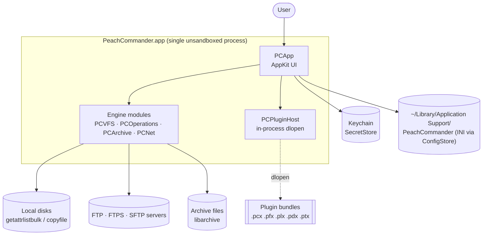
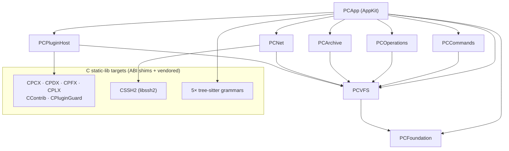
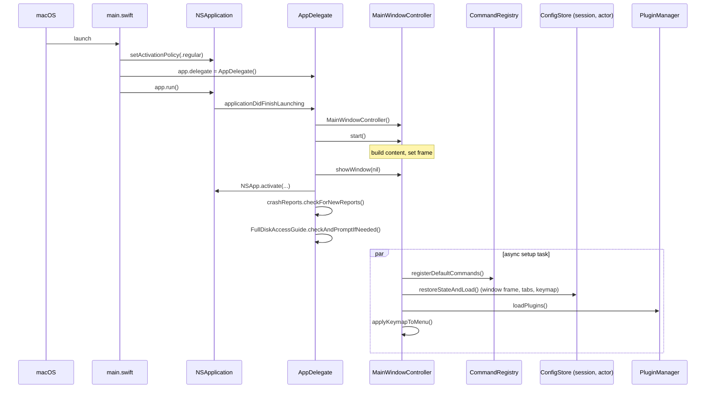
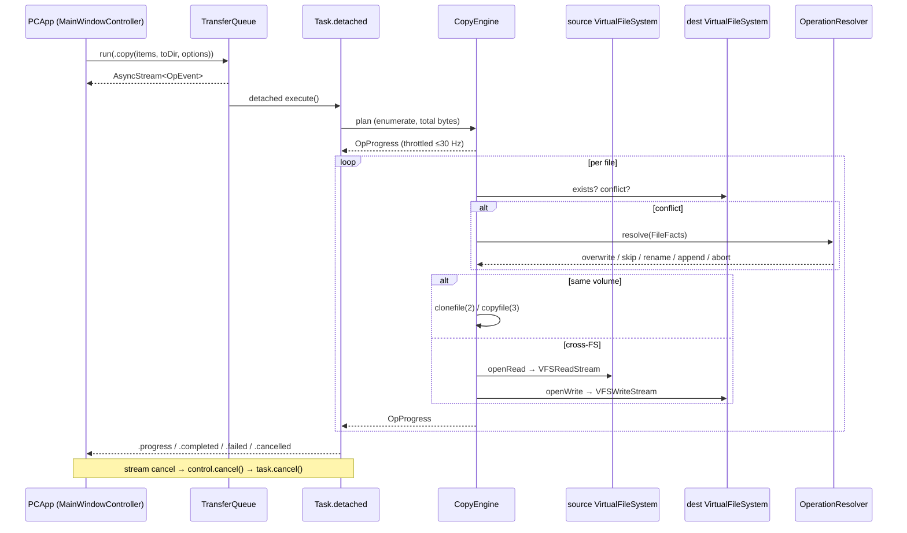
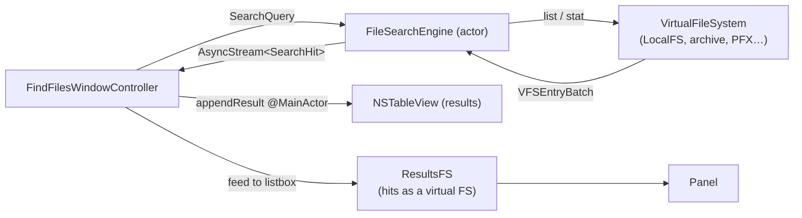
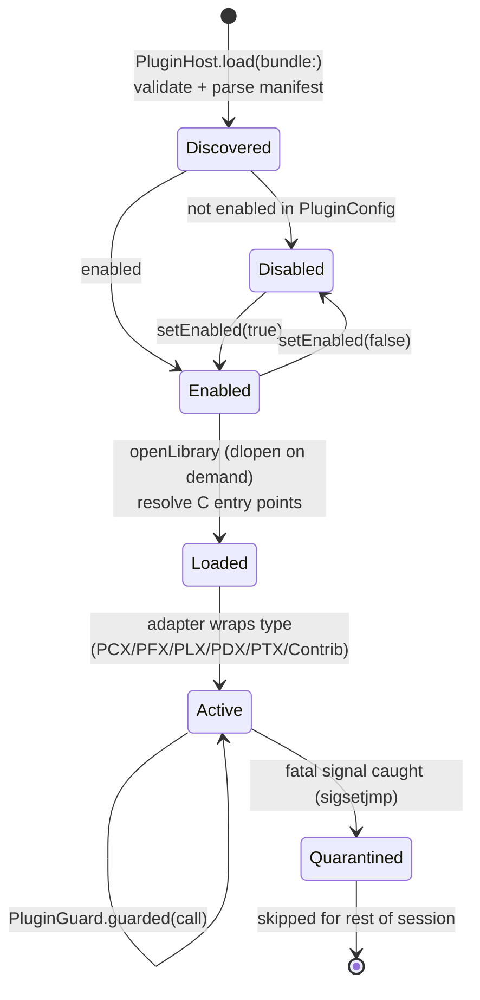
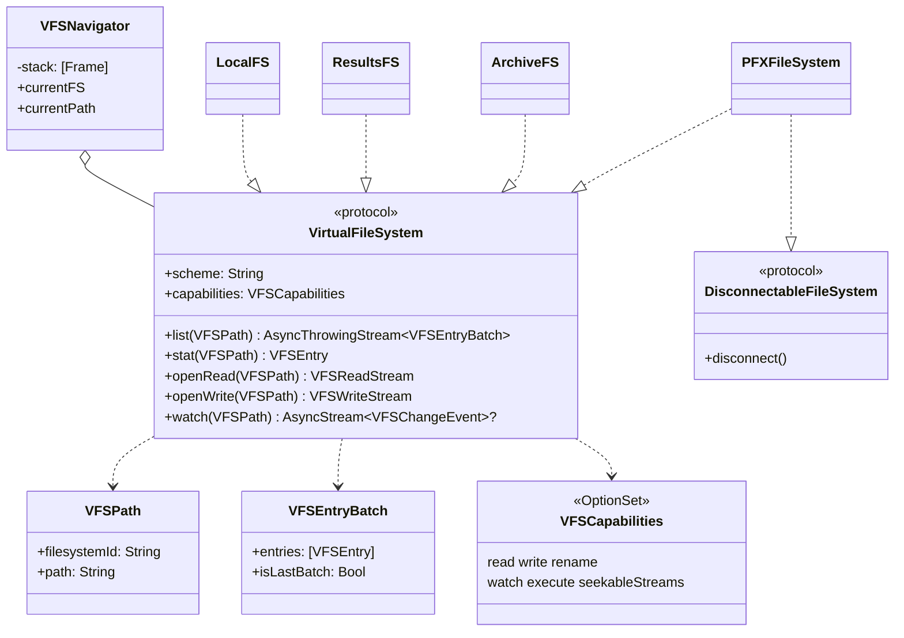

A curated set of Mermaid diagrams for contributors and integrators. Each one is a
different lens on the same system: the outward-facing context, the module graph,
and the four runtime flows that most code touches (startup, a file-copy operation,
search, plugin loading), plus the VFS type relationships that tie everything
together. Diagrams are deliberately simplified — they name the real types and
modules but omit edges that would only add noise. Where a diagram simplifies
something load-bearing, the caption says so. For prose and rationale see the
[architecture overview](architecture-overview) and the ADRs in `DECISIONS.md`.

## 1. System context

Peach Commander is a single, unsandboxed macOS app process (App Sandbox is
intentionally off — a file manager needs full-disk reach; see ADR and
`docs/distribution/`). Everything it talks to is either the local machine or a
resource reached *through* the VFS abstraction: local disks, archives, and remote
servers. Plugins are `dlopen`ed into the same process, not separate services.

## 2. Module dependency graph

Eight Swift modules; dependency arrows point *down* toward `PCFoundation`, and
`AppKit` is imported only in `PCApp` (ADR-001). The five siblings above `PCVFS`
(`PCCommands`, `PCOperations`, `PCArchive`, `PCNet`, `PCPluginHost`) depend on
`PCVFS` and `PCFoundation` but not on each other; `PCApp` depends on all of them.
Twelve C static-lib targets sit underneath as ABI shims and vendored code.

Simplification: the C-target edges show the primary consumer only; the exact
`link`/`dependencies` wiring is authoritative in `project.yml` (the XcodeGen
source of truth; the `.xcodeproj` is generated and gitignored — ADR-002).

## 3. App startup sequence

`Sources/PCApp/main.swift` creates the `NSApplication`, sets `.regular`
activation policy, and installs `AppDelegate`. On
`applicationDidFinishLaunching`, the delegate builds the window content *before*
showing the window, then kicks off an async task that registers commands,
restores the saved session, loads plugins, and applies the keymap to the menu.
Session/config restore is `async` because `ConfigStore` is an actor.

## 4. File-copy operation (UI → queue → VFS)

A copy is a `TransferQueue.run(OperationKind.copy(...))` call that returns an
`AsyncStream<OpEvent>`. The work runs on a detached task so file I/O never blocks
the main actor; progress is coalesced by `ProgressThrottle` to ≤30 Hz (ADR-008).
`CopyEngine` picks the fastest strategy per file: `clonefile(2)` on the same
volume, else `copyfile(3)` with metadata, else manual `VFSReadStream` →
`VFSWriteStream` streaming for cross-filesystem copies. Target-exists conflicts
are resolved through an `OperationResolver` (default `OverwriteAllResolver`),
which can suspend and ask the UI.

## 5. Search data flow

`FindFilesWindowController` builds a `SearchQuery` and hands it to the
`FileSearchEngine` actor, which walks a `VirtualFileSystem` (name masks, content
match, date filters, optional archive descent) and emits `SearchHit`s over an
`AsyncStream`. Results stream into the table as they arrive; cancelling the
consumer cancels the walk via `onTermination`. "Feed to listbox" wraps the hits
in a `ResultsFS` so a panel can browse them like any other filesystem.

## 6. Plugin load / lifecycle

Plugins are in-process `dlopen`ed bundles (ADR-004). `PluginHost.load(bundle:)`
validates the `.bundle` and parses its manifest into a `DiscoveredPlugin`;
`PluginManager` tracks which are enabled and only `dlopen`s the dylib on demand
(`openLibrary`). Every call into plugin code runs through `PluginGuard.guarded`,
a `sigsetjmp`-based crash guard: a plugin that raises a fatal signal is caught
and permanently **quarantined** for the rest of the session rather than taking
the app down (this is a pragmatic in-process guard, not a sandbox).

## 7. VFS type relationships

`VirtualFileSystem` (in `Sources/PCVFS/PCVFS.swift`) is the load-bearing
protocol every backend implements. A `VFSPath` names `(filesystemId, path)`;
listing streams `VFSEntryBatch`es of `VFSEntry`; reads/writes go through
`VFSReadStream`/`VFSWriteStream`; `VFSCapabilities` is an `OptionSet` advertising
what a backend supports. `VFSNavigator` holds the nested-mount stack (entering a
zip pushes a frame; `..` out pops it). Connection-backed filesystems also conform
to `DisconnectableFileSystem` so sessions are torn down on unmount.

> **Open question / accuracy note.** `LocalFS.watch(_:)` currently returns `nil`
> (FSEvents-backed watching is a placeholder pending the panel migration, I08-T03).
> Live panels instead use `FSEventsWatcher`, which **polls at roughly a 2-second
> interval** rather than subscribing to true `FSEventStream` callbacks. Treat the
> `watch` capability as "coarse polling" until that work lands.
