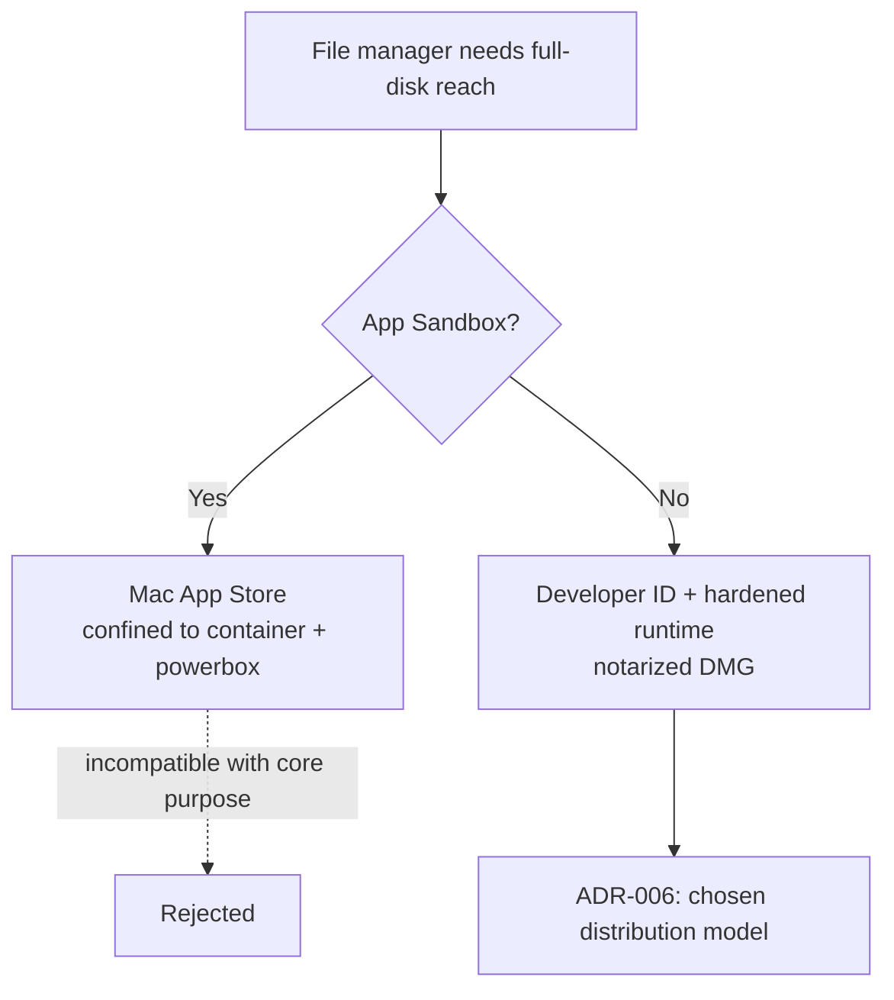
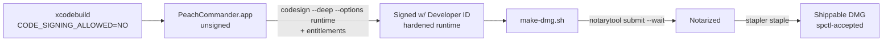
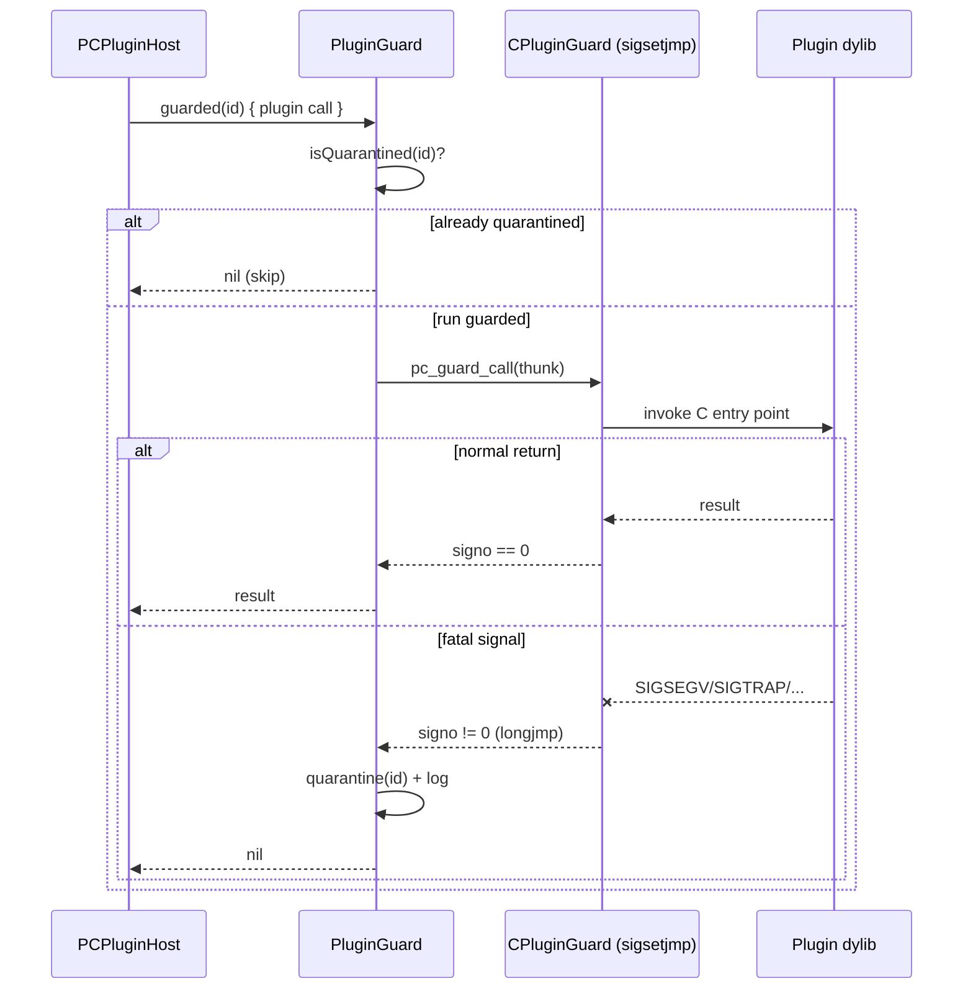

Peach Commander is a file manager, and a file manager is only useful if it can
reach the user's whole disk. That single requirement drives most of the security
model: **the App Sandbox is intentionally off**, distribution is via Developer ID
and notarization rather than the Mac App Store, and trust is layered on top with
the hardened runtime, Keychain-backed credential storage, and an in-process crash
guard for third-party plugins.

This page documents the model as it actually is, including the parts that are
declared but not yet wired up. It is grounded in
`Resources/PeachCommander.entitlements`,
`Sources/PCFoundation/SecretStore.swift`,
`Sources/PCPluginHost/PluginGuard.swift`, `RELEASE.md`, and the ADRs in
`DECISIONS.md`.

## Threat model in one paragraph

Peach Commander runs as the local user, with the local user's authority. It is
**not** a privilege boundary between the user and their own files — it deliberately
has as much reach as Finder plus whatever the OS will grant. The boundaries it
*does* care about are: (1) credentials for remote file systems must never sit in
plaintext config; (2) a misbehaving third-party plugin should degrade gracefully
rather than take the app down or silently corrupt it; and (3) a shipped build must
be something Gatekeeper will run on a machine other than the developer's.

## Why the App Sandbox is off (ADR-006)

The Mac App Store requires the App Sandbox, and the App Sandbox confines a process
to a small set of container paths plus whatever the user explicitly opens through
a powerbox panel. That is fundamentally incompatible with a dual-panel commander
whose entire job is to browse, copy, move, and operate on arbitrary paths across
the whole file system, including other volumes and (with permission) other apps'
data.

ADR-006 therefore records the decision plainly: **no sandbox; hardened runtime on;
Developer ID + notarized DMG for distribution.** The consequence is that Peach
Commander cannot ship on the Mac App Store, and release builds require an Apple
Developer ID certificate that the maintainer supplies (it is never checked into the
repo).



## Entitlements

The single entitlements file, `Resources/PeachCommander.entitlements`, is applied
at signing time (see [distribution](#hardened-runtime--developer-id-distribution)).
It contains exactly two keys, and — notably — it does **not** contain
`com.apple.security.app-sandbox`. Both keys are hardened-runtime *relaxations*, and
each exists for a concrete reason:

| Entitlement | Value | Why it is needed |
| --- | --- | --- |
| `com.apple.security.cs.disable-library-validation` | `true` | Peach Commander loads third-party content and file-system plugins (WCX/WLX/WDX/WFX-style bundles) that are **not** signed by our team. Without this, the dynamic loader refuses to map a dylib whose Team ID differs from the host's. See the [plugin trust](#plugin-trust) section. |
| `com.apple.security.cs.allow-dyld-environment-variables` | `true` | Some plugins and helper tools are launched or configured with `DYLD_*`/environment variables and may not carry the hardened runtime themselves; this lets them inherit the environment without being rejected. |

Because these two keys *weaken* the hardened runtime, they are the deliberate cost
of the plugin model (ADR-004). The trade is stated openly in the entitlements
file's own comments: a file manager that can host arbitrary community plugins
cannot also demand that every plugin be signed by us.

> **Open question / hardening path.** ADR-004 notes that out-of-process / XPC
> plugin hosting is a post-1.0 opt-in. If that lands, `disable-library-validation`
> could be scoped to (or removed from) the host and moved to a dedicated helper,
> tightening the main app's runtime. That work is not started.

## Hardened runtime & Developer ID distribution

The distribution model is Developer ID Application signing with the hardened
runtime enabled, followed by notarization and stapling. The full, reproducible
procedure lives in `RELEASE.md`; the security-relevant shape is:



Two honest caveats that contributors must know:

- **The app is currently UNSIGNED.** The project builds with
  `CODE_SIGNING_ALLOWED=NO`, and `Tools/make-dmg.sh` produces an unsigned DMG. That
  DMG is fine for local testing but will be blocked by Gatekeeper on any other
  machine until the signing and notarization steps run. Those steps are marked
  **[creds]** in `RELEASE.md` because they require the Developer ID certificate and
  an app-specific password / notarytool key, and therefore cannot run in CI or by
  an unattended agent. Signing is **documented but not automated** — this is a known
  blocked item, not an oversight.
- **Sparkle is declared, not integrated.** Sparkle 2 is chosen for auto-updates in
  ADR-006 and is present as an SPM dependency in `project.yml`, but it is **not yet
  linked into the app**. There is no `SUFeedURL`/`SUPublicEDKey` in `Info.plist` and
  no EdDSA-signed appcast yet; `RELEASE.md` §5 describes the wiring as *planned*.
  Until then there is no in-app update channel and thus no update-signing surface to
  secure.

When signing does run, `codesign --deep` signs the bundled loadable plugins and the
embedded frameworks (`PCFoundation`, `PCVFS`, …) as part of the app bundle, and the
entitlements file above is passed with `--entitlements`.

## Credentials: Keychain-backed SecretStore

Remote file systems (FTP/SFTP, implemented as PFX plugins per ADR-011) need
passwords and key passphrases. ADR-007 is categorical: **passwords are NEVER stored
in the INI config** — the macOS Keychain only. Everything else (window layout,
FTP host/user, options) is plain-text INI under
`~/Library/Application Support/PeachCommander/`; secrets are the one exception, and
they are kept out of that directory entirely.

The abstraction is the `SecretStore` protocol in
`Sources/PCFoundation/SecretStore.swift`:

```swift
public protocol SecretStore: Sendable {
    func setPassword(_ password: String, service: String, account: String) throws
    func password(service: String, account: String) throws -> String?
    func deletePassword(service: String, account: String) throws
}
```

- **`KeychainSecretStore`** is the production implementation. It stores each secret
  as a generic-password item (`kSecClassGenericPassword`) keyed by `(service,
  account)`, backed by Security.framework. Writes are idempotent — `setPassword`
  does a `SecItemDelete` before `SecItemAdd` so re-saving a credential replaces it
  cleanly. Items are stored with `kSecAttrAccessibleWhenUnlocked`, so a secret is
  only readable while the device is unlocked (it is not synced to iCloud Keychain,
  and not available in the background before first unlock).
- **`InMemorySecretStore`** is a thread-safe (`NSLock`-guarded) implementation for
  tests and previews, so credential round-trips can be verified without touching the
  real Keychain or prompting the user (see
  `Tests/PCFoundationTests/SecretStoreTests.swift`).

Because credentials live in the Keychain rather than the app's config directory,
the `-ConfigRoot` / `PEACHCMD_CONFIG_ROOT` override (which redirects INI storage for
testing and isolation) does **not** relocate secrets — a deliberate separation of
"settings you can diff and sync" from "secrets the OS protects".

## Full Disk Access

Turning the sandbox off does not grant unrestricted access on modern macOS.
TCC-protected locations (Mail, Messages, other apps' data under `~/Library`, other
users' home folders) remain gated behind **Full Disk Access** until the user grants
it in System Settings. Peach Commander handles this in
`Sources/PCApp/FullDiskAccessGuide.swift` (feature F-299):

- **Best-effort detection.** `FullDiskAccessGuide.isGranted` probes whether the
  current user's `~/Library/Application Support/com.apple.TCC/TCC.db` is readable —
  that file is only readable with Full Disk Access. If the file is absent it assumes
  access is fine (to avoid a false prompt) rather than nagging. This is a heuristic,
  not an API — macOS exposes no first-class "do I have FDA?" query.
- **Non-blocking onboarding.** On launch, `checkAndPromptIfNeeded()` shows a
  one-time explanatory prompt (suppressible with "Don't remind me again") that deep-
  links to `x-apple.systempreferences:com.apple.preference.security?Privacy_AllFiles`.
  The same dialog is reachable on demand via the `cm_FullDiskAccess` command
  (id 30094) in `PCCommands`. Crucially, the app **never blocks**: it keeps working
  with reduced access, and simply cannot see the protected locations until access is
  granted.

## Plugin trust

Plugins are the largest attack/stability surface, and the model is inherited from
Total Commander by design (ADR-004): plugins are macOS bundles containing a dylib
that exports a flat **C ABI**, loaded **in-process** via `dlopen` into the host.
There are five plugin types (`pcx`/`pfx`/`plx`/`pdx`/`ptx`) plus a contribution ABI.
In-process C-ABI hosting is chosen for speed — content plugins are called per row —
and the ADR is explicit that this means **a crashing plugin can crash the app, just
as in TC**. Out-of-process/XPC isolation is deferred to post-1.0.

Given that, trust is layered rather than absolute:

**1. Loading is unsigned-friendly by necessity.** Community plugins are not signed
by our team, so `disable-library-validation` (above) is what lets `dlopen` accept
them at all. This is the entitlement whose cost is highest, and it is accepted
knowingly.

**2. Version handshake at load.** `Sources/PCPluginHost/PluginLibrary.swift`
resolves the plugin's exported symbols and runs an optional handshake: if the plugin
exports `PcGetApiVersion`, its result must equal the host's `currentAPIVersion`
(currently `1`, in `PluginManifest.swift`), otherwise loading fails with a
structured `apiVersionMismatch`. Missing *required* symbols likewise fail fast, so
an incompatible or malformed plugin is rejected up front rather than mid-call.

**3. In-process crash guard + per-plugin quarantine (F-230).**
`Sources/PCPluginHost/PluginGuard.swift` wraps each synchronous plugin C call. Its
`guarded(_:_:)` runs the call through the `CPluginGuard` C shim
(`pc_guard_call`), which installs a `sigsetjmp`/handler for fatal signals
(SIGSEGV/SIGBUS/SIGILL/SIGFPE/SIGTRAP — the last being how every Swift runtime failure
arrives, which is the common case since the plugins are written in Swift). If the
plugin raises one of those, the guard catches
it, returns `nil` instead of propagating the crash, logs it, and **quarantines** the
plugin id — every subsequent guarded call for that id fails fast for the rest of the
session:



The guard's own header comment is careful about what it is **not**: recovering from
a memory-corruption signal can leave host state inconsistent, which is exactly why a
crashed plugin is treated as untrusted and quarantined rather than retried. It is *a
pragmatic in-process guard, not a sandbox* — true isolation would require the
out-of-process host that ADR-004 defers.

## Summary of current status

| Area | State |
| --- | --- |
| App Sandbox | Off by design (ADR-006) |
| Entitlements | `disable-library-validation`, `allow-dyld-environment-variables` only |
| Hardened runtime | Enabled at signing time |
| Code signing | Documented in `RELEASE.md`; **app currently unsigned** (`CODE_SIGNING_ALLOWED=NO`), signing not automated (**[creds]**-gated) |
| Notarization | Documented; runs only with maintainer credentials |
| Sparkle auto-update | Declared in `project.yml`, **not integrated** — no appcast/keys yet |
| Credentials | Keychain via `KeychainSecretStore`; never in INI (ADR-007) |
| Full Disk Access | Best-effort detection + non-blocking prompt (F-299) |
| Plugin isolation | In-process; version handshake + `sigsetjmp` crash guard + per-session quarantine (F-230); XPC isolation deferred post-1.0 |

## Open questions

- **Scoping down `disable-library-validation`.** Would depend on out-of-process
  plugin hosting existing; not started (ADR-004 defers it).
- **Update-channel security.** Cannot be assessed until Sparkle is actually linked
  and an EdDSA-signed appcast exists (`RELEASE.md` §5, planned).
- **FDA detection heuristic.** The `TCC.db`-readability probe is best-effort; there
  is no supported API to query Full Disk Access directly, so false negatives/
  positives are possible on future macOS releases.
