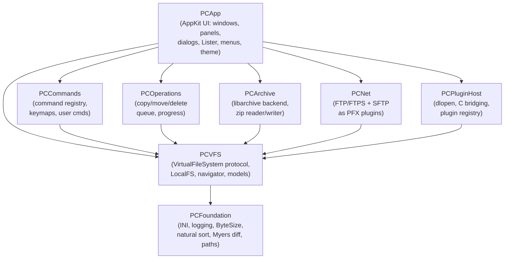
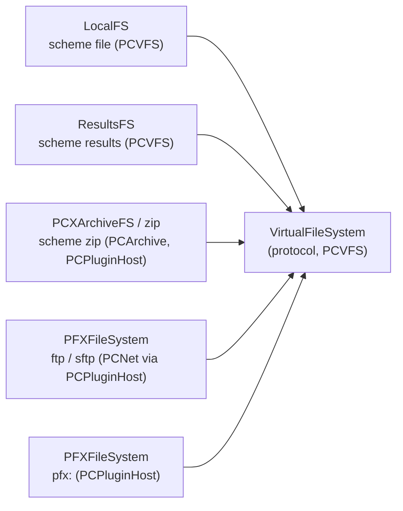
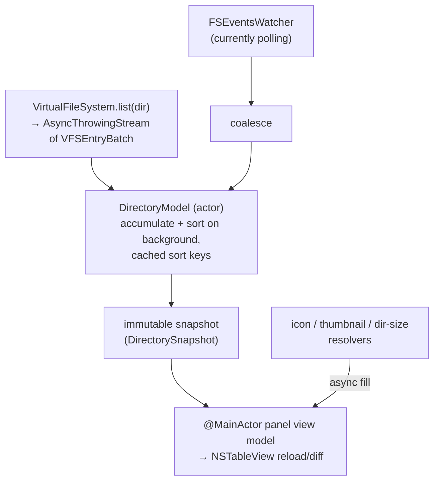
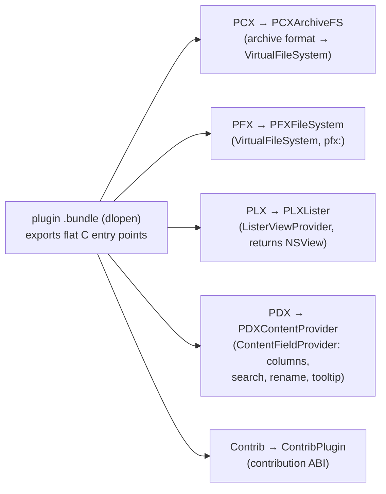

# Architecture overview

Peach Commander is a native macOS orthodox file manager (a Total Commander-style
two-panel tool). This page is the map for contributors and integrators: the module
layout, the direction of dependencies, and where each subsystem lives. It is the
top of the Architecture section — the sibling pages (`arch-diagrams`,
`arch-concurrency-data`) drill into individual subsystems.

Ground truth for everything here is the source under `Sources/` plus the
authoritative design notes in `docs/architecture/` and the binding decisions in
`DECISIONS.md`. Where a design decision needs justification, the relevant ADR is
cited inline. There are **no AI/ML features** in the codebase; ignore any older
note that suggests otherwise.

## Layering in one sentence

Everything is a stack of Swift Package Manager modules whose dependencies point
**down** to `PCFoundation`; **AppKit is imported only by `PCApp`**; and every
data source a panel can show — local disk, an archive's interior, an FTP/SFTP
server, a search-results list, a plugin-provided file system — is the same
`VirtualFileSystem` protocol from `PCVFS`.

## Module map (8 Swift targets)

The eight Swift modules and their dependency direction. Arrows mean "depends on";
they all point down, toward `PCFoundation`. `PCApp` is the only target that links
AppKit and is the only place UI/controller code lives.



| Module | Role | Depends on |
|---|---|---|
| `PCFoundation` | Pure utilities: INI parser (ADR-007), `os.Logger` wrapper, `ByteSize`, natural/locale sort, wildcard+regex helpers, Myers diff, path math, `ConfigStore` (actor), `SecretStore` (Keychain). No dependencies. | — |
| `PCVFS` | The `VirtualFileSystem` protocol, value types (`VFSEntry`, `VFSPath`, `VFSEntryBatch`, `VFSCapabilities`), `LocalFS` + `LocalDirectoryLister`, `VFSNavigator`, `ResultsFS`, the `DirectoryModel`, `FSEventsWatcher`, drive bar and directory-statistics models. | `PCFoundation` |
| `PCCommands` | The `cm_*` command registry, keymaps, user commands (`em_*`), `SelectionState`. UI-agnostic: talks to panels/windows through the `PanelControllerProtocol` / `WindowControllerProtocol` abstractions. | `PCVFS` |
| `PCOperations` | The operation engine: `CopyEngine`, `MoveEngine`, `DeleteEngine`, checksum/attribute/split-combine/encode-decode engines, and the `TransferQueue` that runs one operation and emits a coalesced event stream. | `PCVFS` |
| `PCArchive` | Archive support built on system libarchive (ADR-005), plus an own random-access ZIP reader/writer for fast in-archive browsing. Exposes archives as `VirtualFileSystem`s. | `PCVFS` |
| `PCNet` | FTP/FTPS (on Network.framework) and SFTP (libssh2). Per ADR-011 these are implemented as **PFX file-system plugins** against the public plugin API, not as privileged core code. | `PCVFS` |
| `PCPluginHost` | `dlopen`/`dlsym` of plugin dylibs, C↔Swift bridging, the `PluginManager` (actor), the `PluginGuard` crash guard, and the type adapters (below). | `PCVFS` |
| `PCApp` | The only AppKit target: windows, panels, dialogs, Lister, menus, toolbar, theme. Thin controllers — no business logic the tests need lives here (ADR-001). | all of the above |

**Enforced rule:** engine modules never `import AppKit`. Keeping AppKit isolated
to `PCApp` is what lets the entire engine (VFS, operations, commands, archives,
plugin host) be unit-tested headlessly — see the ~1304 tests across nine targets.

## C targets (12 static libraries)

Alongside the Swift modules, `project.yml` defines twelve C static-library targets.
They are ABI/shim layers, deliberately tiny, so the C ABI stays stable and Swift
never links a plugin's Swift runtime.

- **Plugin ABIs** — `CPCX`, `CPDX`, `CPFX`, `CPLX` (archive / content / file-system
  / lister ABIs), `CContrib` (the contribution ABI), and `CPluginGuard` (the
  `sigsetjmp`/`siglongjmp` crash-guard trampoline).
- **`CSSH2`** — module map / build glue for libssh2, the SFTP backend used by `PCNet`.
- **Five tree-sitter grammars** — `CTreeSitterCSharp`, `CTreeSitterJS`,
  `CTreeSitterPython`, `CTreeSitterRust`, `CTreeSitterTypeScript`, vendored for the
  Lister's syntax highlighting.

## Build & toolchain

`project.yml` is the **single source of truth** for the Xcode project (ADR-002):
LLMs and merges corrupt `.xcodeproj` plists, so the `.xcodeproj` is generated by
`xcodegen` and is gitignored. The flow is `xcodegen generate` → `xcodebuild`,
wrapped by `Tools/bootstrap.sh` (install xcodegen + generate), `Tools/build.sh`,
and `Tools/test.sh`.

- Swift 5.10+, Xcode 16, deployment target **macOS 13.0**.
- Universal binary: **arm64 + x86_64**.
- CI runs on `macos-14`.

## The VFS — the load-bearing abstraction

`PCVFS` is the spine of the system (SPEC-006). A panel never knows what kind of
storage it is showing; it holds a `VFSPath` = `(filesystemId, path)` and talks to a
`VirtualFileSystem`.

```swift
public protocol VirtualFileSystem: AnyObject, Sendable {
    var scheme: String { get }                   // "file", "zip", "ftp", "pfx:<name>", "results"
    var capabilities: VFSCapabilities { get }     // read, write, rename, watch, execute, seekableStreams

    func list(_ dir: VFSPath) -> AsyncThrowingStream<VFSEntryBatch, Error>
    func stat(_ path: VFSPath) async throws -> VFSEntry
    func openRead(_ path: VFSPath) async throws -> VFSReadStream       // seekable iff .seekableStreams
    func openWrite(_ path: VFSPath, options: WriteOptions) async throws -> VFSWriteStream
    func mkdir(_ path: VFSPath) async throws
    func delete(_ path: VFSPath) async throws
    func rename(_ from: VFSPath, to: VFSPath) async throws
    func setAttributes(_ path: VFSPath, attributes: VFSAttributes) async throws

    func watch(_ dir: VFSPath) -> AsyncStream<VFSChangeEvent>?          // nil if unsupported
    func localFileIfAvailable(_ path: VFSPath) async throws -> URL?     // temp extraction for edit/execute
}
```

`VFSCapabilities` is an `OptionSet` (`read`, `write`, `rename`, `watch`, `execute`,
`seekableStreams`); callers branch on it rather than downcasting. Listings are
**streamed in batches** (`VFSEntryBatch`) so a 100k-entry directory renders
progressively instead of blocking on a full enumeration. Connection-backed file
systems (FTP/SFTP) additionally conform to `DisconnectableFileSystem` so control
connections, keep-alive tasks and SSH sessions are torn down when a panel leaves
the mount.

### Backends



- **`LocalFS`** (`scheme = "file"`) — local disks. Backed by the
  `getattrlistbulk(2)` enumerator in `LocalDirectoryLister` (ADR-009), which
  fetches name/type/size/dates/flags/permissions in batched syscalls instead of
  one `stat` per file. Copy uses `copyfile(3)` with a `clonefile(2)` fast-path
  (ADR-008).
- **Archive** — `PCArchive` (libarchive read/write, ADR-005) plus an own
  random-access ZIP directory reader for fast browsing; `PCXArchiveFS` in
  `PCPluginHost` presents PCX-plugin archive formats through the same protocol.
- **FTP/FTPS/SFTP** — `PCNet`, surfaced as `PFXFileSystem` instances (ADR-011).
- **Results** (`scheme = "results"`) — `ResultsFS`, a read-only virtual listing
  used by search results and similar synthetic panels.
- **Plugin FS** (`scheme = "pfx:<name>"`) — any PFX plugin, mounted under the
  Network virtual root.

### Navigation

`VFSNavigator` owns the stack of nested file systems and `..`/path semantics:
descending into a zip pushes an archive FS; leaving it pops back to the local FS at
the archive's own location. **File operations are VFS→VFS** (SPEC-004): copying
from a zip to an SFTP server composes read/write streams, while the operation
engine special-cases local→local and same-FS server-side moves via the capability
flags.

## Panel data flow



The `DirectoryModel` actor accumulates batches, sorts on a background thread with
cached sort keys, and publishes an **immutable snapshot**. The table renders only
snapshots and never touches the live model, which is what removes data races
between listing, watching, and drawing (ADR-001, ADR-008).

## Directory watching — current state

`FSEventsWatcher` **polls** the watched directory (roughly every ~2 s) and diffs.
`LocalFS.watch(_:)` currently returns `nil`, i.e. **true FSEvents-based watching is
not yet wired up** — it is a placeholder despite the type name. The intended
target is `FSEventStreamCreate` per panel path with ~0.1 s latency and coalescing
(see `docs/architecture/tech-stack.md`). **Open item:** replace polling with a real
FSEvents stream and have `LocalFS` return a live `AsyncStream<VFSChangeEvent>`.

## Command system

`PCCommands` is the UI-agnostic command layer. Commands carry **TC-compatible
`cm_*` identifiers** (`cm_Edit`, `cm_RenameOnly`, `cm_CompareDirs`, `cm_GotoPath`,
`cm_QuickLook`, `cm_FtpConnect`, …) so Total Commander muscle memory, keymaps and
button bars transfer. User-defined commands use the `em_*` namespace (`usercmd.ini`).

The registry does not depend on AppKit: it drives panels and windows through the
`PanelControllerProtocol` and `WindowControllerProtocol` abstractions, and `PCApp`
supplies the concrete controllers. Keymaps map key chords (per SPEC-003 handling in
`PanelListView`) to command ids; a base scheme is chosen in `peachcmd.ini` and
user overrides live in `keymap-user.ini`.

## Window & panel management (PCApp)

- **`MainWindowController`** — one per window; owns two `PanelController`s plus
  shared chrome (toolbar, command line, F-key bar). Multiple main windows are
  allowed.
- **`PanelController`** — the tabs of one side; each tab is a panel view model plus
  the `NSTableView` subclass `PanelListView` (view-based, virtualized for 100k+
  rows — ADR-001).
- **Dialog controllers** — `ListerWindowController`, `SearchController`,
  `SyncController`, `MultiRenameController`, `OptionsController`,
  `TransferManagerController` — one per dialog, all driven through `PCCommands`.

## Operation engine

`PCOperations` runs file operations off the main actor. `TransferQueue` starts one
`OperationKind` (copy/move/delete/pack/unpack/checksum/…) on a detached task and
exposes a live **`AsyncStream<OpEvent>`**. Each operation runs plan → execute →
(optional) verify:

1. **plan** — enumerate sources and compute totals; streamed and cancellable.
2. **execute** — per-file work with progress.
3. **verify** — optional post-checks.

Progress events are **coalesced to ≤ 30 Hz** so the UI is never flooded (ADR-008).
Conflicts (overwrite/error) are resolved through an `OperationResolver`
(e.g. `OverwriteAllResolver`), letting an answer apply "for all". The default queue
runs operations sequentially (TC F2 behavior); ad-hoc/background operations run in
their own queue. Cancellation is via `Task`/`OperationControl` — no GCD in new
code.

## Persistence

Config is **INI files** under `~/Library/Application Support/PeachCommander/`
(ADR-007): `peachcmd.ini`, `session.ini`, `hotlist.ini`, `usercmd.ini`,
`plugins.ini`, `ftp-sites.ini`, and friends. Key names mirror `wincmd.ini` where a
1:1 concept exists.

- All access goes through **`ConfigStore`** (an **actor** in `PCFoundation`) with
  typed accessors and per-key-path change notifications. Writes are **atomic**
  (temp + rename) and **debounced**. **No `UserDefaults`** for app config —
  `UserDefaults` is reserved for trivial OS-integration bits (e.g. window autosave
  names).
- The config root is overridable for tests/portable use via the `-ConfigRoot`
  launch argument or the `PEACHCMD_CONFIG_ROOT` environment variable; engine code
  receives paths via a `ConfigPaths`/`ConfigStore` handle rather than hardcoding.
- **Secrets** (FTP/SFTP/archive passwords) live in the macOS **Keychain** via
  `SecretStore` (`kSecClassGenericPassword`); `ftp-sites.ini` stores only a
  `password=keychain` marker.
- Caches (icons, dir sizes, thumbnails) are in-memory LRU with byte budgets; an
  optional SQLite thumbnail cache is post-1.0.

See `docs/architecture/configuration.md` for the full on-disk layout and INI
conventions.

## Plugin host

Plugins are **in-process `dlopen` bundles** with a flat **C ABI** (ADR-004),
directly porting Total Commander's model: bundles named `.pcxplugin` / `.pfxplugin`
/ `.plxplugin` / `.pdxplugin` (plus the contribution ABI and PTX), each containing
a dylib that exports the TC-named C entry points (`OpenArchive`, `FsFindFirst`,
`ListLoad`, `ContentGetValue`, …). `PCPluginHost` resolves those symbols and wraps
each plugin type in a Swift adapter:



| Type | Adapter | Surfaces as |
|---|---|---|
| PCX (archive) | `PCXArchiveFS` | a `VirtualFileSystem` in the archive format registry |
| PFX (file system) | `PFXFileSystem` | a `VirtualFileSystem` mounted under the Network root |
| PLX (lister) | `PLXLister` | a `ListerViewProvider` returning an `NSView` for the Lister |
| PDX (content) | `PDXContentProvider` | a `ContentFieldProvider` feeding columns/search/rename/tooltip |
| Contrib | `ContribPlugin` | host contribution points |

Callbacks (progress, crypt, request-password) are C function pointers back into the
host. Two safety mechanisms wrap every plugin call:

- **`PluginGuard`** (`CPluginGuard` shim) — a `sigsetjmp`/`siglongjmp` crash guard
  (F-230). A plugin that raises a fatal signal is caught, logged, and the plugin is
  **quarantined** for the rest of the session instead of taking down the app. This
  is best-effort in-process containment, not true isolation — a crashing plugin can
  still corrupt shared state (same risk profile as TC). Out-of-process/XPC hosting
  is a documented **post-1.0** hardening, not present today.
- **Version handshake** — the host checks the plugin's declared API version at load
  and refuses incompatible ones.

`PluginManager` (actor) owns the loaded set, enable/disable state and extension
associations (`plugins.ini`).

## Security & distribution model

- **App Sandbox is intentionally OFF.** A file manager needs full-disk access, so
  the Mac App Store sandbox is a non-starter (ADR-006). The distribution model is
  **Developer ID + hardened runtime + notarized DMG**, not the App Store.
- **Entitlements:** `com.apple.security.cs.disable-library-validation` (so unsigned
  plugin dylibs can be `dlopen`ed) and `com.apple.security.cs.allow-dyld-environment-variables`.
- The app is **currently unsigned.** Signing/notarization is documented in
  `RELEASE.md` and `docs/distribution/` but **not automated** — this is a known
  blocked item.
- **Sparkle 2** is the chosen updater (ADR-006) and is declared, but **not yet
  integrated** (the appcast/DMG scripts are planned for the release iteration).

## Extension points (integrator surface)

If you are extending Peach Commander, these are the seams:

1. **New file source** → implement `VirtualFileSystem` (in-tree in `PCVFS`, or as a
   PFX plugin against the C ABI). Everything else — panels, copy engine, search —
   works against it unchanged.
2. **New archive format** → a PCX plugin, or extend `PCArchive`'s libarchive-backed
   registry.
3. **New viewer** → a PLX lister plugin (`ListerViewProvider`).
4. **New columns / metadata** → a PDX content plugin (`ContentFieldProvider`),
   feeding columns, search, multi-rename and tooltips.
5. **New command** → register a `cm_*` in `PCCommands`, bind it in a keymap; or a
   user `em_*` command in `usercmd.ini`.
6. **Config** → add typed keys through `ConfigStore`; never touch `UserDefaults`.

## Open questions / known gaps

- **Directory watching** is polling-based; real FSEvents integration
  (`LocalFS.watch` returning a live stream) is outstanding.
- **Code signing/notarization** is documented but not automated; the shipped build
  is unsigned.
- **Sparkle** is declared but not integrated.
- **Plugin isolation** is in-process crash-guard + quarantine only; XPC/out-of-process
  hosting is deferred to post-1.0.

## Where to read next

- `arch-diagrams` — larger system and sequence diagrams.
- `arch-concurrency-data` — the actor/AsyncStream model and data ownership in depth.
- `docs/architecture/architecture.md`, `configuration.md`, `performance.md`,
  `tech-stack.md`, and `DECISIONS.md` (the ADRs cited above) in the repo.
