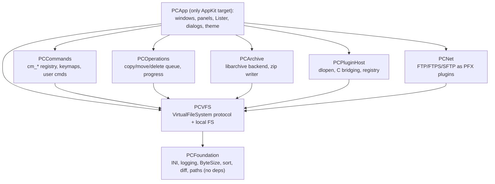
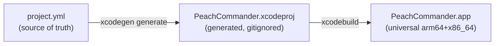

# Project overview

This page orients contributors and integrators to the Peach Commander codebase:
what the product is trying to be, the principles that shape its design, and the
concrete technology stack — languages, frameworks, modules, build system, and
external dependencies. It is written to be technically precise; the equivalent
end-user material lives in the user guide.

Where a design choice is load-bearing, this page points at the Architecture
Decision Record that justifies it. ADRs are binding and live in
[`DECISIONS.md`](https://github.com/) at the repository root; coding and layout
conventions live in `CONVENTIONS.md`; the canonical technology list is
`docs/architecture/tech-stack.md`.

> Note: Peach Commander has **no AI or machine-learning features**. It is a
> conventional native file manager. If you encounter documentation elsewhere
> that suggests otherwise, it is stale.

## What Peach Commander is

Peach Commander is a fast, keyboard-driven, dual-panel file manager for macOS in
the tradition of Total Commander (TC). The project goal (see `PLAN.md`) is
**feature parity with Total Commander on macOS**: the same interaction model
(function-key commands, TC selection semantics, ~150 named commands), the same
feature surface where it makes sense on the platform, and a **TC-compatible
plugin system** whose C ABIs mirror WCX/WFX/WLX/WDX function-for-function.

### Product philosophy

- **Total Commander parity, adapted to macOS.** Same muscle memory (F5 copy, F6
  move, Tab to switch panels, Space/Insert selection). Windows-only concepts
  (registry FS, 8.3 names) are explicitly marked `n/a-macos` in the feature
  inventory, each with a native replacement where one is sensible. The parity
  audit is tracked feature-by-feature in `docs/product/feature-inventory.md`.
- **Keyboard-first.** Every UI action routes through the command registry
  (`PCCommands`, `cm_*` commands) so that any command can be remapped, placed on
  the button bar, or invoked from the command line. Menu items never wire
  directly to controller selectors (see `CONVENTIONS.md` → UI conventions).
- **Native, not a port.** AppKit UI, native dialogs, Quick Look, Tags, Services,
  Trash, and Keychain integration. The app should feel like a Mac app while
  behaving like TC.
- **Fast and memory-frugal at scale.** Panels must render 100k+ rows fluidly and
  the target is a 1M-file directory listed in under 5 seconds. Performance
  drives several core architectural choices (see below).

### Supported platforms

| Property | Value |
|---|---|
| Minimum macOS | 13.0 (Ventura) — the deployment target |
| Architectures | Universal binary: Apple Silicon (`arm64`) + Intel (`x86_64`) |
| Distribution | Developer ID + notarized DMG (Sparkle updates), **not** the Mac App Store |
| Sandbox | Intentionally **off** — a file manager needs full-disk access |

## Technical guiding principles

These are the decisions a new contributor most needs to internalize. Each is a
formal ADR; do not reverse one without appending a superseding ADR.

- **AppKit, not SwiftUI, for anything performance-relevant** (ADR-001). Panels
  use a virtualized view-based `NSTableView` with custom drawing where profiling
  demands it. SwiftUI is permitted only for trivial auxiliary sheets (About,
  small dialogs) — never for panels, the Lister, or the operation UI.
- **`project.yml` is the source of truth for the Xcode project** (ADR-002). The
  `.xcodeproj` is generated by XcodeGen and is **gitignored**. Never hand-edit
  the project file; edit YAML and regenerate.
- **English for all code and docs** (ADR-003); the UI itself is localized (EN
  base, DE added later). All user-visible strings go through `String(localized:)`
  from day one.
- **Swift Concurrency, no new GCD** (ADR-008). The operation engine and I/O use
  actors and structured concurrency; cancellation via `Task`; progress via
  `AsyncStream` coalesced to ≤ 30 UI updates/second. The main thread only
  renders — all enumeration and I/O runs off-main.
- **A single load-bearing VFS abstraction.** Local disks, archives, FTP/SFTP,
  and plugin file systems are all `VirtualFileSystem` implementations in `PCVFS`;
  file operations are VFS→VFS. This is the keystone that everything else composes
  on. See the [Architecture overview](architecture-overview.md).
- **Config as plain INI, secrets in Keychain** (ADR-007). Human- and
  diff-friendly INI files; passwords never touch disk in cleartext.
- **Plugins are in-process C-ABI dylibs** (ADR-004). Maximum speed (content
  plugins are called per row) and function-for-function TC porting, at the cost
  that a crashing plugin can, in principle, crash the host — mitigated by a crash
  guard and per-plugin quarantine.

## Languages

- **Swift 5.10+** for essentially all of the application and engine code.
- **C** for the plugin ABI headers and the thin static-library shims that expose
  C dependencies to Swift as Clang modules (module maps). Contributors writing or
  porting plugins work against the C headers in `Plugins/SDK/*.h`.

Toolchain: **Xcode 16+**, Swift 5.10+, targeting macOS 13.

## Frameworks and system APIs

Peach Commander leans heavily on the platform rather than third-party code.

| Concern | API / framework |
|---|---|
| UI | **AppKit** (`NSWindow`/`NSView`/`NSTableView`), custom drawing |
| Networking | **Network.framework** (custom FTP/FTPS client in `PCNet`) |
| Secrets | **Security** framework — Keychain via `SecretStore` |
| Help & rich text views | **WebKit** (`WKWebView`, local content only) |
| Syntax highlighting (editor/Lister) | **tree-sitter** via `SwiftTreeSitter` + `Neon` |
| SFTP transport | **libssh2** (vendored, exposed through the `CSSH2` module) |
| Directory enumeration | `getattrlistbulk(2)` custom enumerator (ADR-009) |
| Copy engine | `copyfile(3)` with callbacks, `clonefile(2)` fast-path, streaming fallback for VFS |
| Archives | system **libarchive** (`/usr/lib/libarchive.dylib`) + own random-access ZIP reader/writer (ADR-005) |
| Hashing | **CryptoKit** (SHA family, MD5 via `Insecure`); CRC32 own/zlib |
| Icons / thumbnails / Quick Look | `NSWorkspace`, `QLThumbnailGenerator`, `QLPreviewPanel` |
| Logging | `os.Logger`, subsystem `com.peachcommander`, category = module name |

`docs/architecture/tech-stack.md` carries the full "system APIs cheat-sheet"
(watching, volumes, trash, permissions/ACL, clipboard, session restore) that
implementers should read before touching the relevant area.

### AI/ML

None. There is no LLM, embedding, model-inference, or "smart" feature anywhere in
the product or its dependencies.

## Module layout

The codebase is 8 Swift modules plus 12 C static-library targets. Swift
dependencies point **down** toward `PCFoundation`; **AppKit is imported only in
`PCApp`**. Engine modules never import `PCApp`, and `PCFoundation` imports none of
our own modules.

| Module | Responsibility | AppKit? |
|---|---|---|
| `PCFoundation` | INI parser, logging, `ByteSize`, natural sort, wildcard/regex helpers, Myers diff, path utilities | no |
| `PCVFS` | `VirtualFileSystem` protocol + local-FS implementation; the unifying abstraction | no |
| `PCOperations` | file operation engine: copy/move/delete queue, planning, progress | no |
| `PCArchive` | archive VFS backends (libarchive wrapper, random-access ZIP) | no |
| `PCPluginHost` | plugin loading, C-ABI bridging, plugin registry, crash guard | no |
| `PCNet` | FTP/FTPS (Network.framework) and SFTP (libssh2) as bundled PFX plugins | no |
| `PCCommands` | command registry (`cm_*`), shortcut mapping, user commands | no |
| `PCApp` | the AppKit application: windows, panels, dialogs, Lister, menus, toolbar, theme | **yes** |

The 12 C static-library targets are: the plugin-ABI modules **CPCX / CPDX /
CPFX / CPLX** (mirroring WCX/WDX/WFX/WLX), **CContrib** (a Peach-specific contrib
ABI) and **CPluginGuard** (the crash-guard shim); **CSSH2** (libssh2 module map);
and five vendored tree-sitter grammars **CTreeSitterJS / CTreeSitterPython /
CTreeSitterRust / CTreeSitterCSharp / CTreeSitterTypeScript**.

## Plugin system (at a glance)

Plugins are macOS bundles containing a dylib that exports the C entry points from
`Plugins/SDK/*.h` (UTF-8 strings, 64-bit sizes, TC function names preserved).
`PCPluginHost` `dlopen`s the bundle, resolves the symbols, and wraps each plugin
in a Swift adapter. Five types plus a contrib ABI are supported:

| Type | Bundle | TC analogue | Host adapter |
|---|---|---|---|
| PCX | `.pcxplugin` | WCX (packer) | `ArchiveFormatProvider` (PCArchive registry) |
| PFX | `.pfxplugin` | WFX (file system) | `VirtualFileSystem` (mounted under "Network") |
| PLX | `.plxplugin` | WLX (Lister) | `ListerViewProvider` (returns an `NSView`) |
| PDX | `.pdxplugin` | WDX (content) | `ContentFieldProvider` (columns/search/rename) |
| PTX | — | — | contrib/experimental |

Because plugins run **in-process**, robustness comes from a `sigsetjmp`-based
crash guard, per-plugin quarantine after repeated faults, and a version
handshake at load time. Out-of-process/XPC hosting is a post-1.0 hardening option
(ADR-004), not the current model.

## Build system

The project uses **XcodeGen** to generate the `.xcodeproj` from `project.yml`,
then builds with `xcodebuild`.

Helper scripts in `Tools/` wrap the flow:

| Script | Purpose |
|---|---|
| `Tools/bootstrap.sh` | install XcodeGen (Homebrew) and generate the project |
| `Tools/build.sh` | `xcodegen generate` + `xcodebuild` (Debug) |
| `Tools/test.sh` | run all test targets with readable output |
| `Tools/make-fixtures.sh` | generate perf/test file trees (100k-entry dirs, sparse big files) |
| `Tools/bench.sh` | run `PCPerfTests` against budget JSON |
| `Tools/make-dmg.sh` | build Release, (sign), package DMG |
| `Tools/make-appcast.sh` | generate the Sparkle appcast |

CI runs on **macos-14** runners. See [Getting started](dev-getting-started.md)
for the concrete first-build walkthrough.

## External dependencies

New third-party dependencies require a new ADR (`CONVENTIONS.md`). The current
set, pinned in `project.yml`:

| Dependency | Delivery | Used for |
|---|---|---|
| **Sparkle** 2.6.3 | SPM | Auto-updates — **declared but not yet integrated** into the app |
| **SwiftTreeSitter** + **Neon** | SPM | Incremental parsing / syntax highlighting in the editor and Lister |
| **TreeSitterJSON / TreeSitterC / TreeSitterJava** | SPM | tree-sitter grammars (JSON, C, Java) |
| tree-sitter JS/Python/Rust/C#/TypeScript | vendored C targets | additional grammars |
| **libssh2** | vendored, `CSSH2` module (Homebrew keg during dev) | SFTP transport for `PCNet` |
| **libarchive**, **zlib** | from macOS | archive read/write, CRC/compression |

Everything else is the OS. Note the libssh2 dev setup currently relies on the
Homebrew paths baked into `project.yml` (`/opt/homebrew/opt/libssh2`); for
distribution the dylib and its OpenSSL deps must be bundled with fixed install
names (tracked as a `make-dmg` TODO).

## Concurrency and persistence

- **Concurrency (ADR-008).** The operation engine is an `OperationQueue` actor
  running `FileOperation`s through **plan → execute → verify** phases. Progress
  is delivered over an `AsyncStream<OpEvent>` **coalesced to ≤ 30 Hz** so the UI
  is never flooded. Immutable directory snapshots (produced by a `DirectoryModel`
  actor) are what the table renders, which eliminates data races between listing
  and drawing.
- **Persistence (ADR-007).** Settings and session state are INI files under
  `~/Library/Application Support/PeachCommander/`, written by `ConfigStore` — an
  **actor** that performs debounced atomic writes. The config root can be
  redirected with the `-ConfigRoot` launch argument or the
  `PEACHCMD_CONFIG_ROOT` environment variable (used by tests and automation).
  **No `UserDefaults` is used for app configuration.** Secrets live in the
  Keychain via `SecretStore`. Full details in
  `docs/architecture/configuration.md`.

## Security and distribution model

- **App Sandbox is intentionally OFF.** A file manager needs unrestricted disk
  access, which the sandbox precludes; that also rules out the Mac App Store. The
  distribution model is **Developer ID + hardened runtime + notarized DMG**
  (ADR-006).
- **Entitlements** (`Resources/PeachCommander.entitlements`) enable exactly two
  hardened-runtime relaxations:
  `com.apple.security.cs.disable-library-validation` (so the loader accepts
  third-party, differently-signed plugin dylibs) and
  `com.apple.security.cs.allow-dyld-environment-variables`.
- The app currently builds **unsigned** (`CODE_SIGNING_ALLOWED=NO`). The signing
  and notarization procedure is documented in `RELEASE.md` but is **not
  automated** — the credentialed steps must be run by a maintainer with the
  Developer ID certificate and cannot run in CI.

## Directory watching — current reality

Panels reflect on-disk changes, but note the honest current state:
`FSEventsWatcher` **polls (~every 2 s)** rather than using true FSEvents.
`LocalFS.watch` returns `nil` (a placeholder), so the intended
`FSEventStreamCreate`-based push watching described in `tech-stack.md` is **not
yet wired up**. Anything relying on sub-second change notification should treat
this as a known gap, not settled behavior.

## Testing

Roughly **1304 tests across 9 targets** (one test target per module plus
`PCPerfTests`). Highlights:

- A **VFS conformance battery** that every `VirtualFileSystem` implementation must
  pass, so archive, network, and plugin backends behave identically.
- Live network tests gated behind the `PC_NET_LIVE` environment variable (skipped
  by default; require a reachable server).
- Performance fixtures generated by `Tools/make-fixtures.sh`, benchmarked against
  budgets via `Tools/bench.sh`.
- An XCUITest smoke test for the app shell.

Tests never touch the user's real home directory outside temp dirs, and they use
`-ConfigRoot` / `PEACHCMD_CONFIG_ROOT` to isolate configuration.

## Development environment

To build and hack on Peach Commander you need:

- macOS 13+ with **Xcode 16+** (command-line tools installed).
- **XcodeGen** (`brew install xcodegen`, or run `Tools/bootstrap.sh`).
- **libssh2** available at the Homebrew path referenced in `project.yml`
  (`brew install libssh2`) for the SFTP backend to link.

Typical loop: edit YAML/Swift → `Tools/build.sh` → `Tools/test.sh`. Never commit
the generated `.xcodeproj`. The step-by-step first build lives in
[Getting started](dev-getting-started.md); the layered design is in the
[Architecture overview](architecture-overview.md).

## Open questions

- **FSEvents watching** is unimplemented (polling placeholder). When it lands,
  the ~2 s latency and `LocalFS.watch` returning `nil` should be revisited here.
- **Sparkle** is declared as a dependency but not yet linked into the app; the
  auto-update path in `RELEASE.md` §5 is planned, not live.
- **Signing/notarization automation** is blocked on credentials and is currently
  a manual, maintainer-only procedure.
- **libssh2 bundling** for distribution (fixed install names for it and its
  OpenSSL dependencies) is an open `make-dmg` task.
