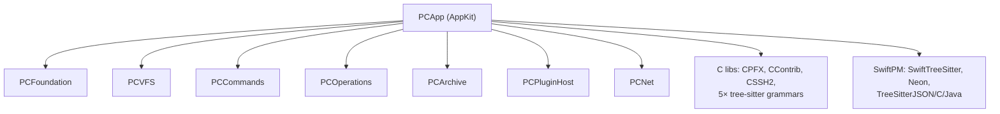
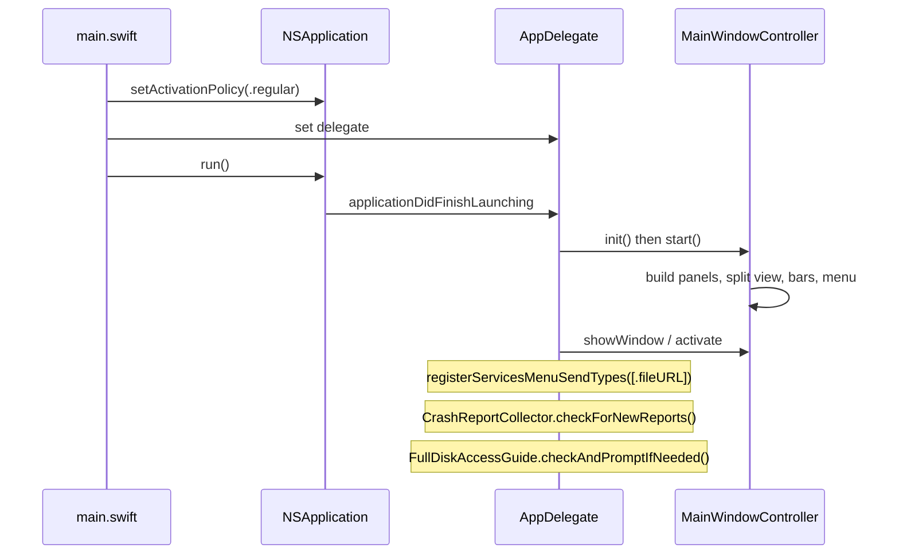

# PCApp

`PCApp` is the AppKit application layer of Peach Commander. It is the only build
target that imports `AppKit`, and it sits at the top of the dependency graph: it
links every engine framework, several C static libraries, and two Swift packages,
and turns them into the windows, panels, menus, dialogs, and tool windows the user
actually touches. Everything below `PCApp` (VFS, operations, archives, network,
plugin host, commands) is UI-agnostic; `PCApp` is where those services are wired
into an interactive dual-panel file manager.

## Purpose and responsibility

- Own the process entry point and application lifecycle (`main.swift` /
  `AppDelegate`).
- Present the dual-panel main window, its panels, and all the surrounding bars
  (path bar, status bar, drive bar, tab bar, button/toolbar, command line,
  function-key bar).
- Build and drive the main menu from the command registry, and translate
  keystrokes/menu clicks into engine calls.
- Host every tool window: the Lister (viewer), text/code editor, hex editor/viewer,
  find files, sync/compare, multi-rename, duplicate finder, FTP console, transfer
  manager, settings, and the various dialogs.
- Bridge in-process and external plugins into the UI: file-system providers,
  contributed commands/views, packers, listers, and content fields.
- Provide syntax highlighting (tree-sitter, one-shot and Neon-incremental) for the
  viewer and editor.
- In DEBUG builds only, expose `AutomationRunner` so tests and tooling can drive
  the real app deterministically.

`PCApp` deliberately holds **no** file-system, copy-engine, archive, or network
logic of its own — those live in the engine modules. It orchestrates them and owns
presentation, focus, persistence of window/session state, and error surfacing.

## Dependencies

`PCApp` depends on all six engine frameworks plus their supporting C libraries and
two SwiftPM packages. The declaration lives in `project.yml` (the generated
`.xcodeproj` is gitignored):

| Dependency | Why `PCApp` needs it |
|---|---|
| `PCFoundation` | `ConfigStore`, `ConfigPaths`, logging, shared value types |
| `PCVFS` | `VirtualFileSystem`, `Volume`, listing/navigation the panels render |
| `PCCommands` | `CommandRegistry`, `Keymap`, `PanelControllerProtocol`, `WindowControllerProtocol` |
| `PCOperations` | `TransferQueue`, `OperationKind`, `OperationControl`, resolvers |
| `PCArchive` | archive browse/pack backends (`PCXArchive`, `PCXArchiveFS`) |
| `PCPluginHost` | `PluginManager`, `PluginHost`, contribution manifests, crash guard |
| `PCNet` | FTP/FTPS/SFTP mounts, `FtpURL`, HTTP download options |
| `CPFX`, `CContrib` | C ABIs for external file-system and contribution plugins |
| `CSSH2` | libssh2 module map (SFTP) |
| 5× tree-sitter grammar libs + SwiftTreeSitter / Neon | syntax highlighting |
| system frameworks | `AppKit`, `CoreServices`, `Security` (Keychain), `Network`, `WebKit` |

**What depends on `PCApp`:** nothing in the shipping product — it is the leaf/top
of the graph. The only external consumer is the test target `PCUITests`
(`Tests/PCUITests`), which launches the built app as an `XCUIApplication`. `PCApp`
is a `type: application` target, not a library, so it exposes no linkable public
API to other modules; its `public` symbols exist only for intra-module clarity and
the plugin-host protocols it implements.

Design rationale: AppKit (not SwiftUI) and the strict "AppKit only in `PCApp`" rule
are recorded in **ADR-001**; XcodeGen + local SwiftPM packages in **ADR-002**. Keeping
AppKit isolated is what lets the engine modules stay testable without a UI.

## Lifecycle

The process is a hand-rolled AppKit app with no storyboard and no `@main`:

- **Startup.** `main.swift` creates `NSApplication`, sets a regular activation
  policy, installs `AppDelegate`, and calls `run()`.
  `applicationDidFinishLaunching` builds a `MainWindowController`, calls
  `start()` **before** `showWindow` (replacing an already-visible window's
  `contentView` collapses it under Auto Layout), then registers the Services menu
  send type (`.fileURL`, via `NSServicesMenuRequestor`), checks for new crash
  reports, and prompts for Full Disk Access if missing.
- **`MainWindowController.init()`** resolves `ConfigPaths.resolve()` and opens the
  `ConfigStore` actors (`mainConfig`, `session`, `hotlist`) — this is where
  `-ConfigRoot` / `PEACHCMD_CONFIG_ROOT` take effect (**never** `UserDefaults` for
  app config).
- **`start()`** is the deterministic setup entry point (used instead of
  `windowDidLoad`, which is unreliable for programmatic windows). It creates the
  two `PanelController`s, builds the `NSSplitView`, all bars, the preview column,
  and wires the menu through the command registry; it also registers the
  `ViewContainerRegistry` mount points and loads plugins.
- **Shutdown.** `applicationShouldTerminateAfterLastWindowClosed` returns `true`.
  `applicationShouldTerminate` returns `.terminateLater`, spawns a
  `Task { await controller.persistNow() }` to flush session/config, then calls
  `NSApp.reply(toApplicationShouldTerminate: true)`.

## Key types and interfaces

`PCApp` is large (roughly 90 Swift files; `MainWindowController` alone is ~6,000
lines). The important seams:

### Application shell

| Type | Role |
|---|---|
| `AppDelegate` (`main.swift`) | Owns the main window controller; persists on quit; `CrashReportCollector`. |
| `MainWindowController` | The center of gravity. Conforms to `WindowControllerProtocol` (defined in `PCCommands`), `NSWindowDelegate`, `NSSplitViewDelegate`. Owns both `PanelController`s, the `CommandRegistry`, `VolumeManager`, all config stores, the `PluginManager`, the button bar, command line, function-key bar, preview panel, and every tool window. Also conforms to the plugin host protocols `ToolHost`, `ContributionHost`, and `FileSystemHost`. |
| `ContentViewController` | Retained `NSViewController` that manages the split panes (the window uses a plain `contentView`, not `contentViewController`, to stay freely resizable). |
| `MainWindow` | `NSWindow` subclass for the main window. |

`MainWindowController` is split across
`Controllers/MainWindowController.swift`,
`Controllers/PanelController+Clipboard.swift`, and
`Controllers/PanelController+Operations.swift` (extensions), plus the DEBUG-only
`AutomationRunner.swift` extension.

### Panels

| Type | Role |
|---|---|
| `PanelController` | Conforms to `PanelControllerProtocol` (from `PCCommands`). One per panel; owns a panel's tabs, sort, cursor, selection, current VFS, and the async `loadDirectory`/`sort`/navigation methods. |
| `PanelView` | Container `NSView` for a panel (path bar + list/tree/grid + status bar). |
| `PanelListView` | View-based `NSTableView` (`NSTableViewDataSource`/`Delegate`) — the default file list. |
| `PanelTreeView`, `IconGridView` | Alternate presentations (tree and thumbnail grid). |
| `PanelCells.swift` | Cell views: `DirectoryCellView`, `PlainCellView`, `TagCellView`, `CursorRowView`, `SortableHeaderView`. |
| `PanelColumn`, `SortDirection`, `PanelEntryHelpers` | Column identity, sort model, entry helpers. |

### Bars and chrome

`PathBarView`, `StatusBarView`, `DriveBarView`, `TabBarView`, `ButtonBarView`
(+ `ButtonBarEditorWindowController`, `DroppableButton`), `CommandLineView`,
`FunctionKeyBar`, `PreviewPanelView` / `PreviewToggleHandle`, `MinimapView`.

### Menus and commands

`AppMenu` builds the menu bar; `MnuMenuBuilder` builds menus from `.mnu` files;
`KeymapMenu` and `DocumentMenus`/`ContributionMenus` inject dynamic items.
`ContributionMenuInjector` and `ContributionMenuValidator` splice plugin-contributed
menu items in and validate their `when` conditions live. Command dispatch runs
through the `CommandRegistry` (from `PCCommands`) and, for plugin commands, through
`ContributionRegistry`.

### Tool windows and dialogs

Viewer/editor family: `ListerWindowController` (with `TextListerView`,
`CodeListerView`, `HexListerView`, `ListerWebView`), `EditorWindowController`
(`EditorCodeTextView`), `HexEditorWindowController`. Comparison/sync:
`DiffWindowController`, `BinaryCompareWindowController`, `SyncWindowController`
(`SyncScanner`/`SyncExecutor`). Bulk tools: `MultiRenameWindowController`,
`DuplicateFinderWindowController`, `FindFilesWindowController`. Network:
`FtpConnectionManagerWindowController`, `FTPConsoleWindowController`,
`DownloadURLWindowController`, `TransferManagerWindowController`. Settings/info:
`SettingsWindowController`, `PluginsWindowController`, `KeysWindowController`,
`ColumnsConfigWindowController`, `TypeColorsWindowController`,
`CommandBrowserWindowController`, `OpenSourceWindowController`,
`ProcessTreeWindowController`, `HotlistManagerWindowController`,
`ErrorLogWindowController`, `ShellOutputWindow`. Sheets/dialogs live under
`Dialogs/`: `InputDialog`, `AttributesDialog`, `ProgressDialog`,
`OverwriteResolver` (`InteractiveResolver`), `MarkColorDialog`,
`ACLEditorWindowController`, plus `PropertiesDialog`, `PackOptionsDialog`,
`SelectUnselectDialog`.

### Background transfers

`TransferManager` (`@MainActor` singleton, `TransferManager.shared`) is the
app-wide background transfer queue. Each enqueued `OperationKind` becomes a `Job`
(with a `TransferQueue` + `OperationControl` from `PCOperations`) that the user can
pause/resume/cancel and, for held download-list jobs, start on demand. It consumes
the queue's `AsyncStream` of progress/completed/failed/cancelled events and
republishes via an `onChange` closure the window observes. `BackgroundSkipResolver`
is its non-interactive `OperationResolver`: overwrite-on-conflict, skip-and-record
per-file errors, then surface them through `ErrorLogWindowController` when the job
ends.

### Plugin host bridges

`PCApp` implements the host side of the C plugin ABIs:

- **`ToolHost`** (`ToolPlugin.swift`) — base host services for an action/tool:
  cursor path, local cursor path (extracts from archive if needed), selection,
  Trash/delete via the op engine, panel reload, present info. Implemented by
  `MainWindowController`.
- **`ContributionHost: ToolHost`** (`Plugins/ContribHostBridge.swift`) — the
  unified contribution host. `ContribHostBridge` builds the `PcHostServices`
  C-callback table from a `ContributionHost` using non-capturing
  `@convention(c)` trampolines that recover the bridge from the opaque `host`
  token; async host data (cursor/selection) is pre-resolved into a snapshot so the
  synchronous C callbacks can serve it. Passwords go through a Keychain-backed
  `crypt` callback (service `com.peachcommander.contrib`).
- **`FileSystemHost` / `FileSystemPlugin`** (`FileSystemPlugin.swift`) — the PFX
  file-system provider seam and its in-process `FileSystemPluginRegistry`.
  `Plugins/PFXHostBridge.swift` builds `PfxHostServices` for **external**
  `.pfxplugin` bundles and adapts them via `LoadedPFXPlugin` (static drives →
  drive bar; interactive connect → a mounted `PFXFileSystem`); its `crypt`
  callback uses Keychain service `com.peachcommander.pfx`.
- **`ContributionRegistry`** (`ContributionRegistry.swift`) — the single source of
  truth for enabled-plugin UI contributions. It aggregates each enabled plugin's
  declared contributions (parsed from the plugin's `Info.plist` — **no dylib code
  is run just to decide presence**) and dispatches a contributed command to its
  behavior ABI. `onChange` triggers a menu rebuild + `ViewContainerRegistry`
  refresh.
- **`ViewContainerRegistry`** (`ViewContainerRegistry.swift`) — named mount points
  ("sidebar", "titlebar", "settings", …) where a plugin can embed an `NSView` via
  `PcMakeView`/`PcCloseView`. `PluginViewMount` owns one embedded view's lifetime
  and retains its host bridge for as long as the view may call back.

### Syntax highlighting

- `TreeSitterLanguages` maps file extensions to grammar configurations (bundled
  grammars + SwiftPM grammar packages).
- `TreeSitterHighlighter` — one-shot highlighting for read-only content (the
  viewer's text/code path).
- `NeonEditorHighlighter` — incremental highlighting for the live editor
  `NSTextView`, driven by Neon (re-highlights only affected ranges as the user
  types).
- `SyntaxCaptureColors` maps tree-sitter capture names to `Theme` colors and is
  shared by both. `SyntaxHighlightApplier`, `SyntaxTheme`, `SymbolOutline`
  (`SymbolSidebar`, `SymbolOutlineController`, `XMLOutlineController`) round out
  the code-view feature set.

### Persistence and theming

- `Theme` (`Theme.swift`) — the `public struct Theme` with `Colors`, `Fonts`,
  `Metrics`, and light/dark palettes; drives all custom drawing.
- `WorkspaceStore` (`actor`) — named panel layouts persisted to `workspaces.ini`
  via `ConfigStore`.
- `RenamePresetStore` — multi-rename presets.
- Config is read/written through `ConfigStore` actors resolved from `ConfigPaths`;
  secrets go to the Keychain (via the bridges' `crypt` callbacks), never to files.

## Inputs and outputs

- **Inputs:** user events (keyboard/mouse/menus, drag-and-drop, Services menu file
  URLs); launch arguments (`-ConfigRoot`, `-LeftPath`, `-RightPath`,
  `-AppleLanguages`/`-AppleLocale`, and DEBUG `-AutomationScript`); INI config +
  session files under `~/Library/Application Support/PeachCommander`; installed
  plugin bundles discovered by `PluginManager`; and the async results of engine
  calls (listings, operation progress, network events).
- **Outputs:** the rendered UI; file-system mutations (delegated to
  `PCOperations`/`PCVFS`); persisted config/session/workspaces (via `ConfigStore`);
  Keychain secrets; and, for automation/tests, dump files written by
  `AutomationRunner`.

## Threading and concurrency

- The entire UI layer is main-thread. `MainWindowController`, `PanelController`,
  `TransferManager`, and the plugin bridges are `@MainActor`. AppKit rendering,
  menu validation, and event handling all run on the main actor by construction.
- Long-running work is delegated to the engine actors and consumed as
  `AsyncStream`s. Panel loads (`loadDirectory`), selection queries, and transfer
  jobs are `async`; the UI awaits them and updates on the main actor.
- The plugin C-ABI bridges cross into synchronous C from the main actor using
  `MainActor.assumeIsolated` inside `@convention(c)` trampolines (the callbacks are
  only ever invoked on the main thread). The bridge object itself is long-lived —
  its opaque token must remain valid for any window/view that calls back after the
  triggering command has returned.
- `TransferManager` serializes each job's pause/resume/cancel calls through a
  `controlChain` `Task` so a fast Pause→Resume reaches the `OperationControl` actor
  in click order.
- Config persistence is debounced and atomic inside the `ConfigStore` actor; the
  UI just calls `persistNow()`/schedules a save. This follows the concurrency model
  in **ADR-008** (Swift actors + `AsyncStream`, no new GCD).

## Error handling

- **Interactive operations** present sheets: `InteractiveResolver`
  (`Dialogs/OverwriteResolver.swift`) resolves overwrite conflicts and per-file
  errors with a real dialog over the main window; `ProgressDialog` shows progress.
- **Background operations** cannot pop dialogs, so `BackgroundSkipResolver`
  overwrites on conflict, skips-and-logs per-file errors, and surfaces a summary in
  `ErrorLogWindowController` when the job finishes.
- **Plugins** run in-process, so a plugin crash would take down the app; the plugin
  host wraps plugin entry points in a `sigsetjmp`-based crash guard with per-plugin
  quarantine (the `pluginID` scopes the quarantine — see `loadPlugins()` /
  `PCPluginHost`). Manifest parsing runs no plugin code, so a broken plugin can be
  disabled without ever loading its dylib.
- **App crashes** are collected on next launch by `CrashReportCollector` and
  surfaced to the user.
- Presence/absence errors in config are handled by defaulting (`ConfigStore`
  returns supplied defaults); missing Full Disk Access is detected proactively by
  `FullDiskAccessGuide`.

## How it is tested

- Because `PCApp` is an application target (not a library), most of its logic is
  validated indirectly: the ~1,304-test suite exercises the engine modules that
  `PCApp` orchestrates.
- **`Tests/PCUITests`** (`MainMenuUITests`) is an XCUITest smoke suite. It launches
  the built app as an `XCUIApplication` with `-AppleLanguages (en)`,
  `-AppleLocale en_US`, an isolated `-ConfigRoot`, and fixed `-LeftPath`/`-RightPath`
  so assertions are deterministic, then checks the window and the menu bar
  structure (File / Commands / Net / Mark / View / Configuration, View ▸ Tree,
  etc.) via Accessibility — no screenshots or synthetic keystrokes.
- **`AutomationRunner`** (DEBUG only, `-AutomationScript <path>`) is the preferred
  way to drive deeper flows — including the network connect path — deterministically
  without fragile GUI clicking. It runs one verb per script line (`left`, `right`,
  `active`, `focus`, `enter`, `cmd`, `connect`, `disconnect`, `wait`, `dump`,
  `view`, `editdump`, `menudump`, `menuclick`, `reloadmenu`, `symbols`, and many
feature-specific verbs) and
  can dump live view state (visible entries, rendered outline rows, menu trees,
  context menus) to files for a driver to assert on. It is compiled out of release
  builds (`#if DEBUG`).

## Extension points

`PCApp` is the host end of every plugin seam; new capability is added *through*
these, not by editing `PCApp` core:

- **File-system providers** — register a `FileSystemPlugin` with
  `FileSystemPluginRegistry.shared` (in-process), or ship a `.pfxplugin` bundle
  adapted by `LoadedPFXPlugin` over `PFXHostBridge`. Contributes drive-bar chips
  and/or an interactive connect that mounts a `VirtualFileSystem`.
- **Contributed commands and views** — declare them in the plugin's `Info.plist`;
  `ContributionRegistry` picks them up and dispatches through the unified
  `PcHostServices` ABI (`ContribHostBridge`). Views mount at named seams via
  `ViewContainerRegistry` / `PluginViewMount`.
- **Packers / archive browsing** (`PCX`) — `loadPlugins()` wires enabled PCX
  plugins into both panels for browse and into the pack dialog for creation.
- **Listers / content viewers** (`PLX`) — `makeListerPlugins()` loads enabled PLX
  listers for the `ListerWindowController`.
- **Content fields / columns** (`PDX`) — `ContentFieldRegistry` exposes plugin
  fields as selectable panel columns.
- **Host services** — extend `ToolHost`/`ContributionHost` when a plugin needs a
  new capability from the app; add the trampoline in `ContribHostBridge` and the
  default in the protocol extension.

## Security and distribution notes

- The **App Sandbox is intentionally off**: a general file manager needs full-disk
  access. The distribution model is Developer ID + hardened runtime (see
  `RELEASE.md`), **not** the Mac App Store. Entitlements include
  `disable-library-validation` (to `dlopen` unsigned plugin dylibs) and
  `allow-dyld-environment-variables`. The app is currently **unsigned**;
  signing/notarization is documented but not yet automated.
- `SendUserFile`-style file distribution is not relevant here, but note that
  `PCApp` writes plugin/network passwords only to the **Keychain** (the `crypt`
  callbacks), never to config files.

## Open questions

- **Directory watching is polling, not FSEvents.** `FSEventsWatcher` currently
  polls (~2 s); true FSEvents is a placeholder (`LocalFS.watch` returns `nil`).
  `PCApp`'s panels rely on whatever `PCVFS` provides, so panel auto-refresh
  inherits the polling behavior until real FSEvents lands.
- **Sparkle auto-update is declared but not integrated.** The package is present in
  `project.yml` but there is no update UI or feed wired into `PCApp` yet.
- **View containers are only partially wired.** `ViewContainerRegistry` supports
  arbitrary named seams, but today only a subset (sidebar/titlebar/settings) is
  actually mounted; more seams attach the same way when needed.
