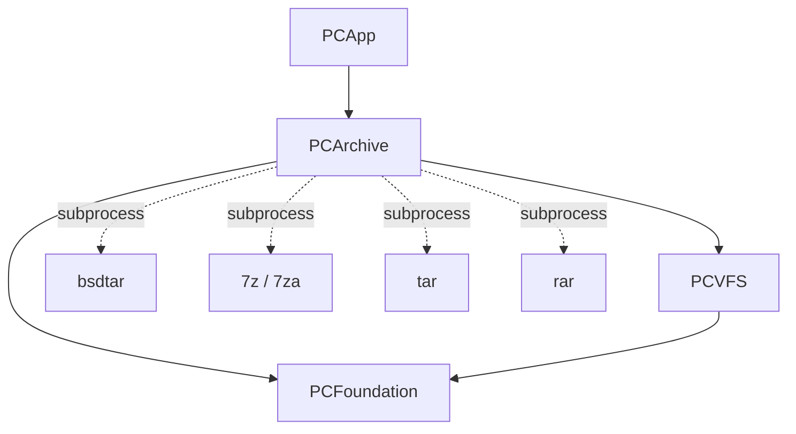

# PCArchive

`PCArchive` is Peach Commander's archive engine. It lets the app *browse an
archive as if it were a folder* (read-only), *extract* it, *create* new
archives, and perform limited *in-place edits* of zip files. It sits above
`PCVFS` — its central abstraction, `ArchiveFS`, is a `VirtualFileSystem` — and
below `PCApp`, which drives the pack/unpack/edit commands and password prompts.

## Purpose and responsibility

The module has four responsibilities, each with a distinct entry point:

1. **Browse** — present a zip/tar/… file as a mounted, read-only filesystem
   (`ArchiveFS`), backed by pluggable readers.
2. **Extract** — walk any such filesystem to disk (`ArchiveExtractor`).
3. **Pack** — create archives in many formats by driving external CLI packers
   (`PackEngine`).
4. **Edit** — add/remove/rename entries inside an existing zip by full rewrite
   (`ArchiveEditor`).

Reading of the two "hot" formats (zip and tar/tar.gz) is implemented in pure
Swift with no third-party dependency — parsing uses Foundation `Data`, and
DEFLATE inflate/deflate use the system **Compression** framework
(`compression_decode_buffer` / `compression_encode_buffer` with
`COMPRESSION_ZLIB`, which produces *raw* RFC 1951 DEFLATE). Encryption uses
**CommonCrypto**. Everything else (exotic read formats, all packing) is
delegated to system command-line tools.

> **Note on ADR-005.** `DECISIONS.md` (ADR-005) frames PCArchive as "wraps
> libarchive for read". In the current source, PCArchive does **not** link
> `libarchive` directly. Instead it (a) ships its own random-access
> `ZipReader`/`ZipWriter` and a `TarReader` (the fast in-archive browsing path
> ADR-005 anticipated), and (b) reaches the remaining libarchive-supported
> formats by shelling out to `bsdtar` (which *is* libarchive) rather than
> linking the library. Packing shells out to `7z`/`tar`/`rar`. The ADR's intent
> (one battle-tested engine for the long tail, our own reader for speed) holds;
> the mechanism is subprocess invocation, not linkage. Treat this as the
> authoritative description.

## Dependencies

**Needs (linked):** `PCFoundation` and `PCVFS`. `ArchiveFS` conforms to
`PCVFS`'s `VirtualFileSystem` protocol and produces `VFSEntry` / `VFSPath` /
`VFSEntryBatch` / `VFSReadStream` values; it throws `VFSError`. System
frameworks: `Compression` (DEFLATE) and `CommonCrypto` (WinZip AES). Declared in
`project.yml` — the target has no third-party linkage.

**Needs (runtime, optional):** external binaries discovered on `PATH`-like
directories: `bsdtar` (browse of non-zip/tar formats), `7z`/`7za`, `tar`, `rar`
(packing). Absence degrades gracefully — a format simply becomes unavailable.

**Depended on by:** `PCApp` only. Concretely
`Controllers/MainWindowController.swift`,
`Controllers/PanelController+Operations.swift`, `PackOptionsDialog.swift`, and
`SyncWindowController.swift` (zip-sync). The file-search engine also opens
archives through an `ArchiveFS` opener to search inside them (see
`SearchInArchiveTests`).

## Public interfaces and key types

### ArchiveFS — read-only VFS over an archive

`public final class ArchiveFS: VirtualFileSystem, @unchecked Sendable`
(`ArchiveFS.swift`). Presents a zip or tar archive as a filesystem rooted at
`/`, `scheme = "zip"`, `capabilities = [.read]`.

- `init?(archiveFileURL:fsID:)` — opens the file. Format detection is
  extension-aware: for extensions in `ShellArchiveSource.handledExtensions`
  (`cpio`, `iso`, `cab`, `lzh`, `lha`, `xar`, `pax`, `ar`, `cpgz`, `img`) it
  tries `ShellArchiveSource` first, otherwise `ZipReader` then `TarReader` then
  `ShellArchiveSource`. Extension-first ordering exists because the lenient
  `TarReader` would otherwise mis-claim libarchive-only formats (F-130).
  Returns `nil` when nothing can parse the file.
- On open it eagerly builds an in-memory tree: one `Node` per member keyed by
  normalized full path, plus a `childOrder` adjacency map. Because many archives
  omit explicit directory entries, intermediate directory nodes are
  **synthesized** from each member's path (`ensureDirectory`).
- `VirtualFileSystem` conformance: `list` (yields a single `VFSEntryBatch` from
  the pre-built tree), `stat`, `openRead` (returns `ArchiveReadStream`),
  `localFileIfAvailable` (materializes a member to a temp file). All mutating
  operations — `openWrite`, `mkdir`, `delete`, `rename`, `setAttributes` — throw
  `VFSError.unsupported`. `watch` returns `nil`.
- **Encryption support:** `var password: String?` (set by the host after
  prompting), `hasEncryptedEntries: Bool`, and `passwordIsValid() -> Bool`
  (tries the first encrypted member so a Keychain-remembered password can be
  validated before use — F-136).

`ArchiveReadStream` (`final class … VFSReadStream`) chunks already-decompressed
in-memory bytes at 1 MiB, mirroring `LocalReadStream`'s shape.

### ArchiveSource / ArchiveMember — the reader abstraction

`ArchiveSource.swift` defines the format-agnostic backend contract so
`ArchiveFS` shares its tree/list/stat/read logic across formats:

- `public struct ArchiveMember: Sendable` — metadata only: normalized `path`
  (no leading `/`; directories end `/`), `uncompressedSize`, `isDirectory`,
  `modified: Date?`, `isEncrypted`.
- `public protocol ArchiveSource: AnyObject` — `var members: [ArchiveMember]`
  and `func data(atIndex:password:) throws -> Data`. The index into `members`
  *is* the byte-access handle.

Three conformers: `TarReader` (direct), `ShellArchiveSource` (direct), and
`ZipReader` via an adapter extension in the same file (member order mirrors
`ZipReader.entries`, so one index serves both).

### ZipReader — pure-Swift zip parser/extractor

`public final class ZipReader` (`ZipReader.swift`). Parses the classic
(non-ZIP64) End-Of-Central-Directory → central-directory layout via a
bounds-checked little-endian `ByteReader`, exposing `let entries: [ZipEntry]`.

- `init?(fileURL:)` returns `nil` for a missing EOCD or malformed central
  directory. `findEOCD` scans backwards allowing up to a 64 KB archive comment.
- `data(for:password:)` seeks to the local header, reads the compressed bytes,
  decrypts if needed, then inflates. Supported methods: **store (0)** and
  **DEFLATE (8)**; anything else throws `ZipError.unsupportedCompression`.
- **Encryption:** classic PKWARE ZipCrypto (12-byte header, check byte against
  CRC or mod-time high byte for streamed/data-descriptor entries — see
  `ZipCryptoKeys`) and WinZip AES (method 99; strength and real method read from
  the `0x9901` extra field, decrypted via `WinZipAES`).
- `verify() -> [IntegrityProblem]` decompresses every entry and checks size +
  CRC-32, backing the "Test archive" command (F-135).
- `static func inflate(_:expectedSize:)` is internal so `TarReader` can reuse it
  for gzip payloads.
- Errors: `enum ZipError` — `malformed`, `unsupportedCompression`,
  `inflateFailed`, `passwordRequired`, `wrongPassword`, `encryptedAES`.
- **Scope limits (intentional MVP):** no ZIP64, no multi-disk; filenames decoded
  UTF-8 with Latin-1 fallback (not full CP437).

### ZipWriter — pure-Swift zip writer

`public enum ZipWriter` (`ZipWriter.swift`). `create(at:files:)` takes
`[(path:String, data:Data)]` and writes the same non-ZIP64 layout `ZipReader`
reads. Each entry is DEFLATE-compressed only when that is smaller than the raw
bytes (else stored); a path ending in `/` with empty data is a directory entry.
Sets the UTF-8 filename flag (GP bit 11). It also owns the shared `crcTable` and
`crc32(of:)` (reused by `ZipReader.verify()` and `ZipCryptoKeys`). Errors:
`enum ZipWriteError`. Scope: no ZIP64, no encryption, no comment.

### TarReader — pure-Swift tar / tar.gz reader

`public final class TarReader: ArchiveSource` (`TarReader.swift`). Parses POSIX
`ustar` and GNU tar 512-byte blocks; transparently gunzips a `1f 8b` stream
first (payload is raw DEFLATE, sized from the gzip ISIZE trailer, inflated via
`ZipReader.inflate`). Handles GNU long names (`L`), pax extended headers
(`x`/`g` `path=`), the `ustar` prefix+name split, old-style v7 headers via a
heuristic, and `./`-prefixed members. Member data are returned as slices of the
in-memory tar buffer. `init?` returns `nil` when no valid header is found so the
opener can fall through to another format.

### ShellArchiveSource — bsdtar fallback

`public final class ShellArchiveSource: ArchiveSource` (`ShellArchiveSource.swift`).
For the libarchive long-tail formats. Lists via `bsdtar -tvf` (one verbose
parser covers every format) and extracts a single member via `bsdtar -xOf` to
stdout, keying off the *raw* listed member string. Locates `bsdtar` (or `tar`)
under `/usr/bin`. `init?` returns `nil` if the tool is missing or the listing is
empty.

### ArchiveExtractor — extract a VFS tree to disk

`public enum ArchiveExtractor` (`ArchiveExtractor.swift`). `extractAll(from:to:)`
recursively walks any `VirtualFileSystem` (typically an `ArchiveFS`) writing each
member under `destination`, returning `Result(files:bytes:)`. Backs
`cm_UnpackFiles`. It is `async`, honors `Task` cancellation between entries, and
caps a single member at **512 MiB** (`perFileLimit`) to guard against a crafted
"zip-bomb" size claim.

### PackEngine — create archives via external tools

`public enum PackEngine` (`PackEngine.swift`). `pack(items:to:options:)` drives
a system packer through `Foundation.Process`.

- `enum PackFormat`: `zip`, `sevenZip`, `tar`, `tarGz`, `tarBz2`, `tarXz`,
  `rar`, each with `fileExtension`, `supportsEncryption`, `supportsSplit`.
- `struct PackOptions`: `format`, `password?`, `splitSize?` (bytes/volume),
  `level` (0–9).
- Tooling: tar family → `tar` (`-cf`/`-czf`/`-cjf`/`-cJf`); `zip`/`sevenZip` →
  `7z`/`7za` (AES-256 via `-mem=AES256` / `-mhe=on`, split via `-v…b`); `rar` →
  the proprietary `rar` binary. Tools are resolved by `toolPath(_:)` across
  `/opt/homebrew/bin`, `/usr/local/bin`, `/usr/bin`, `/bin`.
- `enum PackError`: `toolNotFound`, `unsupportedOption`, `noItems`,
  `failed(String, Int32)` (stderr + exit code). Backs `cm_PackFiles` /
  `PackOptionsDialog` (F-132/F-136/F-138). Items must share a parent directory;
  the process runs from that parent so entries are stored by basename, and any
  pre-existing target (including split volumes) is removed first.

### ArchiveEditor — in-place zip edits

`public enum ArchiveEditor` (`ArchiveEditor.swift`). Because zip has no cheap
in-place mutation, `remove`, `rename`, and `add` all **read surviving entries
through `ZipReader` and re-emit the whole archive with `ZipWriter`** (F-133;
copy-into-archive F-139). `add` walks local directories recursively.
`enum ArchiveEditError.unreadableArchive`. **Caveat:** the rewrite does not
preserve modification timestamps (ZipWriter stamps write time); byte contents
are preserved exactly.

### WinZipAES — AES-encrypted zip decryption

`enum WinZipAES` (`WinZipAES.swift`, internal). `decrypt(_:password:strengthCode:)`
implements the AE-1/AE-2 body layout (salt | 2-byte verifier | AES-CTR
ciphertext | 10-byte HMAC-SHA1) using CommonCrypto PBKDF2-HMAC-SHA1 (1000 iters)
for key derivation and a hand-rolled **little-endian** 128-bit CTR (CommonCrypto's
built-in CTR is big-endian, so the keystream is computed manually via ECB).
Verifier or HMAC mismatch → `ZipError.wrongPassword`.

## Inputs and outputs

| Concern | In | Out |
|---|---|---|
| Browse | archive file `URL` + `fsID` | an `ArchiveFS` (a `VirtualFileSystem`) |
| Read member | `VFSPath` | `ArchiveReadStream` of `Data` chunks |
| Extract | a `VirtualFileSystem` + destination `URL` | files on disk + `ArchiveExtractor.Result` |
| Pack | local paths + `PackOptions` | an archive file (or split volumes) |
| Edit | zip `URL` + path/entry lists | rewritten zip at the same `URL` |
| Verify | (implicit, whole archive) | `[ZipReader.IntegrityProblem]` |

## Lifecycle

`ArchiveFS` is short-lived and load-once: `init?` reads the whole file (or the
tar bytes) into memory and materializes the full node tree up front; there is no
lazy/streaming central-directory scan. Subsequent `list`/`stat` are pure
in-memory lookups, and `openRead` decompresses on demand from the retained
bytes. There is no explicit teardown — the instance and its buffer are released
when the mount is dismissed. Temp files created by `localFileIfAvailable` land
under `FileManager.temporaryDirectory` in a per-mount subdirectory and are the
caller's to clean up. `PackEngine` and `ArchiveEditor` are stateless enums
operating per call.

**Implication:** because reads hold the entire (uncompressed, for tar) archive
in memory, PCArchive is tuned for interactive browsing of ordinary archives, not
for streaming multi-gigabyte files.

## Threading and concurrency

- `ArchiveFS` is `@unchecked Sendable`: after `init`, its `nodes`/`childOrder`
  are immutable; the only mutable member is `password`, expected to be set by
  the host before reads. `list` is synchronous internally but exposed as an
  `AsyncThrowingStream`; `stat`/`openRead`/`localFileIfAvailable` are `async` to
  satisfy the protocol though the work is CPU/IO-bound and synchronous.
- `ArchiveExtractor.extractAll` is `async` and cooperatively cancellable
  (`Task.isCancelled` checked per entry and per chunk).
- `PackEngine.pack` and `ShellArchiveSource` block on `Process.waitUntilExit()`;
  callers (in `PCApp`) run them off the main actor.
- `TarReader`/`ZipReader`/`ZipWriter` are not internally synchronized; instances
  are used from a single task at a time.

## Error handling

Errors are typed per concern: `ZipError`, `ZipWriteError`, `PackError`,
`ArchiveEditError`, and `VFSError` (surfaced by the `ArchiveFS` protocol
methods — notably `.notFound`, `.unsupported`). Detection failures are modeled
as `nil` from failable initializers (`ZipReader`/`TarReader`/`ShellArchiveSource`/
`ArchiveFS` `init?`) so the opener can cascade through formats. Diagnostic
strings in `ZipError.malformed` are explicitly *not* for end-user display.
Integrity is a first-class, non-throwing result via `verify()`.

## How it is tested

Tests live under `Tests/PCArchiveTests` (part of the module suite):

- `ZipReaderTests`, `ZipWriterTests` — round-trips against the pure-Swift
  reader/writer.
- `TarReadTests` — ustar/GNU/pax and tar.gz parsing.
- `ZipCryptoTests`, `ZipAESReadTests` — classic ZipCrypto and WinZip AES
  decryption (fixtures produced by the system `zip`/`7z`, skipped when the tool
  is absent via `XCTSkipUnless`).
- `ArchiveFSTests` — tree building, listing, stat, read over synthesized dirs.
- `ArchiveExtractorTests` — full-tree extraction and the byte/file counts.
- `PackEngineTests` — format/args/encryption/split behavior (tool-gated).
- `ArchiveEditorTests` — add/remove/rename rewrite semantics.
- `SearchInArchiveTests` — the search engine descending into an `ArchiveFS`.

Many tests generate fixtures with real system tools and skip when those tools
are unavailable, so the suite stays green on a minimal machine.

## Extension points

- **New read format:** conform a new type to `ArchiveSource` and slot it into
  `ArchiveFS.init?`'s detection cascade; the tree/list/stat/read machinery is
  then reused unchanged.
- **New pack format:** add a `PackFormat` case and a branch in
  `PackEngine.command(for:…)`; `toolPath` already handles binary discovery.
- **Wider libarchive coverage without new code:** add the extension to
  `ShellArchiveSource.handledExtensions` (assuming `bsdtar` reads it).
- **Encryption:** extend `WinZipAES` / `ZipCryptoKeys` for new schemes behind
  the existing `data(for:password:)` decrypt-then-inflate seam.

## Open questions

- **ZIP64 / large archives.** The native reader and writer are non-ZIP64 by
  design; archives above 4 GiB (or with >65535 entries) are out of scope and the
  tar gunzip path assumes a <4 GiB uncompressed size (ISIZE truncation). A
  future ZIP64 path, or routing large archives through `bsdtar`, is unspecified.
- **Whole-file in-memory model.** Streaming reads for very large archives are
  not implemented; whether to add a chunked path is open.
- **ADR-005 wording.** The ADR says "wraps libarchive"; the implementation uses
  bsdtar-as-subprocess plus in-house readers (see the note above). The ADR text
  is stale relative to the source.
