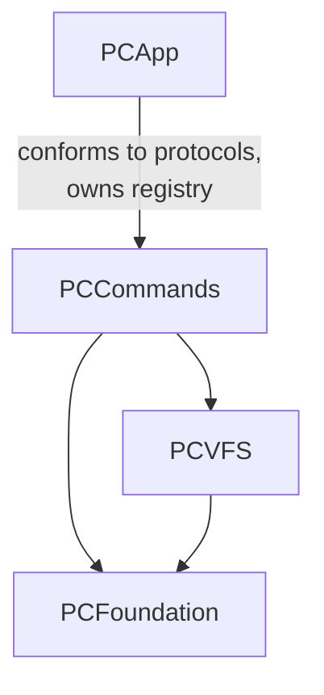
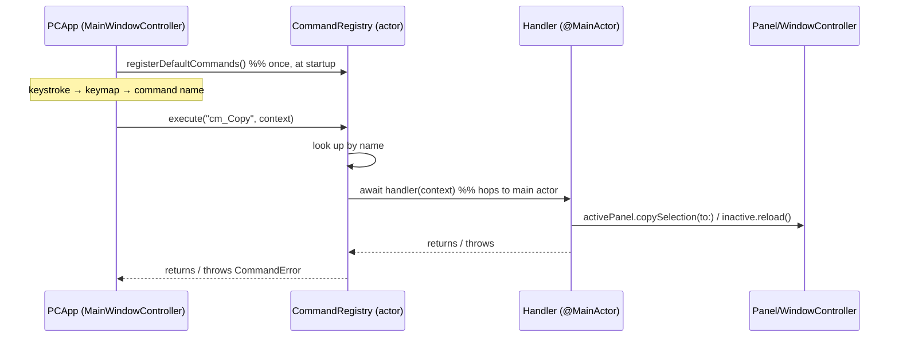

# PCCommands

`PCCommands` is Peach Commander's **command registry**: the single, addressable
catalogue of every user-invokable action (`cm_*`), the actor that dispatches
them, and the selection state machine (`SelectionState`) that TC-style marking
operates on. It sits above `PCVFS` and depends only on `PCFoundation` and
`PCVFS` — it contains **no AppKit**. All UI effects are reached indirectly,
through two protocols the UI layer (`PCApp`) conforms to.

> **Scope note.** This module is *action identity and dispatch*, not
> input-binding or user macros. Keyboard schemes (`Keymap`, the
> `keymap-tc-classic.ini` / `keymap-macos.ini` resources) and user commands
> (`UserCommands`, `em_*`) live in **`PCFoundation`** and are wired to this
> registry by `PCApp` — see [Relationship to keymaps and user commands](#relationship-to-keymaps-and-user-commands).

Source: `Sources/PCCommands/` — `PCCommands.swift`, `SelectionState.swift`,
`CommandStubs.swift`.

## Purpose and responsibility

- Define a **stable, TC-compatible command vocabulary**. Every action a menu
  item, toolbar button, or keyboard chord can trigger is a named `cm_*` command
  with a stable numeric id. `PCApp` never calls window/panel methods by name
  from a keystroke path; it resolves a command name and asks the registry to
  execute it.
- **Decouple** the *what* (a command name) from the *how* (AppKit windows,
  panels, dialogs). Handlers talk to `PanelControllerProtocol` /
  `WindowControllerProtocol`, both implemented in `PCApp`.
- Model **selection** (the marked set) and **cursor** as an independent,
  TC-faithful state machine (`SelectionState`) that file operations,
  select-by-mask, and the status bar all read from.

## Public interface and key types

### `PCCommand`

```swift
public struct PCCommand {
    public let id: Int          // stable numeric id (TC id where known, else custom)
    public let name: String     // "cm_Copy", "cm_OpenDirUnderCursor", …
    public let category: String // grouping for the command browser
    public let help: String     // one-line help
    public let handler: CommandHandler
    public let implemented: Bool // false for registered-but-unbuilt placeholders
}
```

A `PCCommand` is a value describing one action. `implemented: false` marks a
placeholder (see [`CommandStubs`](#commandstubs-not-yet-implemented-placeholders));
such commands appear in menus and the command browser (auto-disabled) and, when
invoked directly, report "not yet implemented".

**Id ranges** (a convention, not enforced by type): low ids mirror Total
Commander (`cm_GoToParent` = 1, `cm_OpenDirUnderCursor` = 2,
`cm_SwitchPanel` = 3, `cm_SrcLong` = 306…); custom commands use high blocks
(`20000` volume, `30000` navigation/view/network/config, `40000` file
operations, `2000`-range mark aliases); stub placeholders are auto-numbered from
`50000`. Uniqueness of both `id` and `name` is an invariant the registry asserts
and the tests verify.

### `CommandHandler` and `CommandContext`

```swift
public typealias CommandHandler = @MainActor (CommandContext) async throws -> Void
```

Handlers are **`@MainActor`-isolated by type**. Dispatch happens on the
`CommandRegistry` actor (a background executor), but handlers routinely touch
AppKit, so isolating the closure type forces every handler — present and
future — onto the main actor automatically. No individual handler has to hop
threads.

```swift
public struct CommandContext {
    public let activePanel: PanelControllerProtocol?
    public let inactivePanel: PanelControllerProtocol?
    public let windowController: WindowControllerProtocol?
    public let selection: SelectionState?
}
```

The context is the handler's whole world. `PCApp` builds a fresh one at each
dispatch, wiring in the currently active/inactive panels. A handler that needs
the *other* panel (e.g. `cm_Copy` copies the active selection into the inactive
panel's directory) reads it from here.

### `CommandRegistry` (actor)

```swift
public actor CommandRegistry {
    public init()
    public func register(_ command: PCCommand)
    public func registerDefaultCommands()
    public func execute(_ name: String, context: CommandContext) async throws
    public func execute(id: Int, context: CommandContext) async throws
    public func getCommand(_ name: String) -> PCCommand?
    public func getAllCommands() -> [PCCommand]
}
```

The registry keeps two indices — `[Int: PCCommand]` by id and
`[String: PCCommand]` by name. `register` asserts (and logs) on a duplicate id
or name; a debug build traps, catching accidental collisions at development
time. `registerDefaultCommands()` populates the entire catalogue (all the
`static let cm_*` definitions plus `registerStubCommands()`); `PCApp` calls it
once at startup. `execute` looks the command up, then `await`s
`command.handler(context)`; an unknown name/id throws `CommandError`.

### `PanelControllerProtocol` and `WindowControllerProtocol`

Two `AnyObject` protocols (implemented by `PanelController` and
`MainWindowController` in `PCApp`) that form the module's **outbound
interface** — the only way a handler reaches the UI.

- `PanelControllerProtocol` — per-panel operations: navigation
  (`goToParent`, `openDirUnderCursor`, `goBack/Forward`), sorting
  (`sort(by:ascending:)`), volumes (`getCurrentVolume`, `getVolumes`,
  `loadDirectoryFromVolume`), selection actions (`toggleMarkAtCursor`,
  `markAll`, `unmarkAll`, `invertSelection`, `restoreSelection`,
  `selectSameExtension`, `showSelectByMask` / `showUnselectByMask`), file
  operations (`copySelection(to:)`, `moveSelection(to:)`, `makeDirectory`,
  `deleteSelection(permanent:)`, `packSelection(to:)`), archive-aware copy
  (`currentArchiveZipPath`, `copyInto(archiveZip:subPath:)`,
  `reloadCurrentArchive`), clipboard/edit, copy-names-to-clipboard, and tabs.
- `WindowControllerProtocol` — window/global actions: `toggleActivePanel`,
  `swapPanels`, `showSettings`, dialogs (find, multi-rename, compare, sync),
  view-mode toggles, network dialogs, `setKeyScheme(_:)`, `runUserCommand(_:)`,
  `showNotImplemented(_:)`, and many more.

Keeping these as protocols in `PCCommands` (rather than importing `PCApp`) is
what lets the module compile without AppKit and lets tests exercise the registry
against `nil` controllers.

### `SelectionState` (actor)

The TC selection model: **cursor and marked set are independent**.

```swift
public struct SelectableEntry: Sendable, Equatable {
    public let path: String       // absolute; unique key within a SelectionState
    public let size: Int64        // bytes, or -1 if unknown (e.g. uncalculated dir)
    public let isDirectory: Bool
}

public actor SelectionState { … }
```

Key behaviours (all faithful to Total Commander):

- **Cursor** is an index; `-1` represents the `..` pseudo-entry, which is never
  a `SelectableEntry` and can never be marked. `moveCursorUp/Down/Top/Bottom`,
  `moveCursorTo`, `getCursorPath`, `isCursorOnRoot`.
- **Marked set** is a `Set<String>` of paths: `select`, `unselect`,
  `toggleSelection` (all reject `..`), `selectAll` (directories included),
  `clearSelection`, `invertSelection(includingDirectories:)` (TC `Num*`).
- **Selection history** for undo (TC `Num/`): `saveSelectionToHistory` /
  `restoreSelectionFromHistory`, a bounded stack (`maxHistoryDepth = 50`).
- **Select by criteria**: `selectByMask` / `unselectByMask` match the leaf name
  against a `WildcardMask` (from `PCFoundation`); `selectSameExtension` marks all
  files sharing the cursor entry's extension.
- **Reconciliation**: `setEntries` re-seats the state after a directory reload —
  marks survive only for paths still present (`intersection`), and the cursor is
  clamped into `[-1, count-1]`.
- **Statistics**: `getStatistics()` (selected/total counts), `getSelectedSize()`
  / `getTotalSize()` (summing only entries whose size is known) — used by the
  status bar.
- **Operation completion**: `unmarkCompleted(_:)` removes only the paths a file
  operation reports as *succeeded*, so failed items stay marked.

### `CommandError`

```swift
public enum CommandError: Error { case unknownCommand(String) }
```

## `CommandStubs` (not-yet-implemented placeholders)

`CommandStubs.swift` registers commands that the menus and shipped keymaps
reference but whose feature is not yet built (`implemented: false`). Every TC
command named by a menu item or a keyboard scheme must exist in the registry so
the UI can display and route it consistently; unbuilt ones become placeholders
that auto-disable and, if invoked, call
`windowController?.showNotImplemented(name)`. The list is a static
`[(name, help)]` (`stubCommandList`, ~26 entries such as `cm_Exit`,
`cm_ContextMenu`, `cm_SrcByName`) auto-numbered from id `50000`. As each feature
lands, its real `PCCommand` replaces the stub entry.

## Dependencies



**Needs:** `PCFoundation` (logging via `PCFoundationLogger`, `WildcardMask`) and
`PCVFS` (`Volume`, referenced by `PanelControllerProtocol`; `PanelViewMode`).
No AppKit.

**Depended on by:** `PCApp` only. `MainWindowController` owns a
`CommandRegistry`, calls `registerDefaultCommands()`, builds each
`CommandContext`, and calls `execute`. `PanelListView` imports the module for
`PanelSortColumn` / selection types.

## Inputs and outputs

- **Input:** a command name (or id) plus a `CommandContext`. Names arrive from
  keystrokes (via `PCApp`'s keymap router), menu selections, the command
  browser, the command line, and the toolbar.
- **Output:** side effects performed through the two controller protocols
  (opening windows, mutating panels, running file operations). The registry
  itself returns nothing on success and throws `CommandError.unknownCommand` on
  a miss. `SelectionState` mutators return `Bool`/`Int` (whether/how much the
  selection changed) so the UI can decide when to refresh.

## Lifecycle



The registry is a long-lived singleton for the process. Commands are registered
once; contexts are ephemeral, created per dispatch.

## Threading and concurrency

- `CommandRegistry` is an **actor** — the command map is only mutated/read under
  actor isolation, so registration and dispatch are race-free.
- `CommandHandler` is **`@MainActor`**: dispatch begins on the registry's
  executor but the handler body runs on the main thread, safe to touch AppKit.
- `SelectionState` is an **actor** — cursor/marked-set/history are serialized;
  `SelectableEntry` is `Sendable`.
- This matches ADR-008 (Swift Concurrency for new code; no GCD): actors and
  `async`/`await` throughout, no locks.

## Error handling

- **Unknown command** → `throw CommandError.unknownCommand(name)`, logged at
  `error`. Callers in `PCApp` typically `try?` the dispatch (a bad name is a
  no-op, not a crash).
- **Duplicate registration** → logged `error` plus `assertionFailure` (traps in
  debug, tolerated in release with the first registration winning — the second
  overwrites the map entry but the assert fires first in debug).
- **Handler errors** propagate out of `execute` to the caller; handlers are
  `throws` but most current handlers are effectively non-throwing.
- **`SelectionState`** has no failure modes — out-of-range cursor moves clamp
  rather than throw; `..` marking is silently refused.

## How it is tested

Two XCTest suites under `Tests/PCCommandsTests/`:

- **`PCCommandsTests.swift`** — registry behaviour: registration, `id`/`name`
  uniqueness across the full default set (`testCommandIdsAreUnique`,
  `testCommandNamesAreUnique`, `testRegistryUniqueIdsAndNames`), TC id mapping
  (`cm_GoToParent`==1, etc.), the `implemented` flag on stubs vs. real commands
  (`testStubCommandsMarkedNotImplemented`), execute-by-name, and the
  unknown-command error path.
- **`SelectionStateTests.swift`** — ~88 tests exhaustively covering cursor moves
  and clamping, `..` handling, mark/unmark/toggle/invert, `setEntries`
  reconciliation, select/unselect-by-mask, same-extension selection, history
  undo, and statistics.

Because the registry can execute against a `CommandContext` with `nil`
controllers, dispatch is testable headlessly without AppKit.

## Extension points

- **Add a command:** define a `static let cm_Foo = PCCommand(id:name:category:help:handler:)`
  and register it inside `registerDefaultCommands()`. Use a custom id block
  (`≥ 20000`) unless mirroring a known TC id. The handler receives the
  `CommandContext` and drives the UI via the two protocols — never by importing
  `PCApp`.
- **Promote a stub:** replace the entry in `CommandStubs.stubCommandList` with a
  real `PCCommand` (`implemented: true`) registered in
  `registerDefaultCommands()`.
- **New UI capability:** add a method to `PanelControllerProtocol` /
  `WindowControllerProtocol`, implement it in `PCApp`, then call it from a
  handler.

## Relationship to keymaps and user commands

`PCCommands` provides *command identity*; **binding** is elsewhere:

- **Keymaps** (`PCFoundation/Keymap.swift`, resources
  `keymap-tc-classic.ini` / `keymap-macos.ini`) map a normalized `KeyChord` to a
  command name. `PCApp`'s `routeKeymap` turns an `NSEvent` into a chord, asks
  `Keymap.command(for:)` for a name, and — if it is a `cm_*` — calls
  `CommandRegistry.execute`. Layered precedence (user > active scheme > builtin)
  and TC id compatibility follow ADR-007.
- **User commands** (`PCFoundation/UserCommands.swift`, TC's `usercmd.ini`,
  `em_*`) are user-defined macros. When a chord or the command line resolves to
  an `em_` name, `PCApp` routes it to `runUserCommand` instead of the registry.

So the dispatch fan-in in `PCApp` is: chord/menu/command-line → name; `em_*` →
`UserCommands`; everything else (`cm_*`) → `CommandRegistry`.

## Open questions / notes

- `cm_DriveCombo` and `cm_FreeSpaceLabel` are registered as `implemented: true`
  but their handlers currently only log — the real drive dropdown / free-space
  UI is delivered by `PCApp`'s panel chrome, so these command entries are
  effectively inert placeholders that escape the `implemented: false`
  convention.
- Several TC command *names* are aliased to existing behaviour (e.g.
  `cm_SelectAll` → `markAll`, `cm_RereadSource` → `reload`,
  `cm_SwitchToTargetPanel` → `toggleActivePanel`) for keymap/menu compatibility;
  they are distinct registry entries, not the canonical command.
