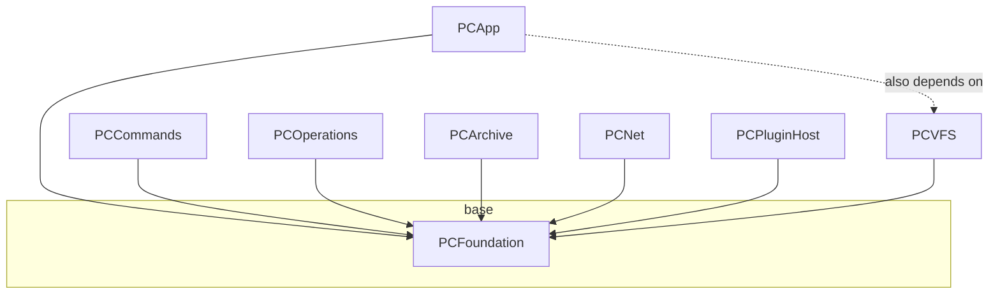

# PCFoundation

`PCFoundation` is the base layer of Peach Commander. It is the one module every
other module is allowed to depend on, and it depends on nothing inside the
project — only `Foundation`, `os`, `Security`, and `CryptoKit` from the platform.
It contains no AppKit: nothing here draws or touches a window, so the whole
module is usable from tests, command-line tools, and background actors.

Think of it as the project's standard library: value types, pure algorithms,
codecs, formatters, and the two stateful services that own persistence
(`ConfigStore`) and secrets (`SecretStore`). If a piece of logic is pure,
UI-free, and reusable, it belongs here.

Source: `Sources/PCFoundation/` (58 Swift files). Tests: `Tests/PCFoundationTests/`.

## Purpose and responsibility

PCFoundation exists to keep the higher layers thin and testable. Its
responsibilities fall into a few groups:

- **Configuration and persistence** — the INI document model, the actor that
  reads/writes config atomically, and the resolver that decides *where* config
  lives.
- **Secrets** — a Keychain-backed credential store behind a protocol, with an
  in-memory implementation for tests.
- **Formatting and parsing** — byte sizes, dates, file lists, checksum files,
  and the many small codecs (Base64, uu/xx, hex rendering).
- **Pure algorithms** — Myers line/character diff, natural sort, wildcard and
  path matching, CRC-32/cryptographic hashing.
- **Value models** — the small `Sendable` structs that describe things like
  panel tabs, column sets, keymaps, hotlists, and rename masks, kept here (not
  in `PCApp`) precisely so their encode/decode round-trips can be unit-tested
  without a UI.

The guiding rule is: **no I/O-hidden-in-a-getter, no global mutable state, no
AppKit.** Anything that must do I/O (`ConfigStore`, `PathCompleter`) does it
explicitly and is either an actor or takes its inputs as parameters.

## Position in the module graph

Dependencies point **down** to PCFoundation. PCFoundation has **no** upward or
sideways dependencies — it never imports `PCVFS`, `PCApp`, or any plugin ABI.
Everything above it (`PCVFS` and, transitively, `PCCommands`, `PCOperations`,
`PCArchive`, `PCNet`, `PCPluginHost`, and `PCApp`) consumes it.

## Public interfaces and key types

### Configuration

- **`INIDocument`** (`INIDocument.swift`) — an ordered, comment- and
  order-preserving INI model. Parsing never fails: unrecognized lines are
  retained verbatim as `.comment` tokens so nothing is silently dropped. Section
  and key matching is case-insensitive; `set(_:section:key:)` rewrites a key in
  place, inserts after the last key of an existing section, or appends a new
  section, always preserving surrounding comments and blank lines.
  `serialized()` round-trips byte-for-byte except for normalizing the trailing
  newline. This matters because config files are meant to be hand-edited and
  synced (see **ADR-007**).
- **`ConfigStore`** (`ConfigStore.swift`) — a Swift **actor** wrapping one
  `INIDocument` behind typed accessors: `bool/int/double/string(_:_:default:)`
  for reads and `setBool/setInt/setDouble/setString(_:_:_:)` for writes. Writes
  update memory immediately, broadcast a `ConfigChange` to subscribers, and
  schedule a **debounced atomic write** (default 1.0 s). `changes()` returns an
  `AsyncStream<ConfigChange>` for UI live-binding; multiple concurrent
  subscribers are supported. `flush()` forces an immediate write (e.g. on quit).
  A `[meta] version=1` key is ensured on first write to give future migrations
  an anchor.
- **`ConfigChange`** — `Sendable` `{ section, key }` value yielded on every write.
- **`ConfigPaths`** (`ConfigPaths.swift`) — resolves the config **root** and all
  well-known file URLs within it (`mainConfig` → `peachcmd.ini`, `session`,
  `hotlist`, `workspaces`, `aliases`, `userCommands`, `buttonBar`, `userKeymap`,
  `mainMenu`, `pluginsConfig`, `columns`, `ftpSites`, and JSON preset files).
  `resolve(arguments:environment:)` picks the root in priority order:
  1. `-ConfigRoot <path>` launch argument,
  2. `PEACHCMD_CONFIG_ROOT` environment variable,
  3. `~/Library/Application Support/PeachCommander`.

  The resolved directory is created if missing. Both override paths take
  injectable `arguments`/`environment`, which is how tests point the whole app
  at an isolated temp directory (F-277). **App config never uses
  `UserDefaults`** — only `ConfigStore` honors the override, and `UserDefaults`
  would pollute the user's real preferences.

### Secrets

- **`SecretStore`** (`SecretStore.swift`) — protocol for
  `setPassword/password/deletePassword` keyed by `(service, account)`.
- **`KeychainSecretStore`** — production implementation over
  `Security.framework` generic-password items, `kSecAttrAccessibleWhenUnlocked`,
  idempotent writes (delete-then-add). Throws `SecretStoreError`
  (`.unexpectedStatus(OSStatus)` / `.dataDecodingFailed`).
- **`InMemorySecretStore`** — thread-safe (`NSLock`) test/preview double so
  credential round-trips can be verified without touching the real Keychain.

FTP/SFTP passwords and key passphrases live **only** in the Keychain, never in
any `.ini` file (ADR-007).

### Formatting and codecs

- **`ByteSize`** (`PCFoundation.swift`) — human-readable byte counts
  (`.bytes`, `.kb`, `.mb`, `.bytesWithSep`) plus `ByteSize.parse("1.5M")` using
  binary units (1 K = 1024).
- **`ByteFormatter`** / **`ByteFormat`** (`ByteFormatter.swift`) — render a byte
  range as text, spaced hex, C array, Python `bytes`, or Base64 (hex-viewer
  "copy as…").
- **`Base64Codec`** (`Base64Codec.swift`) — RFC 4648 encode/decode with optional
  76-column MIME wrapping.
- **`UUCodec`** (`UUCodec.swift`) — uuencode/xxencode encode and decode.
- **`ChecksumAlgorithm`**, **`ChecksumHasher`**, **`CRC32`**
  (`ChecksumAlgorithm.swift`) — CRC-32 (table-based IEEE 802.3, for `.sfv`) plus
  MD5/SHA-1/SHA-256/SHA-512 via CryptoKit, exposed as an incremental
  `ChecksumHasher` so large files stream chunk-by-chunk. Verified against
  published test vectors.
- **`ChecksumFile`** / **`ChecksumEntry`** (`ChecksumFile.swift`) — parse/generate
  SFV and coreutils-style (`md5sum`/`shasum`) checksum files.
- Additional formatters: `PanelDateFormatter`, `FileListFormatter`,
  `SelectionSummaryFormatter`, `StructuredTextFormatter`, `MarkdownRenderer`.

### Pure algorithms

- **`LineDiff`** (`LineDiff.swift`) — a classic **Myers O(ND)** shortest-edit
  diff. `compare(left:right:options:)` returns aligned `DiffRow`s
  (`.equal/.insert/.delete/.change`), coalescing delete+insert runs into paired
  `.change` rows the way side-by-side viewers expect. `intraLine(_:_:)` gives
  grapheme-level differing ranges for intra-line highlighting. `DiffOptions`
  controls case, whitespace (`WhitespaceMode`), and CRLF-vs-LF normalization —
  normalization affects equality only; emitted rows always reference original
  indices. Deterministic and Foundation-only.
- **`naturalCompare(_:_:natural:)`** (`PCFoundation.swift`) — locale-aware,
  numeric-aware sort (`file2` < `file10`) via `localizedStandardCompare`; the TC
  "logical order" default (F-026).
- **`WildcardMask`** (`PCFoundation.swift`) — TC-style masks like
  `"*.c;*.h|*.bak"` (`;` separates patterns, `|` separates include/exclude),
  compiled to case-insensitive regex.
- **`PathUtils`** (`PCFoundation.swift`) — `parent/filename/fileExtension`,
  hidden-file check, Unicode NFC/NFD normalization and canonical-equivalence
  comparison (`nameEquivalent`), and the macOS colon/slash display mapping
  (POSIX `:` shown as `/`, F-100).
- **`PathResolver`** (`PathResolver.swift`) — lexically resolve a user-typed path
  (`~` expansion, relative-to-base, `.`/`..`) without touching disk.
- **`PathCompleter`** (`PathCompleter.swift`) — directory-entry completion for the
  command line (reads a directory; the one path helper that does I/O).
- Text helpers: `TextScanning` (`IdentifierScanner`, bracket matching),
  `ByteSearch`, `OccurrenceFinder`, `TypeAheadSearch`, `SpotlightPredicate`.

### Value models (encode/decode round-trips)

Kept in PCFoundation so their serialization is unit-testable without a UI:
`PanelTabs`/`PanelTabState` + `WorkspaceCodec`, `ColumnSet`, `Keymap`,
`Hotlist`, `AliasStore`, `UserCommands`, `MenuFile`, `ButtonBar`, `CopyRenameMask`
/ `MultiRenameEngine` / `RenameValidator`, `SyncModel` / `SyncPresetStore`,
`NavigationHistory`, `ACLEntry`, `PosixPermissions`, `NetworkShare`,
`DescriptionFile`, `SymbolTree`, `XMLTree` / `XPathQuery`, `HexDocument`,
`WincmdImporter` (reads Total Commander `wincmd.ini`).

Every format shared with Total Commander (`.mnu`, `.bar`, `usercmd.ini`,
`wincmd.ini`) is read through **`WindowsTextFile`** (BOM → UTF-8 →
Windows-1252/Latin-1): such a file is written on Windows, and reading it as strict
UTF-8 failed on the first umlaut — which the callers could not tell apart from the
file not existing. Their parsers split lines on `isNewline`, never on the character
`"\n"`, because Swift reads `"\r\n"` as a single Character and a CRLF file would
otherwise arrive as one line.

### Logging

- **`PCFoundationLogger`** (`PCFoundation.swift`) — thin `os.Logger` wrapper
  (subsystem `com.peachcommander`), used module-internally (e.g. by
  `ConfigStore` when a write fails or a config file is undecodable).

## Inputs and outputs

- **In:** launch arguments and environment (`ConfigPaths.resolve`), INI/JSON/
  checksum text, raw byte buffers, line arrays, filesystem directory contents
  (`PathCompleter` only).
- **Out:** serialized INI text (atomic disk writes via `ConfigStore`), Keychain
  items (`KeychainSecretStore`), formatted strings, diff rows, hashes,
  `AsyncStream<ConfigChange>` events, and `os_log` entries.

## Lifecycle

`ConfigPaths.resolve(...)` runs once early in app startup to fix the config root
and create it if needed. Each well-known config file is then wrapped in a
long-lived `ConfigStore` actor: the initializer reads the file (or starts empty),
and — if the file exists but is not valid UTF-8 — moves it aside as `<name>.bak`
and starts fresh so a corrupt file never blocks launch. During the session,
writes accumulate in memory and are flushed by the debounce timer; `flush()` is
called on quit to guarantee the final state hits disk. Everything else in the
module is stateless (value types, `enum` namespaces of `static` functions) and
has no lifecycle of its own.

## Threading and concurrency

Follows the project's Swift-Concurrency-first rule (**ADR-008**, no GCD in new
code):

- **`ConfigStore` is an `actor`** — all reads/writes are serialized through it;
  callers `await`. The debounced write is a child `Task` that is cancelled and
  rescheduled on each change, so a burst of edits coalesces into a single atomic
  I/O. Change notifications use `AsyncStream` continuations stored per
  subscriber and cleaned up on stream termination.
- Most types are **pure value types marked `Sendable`** (`INIDocument`,
  `ConfigPaths`, `DiffRow`, `ByteFormat`, `ChecksumAlgorithm`, `ConfigChange`,
  the panel/keymap/column models), safe to pass across actor boundaries.
- **`SecretStore` is `Sendable`**; `KeychainSecretStore` is a value type,
  `InMemorySecretStore` is `@unchecked Sendable` guarded by an `NSLock`.
- `ChecksumHasher` is a reference type and is **not** thread-safe — it is meant
  to be driven by a single streaming consumer.

## Error handling

- **Parsing never throws.** `INIDocument(parsing:)` and the checksum-file parser
  treat unrecognized input as preserved comments rather than errors.
- **Config is fail-soft.** `ConfigStore` recovers from an undecodable file
  (`.bak` rename), and every typed reader takes an explicit `default:` so a
  missing/garbage value degrades to a caller-chosen fallback rather than
  crashing. Write failures are logged via `PCFoundationLogger.error`, not thrown
  to callers (writes are fire-and-forget under debounce).
- **Secrets throw explicitly.** `SecretStore` methods `throw SecretStoreError`
  so credential failures are surfaced to the UI.
- **Codecs return optionals.** `Base64Codec.decode`, `ByteSize.parse`, and the
  path resolvers return `nil` on malformed/empty input.

## Testing

PCFoundation is the most thoroughly unit-tested module in the project — a
deliberate consequence of keeping logic pure and UI-free. There is roughly one
test file per source file under `Tests/PCFoundationTests/` (60 test files),
covering the INI round-trip (`INIDocumentTests`), the debounced actor
(`ConfigStoreTests`), path normalization (`PathNormalizationTests`), the Myers
diff (`LineDiffTests`), checksums against known vectors
(`ChecksumAlgorithmTests`/`ChecksumFileTests`), the codecs, and every value-model
encode/decode round-trip. Secrets are tested through `InMemorySecretStore` so no
run touches the real Keychain. These tests are part of the project-wide battery
(~1304 tests across 9 targets) and run in CI on `macos-14`.

## Extension points

- **New config keys:** add typed accessors on `ConfigStore` or a new URL on
  `ConfigPaths`; no schema change is needed because `INIDocument` is
  free-form and preserves unknown keys.
- **New checksum algorithm:** add a case to `ChecksumAlgorithm` and wire it into
  `ChecksumHasher` (file-extension and hex-width switches are exhaustive, so the
  compiler flags every site to update).
- **New copy-as / codec format:** add a case to `ByteFormat` /
  `ByteFormatter`, or a new codec `enum` following the `Base64Codec`/`UUCodec`
  pattern.
- **Alternative secret backend:** implement the `SecretStore` protocol.
- **New value model:** add a `Sendable` struct plus a codec `enum` here (not in
  `PCApp`) so it stays unit-testable.

## Open questions

- `ByteSize.formatted` and `ByteFormatter` currently hardcode English unit
  labels ("bytes", "KB"); localization of these strings is handled at the app
  layer and PCFoundation does not yet expose a localized-formatting hook.
- The `[meta] version=1` marker written by `ConfigStore` is a forward-looking
  anchor; no migration framework consumes it yet.
