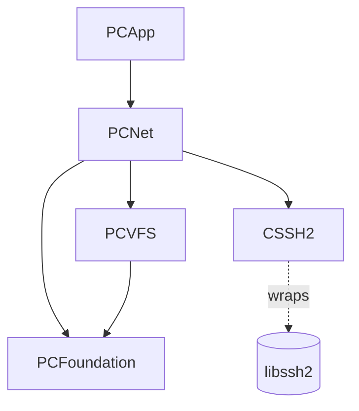

`PCNet` is Peach Commander's networking module. It implements remote file access over **FTP**, **FTPS** (explicit and implicit TLS), **SFTP/SCP** (SSH), and standalone **HTTP(S) downloads**, and it owns the connection-site model that the connection manager persists. Everything in the module is written so that a panel browses and transfers over a remote protocol using the same `VirtualFileSystem` abstraction it uses for local disk or archives (see [Architecture Overview](architecture-overview)).

Sources: `Sources/PCNet/`. Framework target `PCNet` (`project.yml` lines 485–502).

## Purpose & responsibility

PCNet is responsible for:

- **FTP/FTPS**: a from-scratch FTP client (RFC 959 / RFC 3659) built on `Network.framework`, with passive and active data channels, resume, keep-alive, protocol logging, and SOCKS5 proxying.
- **SFTP/SCP**: an SSH file-transfer client wrapping **libssh2** (via the `CSSH2` C target), with agent / password / key-file authentication and `known_hosts` verification.
- **HTTP(S) downloads**: a `wget`-style streaming downloader with range-resume, auth, and proxy support.
- **The site model**: `FtpSite` and its INI round-trip (`ftp-sites.ini`), quick-connect URL parsing, Keychain credential mapping, and a Total Commander site importer.

Each remote protocol is exposed to the rest of the app as a `VirtualFileSystem` conformance (`FTPFileSystem`, `SFTPFileSystem`), so the VFS mount layer, operation engine, and panels treat a remote mount like any other file system.

> **Design note (ADR-011).** `DECISIONS.md` ADR-011 records the intent that FTP and SFTP be delivered *as bundled PFX file-system plugins using the public plugin API*, to prove that API early. As implemented today they are `VirtualFileSystem` conformances compiled into the `PCNet` framework, not separately `dlopen`ed plugin bundles. Whether/when they get externalized behind the PFX ABI is an **open question**; the VFS-adapter shape here is deliberately plugin-friendly.

## Dependencies

**Needs (downward):**

- `PCFoundation` — `INIDocument` (site persistence), `SecretStore` (Keychain), `DownloadName` (Content-Disposition parsing).
- `PCVFS` — `VirtualFileSystem`, `VFSPath`, `VFSEntry`, `VFSEntryBatch`, `VFSReadStream`/`VFSWriteStream`, `VFSError`, `VFSCapabilities`, `DisconnectableFileSystem`.
- `CSSH2` — C static-lib target wrapping **libssh2** (Homebrew headers at `/opt/homebrew/opt/libssh2/include`, see `project.yml` `HEADER_SEARCH_PATHS`). Used only by the SFTP/SCP path.
- System frameworks: `Foundation`, `Network` (FTP transport + SOCKS5), `Darwin` (raw sockets for libssh2).

**Depended on by:** `PCApp` (the connection manager UI, FTP protocol console, and mounting logic). PCNet does **not** import AppKit and has no UI.

## Public interfaces & key types

### FTP command layer

- **`FTPControlConnection`** (`actor`, `FTPControlConnection.swift`) — the FTP command *choreography*: login (`connectAndLogin`, USER/PASS, optional `PBSZ 0`/`PROT P` for protected FTPS data), `FEAT`-based MLSD detection, `list`, `download`/`upload`, streaming `beginDownload`/`finishDownload` and `beginUpload`/`finishUpload`, `delete`/`makeDirectory`/`removeDirectory`/`rename`/`size`, `REST`-based resume, and an idle keep-alive loop (`startKeepAlive`/`stopKeepAlive`, default `NOOP`). Opens passive channels via `EPSV` with `PASV` fallback, or active channels via `EPRT` (falling back to passive if refused, F-212). Serializes all commands because it is an actor.
- **`FTPControlTransport` / `FTPDataTransport`** (`FTPTransport.swift`) — the **transport seam**. `FTPControlConnection` is written against these protocols, never against sockets, so it can be driven by a scripted mock in tests and by real sockets in production. `FTPDataTransport` supports `readAll`, chunked `readChunk`, `write`, `close`. A default `makeActiveData` throws for transports that don't support active mode.
- **`FTPError`** — `unexpectedReply(command:code:text:)`, `badPassiveReply`, `connectionLost`, `notConnected`.

### FTP protocol parsing (pure)

- **`FTPReply`** + **`FTPReplyParser`** (`FTPProtocol.swift`) — reply framing per RFC 959, including multiline replies (`NNN-…` … `NNN …`). `isComplete(_:)` decides whether a buffer holds a full reply; `parse(_:)` extracts code + joined text. `FTPReply` exposes `isPreliminary`/`isSuccess`/`isIntermediate`/`isError`.
- **`FTPDataAddress`** (`FTPProtocol.swift`) — decodes `PASV` (`h1,h2,h3,h4,p1,p2`) and `EPSV` (`|||port|`) replies into a data address.
- **`FTPListParser`** + **`RemoteFileEntry`** (`FTPListing.swift`) — auto-detecting listing parser for **MLSD** (RFC 3659, preferred), **UNIX `ls -l`**, and **DOS/IIS** dialects. Pure functions over text lines so they can be verified against golden fixtures. `referenceDate` disambiguates the year for timeless UNIX entries. Timestamps are interpreted as UTC.

### FTP live transport (Network.framework)

- **`NWFTPControlTransport`** (`actor`, `NWFTPTransport.swift`) — real control channel. Buffers incoming bytes and hands complete replies (via `FTPReplyParser`) to the command layer. Builds `NWParameters` for plain TCP, verified TLS, or insecure TLS (`allowInsecureTLS`, accepts any certificate — curl `-k`). Supports implicit FTPS (`useTLS`) and SOCKS5 tunneling (`proxy`, plain FTP only).
- **`NWFTPDataTransport`** (`actor`) — one passive data connection; SOCKS5-tunnelled when a proxy is set; setup bounded by a 15 s timeout.
- **`NWFTPActiveDataTransport`** (`actor`, `NWFTPActiveTransport.swift`) — active-mode data channel: an `NWListener` on an ephemeral port that the server connects back to (advertised via `EPRT`). `ConnectionInbox` bridges the listener callback to an awaiting consumer. Accept is bounded by a 15 s timeout; one transfer per channel.

### FTP protocol log

- **`FTPProtocolLog`** (`FTPProtocolLog.swift`) — a thread-safe (`NSLock`), bounded (2000-entry) log of control-channel lines with an `onAppend` observer, powering the app's FTP console (F-217). Masks `PASS` so passwords never land in the log.
- **`LoggingFTPControlTransport`** — a decorator over any `FTPControlTransport` that logs every command/reply. Because it sits at the transport seam, the command layer needs no changes.

### FTP VFS adapter

- **`FTPFileSystem`** (`FTPFileSystem.swift`) — `VirtualFileSystem` + `DisconnectableFileSystem`. `scheme = "ftp"`, `capabilities = [.read, .write, .rename]`. Bridges the command layer to VFS: `list` (async stream), `stat`, `openRead`/`openWrite` (streaming, constant memory), `mkdir`/`delete`/`rename`, best-effort `setAttributes` via `SITE CHMOD`, `sendRawCommand` (F-217), and `disconnect()` (stops keep-alive, `QUIT`). `watch` returns `nil` (no change notifications for FTP). Supporting stream types: `FTPReadStream`, `FTPUploadStream`, `InMemoryReadStream`.

### SFTP / SCP layer

- **`SFTPSession`** (`SFTPSession.swift`) — a **blocking libssh2 client serialized onto a dedicated `DispatchQueue`** and exposed as `async` methods (each op wrapped in `run { … }` → `withCheckedThrowingContinuation`). Provides `connect`, `listDirectory`, `stat`, `read`/`write`, streaming handle APIs (`openReadHandle`/`readHandle`/`openWriteHandle`/`writeHandle`/`closeHandle`), `mkdir`/`removeFile`/`removeDir`/`rename`, and **SCP** transfers (`scpDownload`/`scpUpload`). Nested `Entry` struct is the raw listing result.
- **`SFTPFileSystem`** (`SFTPFileSystem.swift`) — `VirtualFileSystem` + `DisconnectableFileSystem`, `scheme = "sftp"`, mirrors `FTPFileSystem`. `transferViaSCP` routes file bytes over SCP while keeping listing/mutations on SFTP. Stream types: `SFTPReadStream`, `SFTPUploadStream`.
- **`SFTPError`** — `resolveFailed`, `connectFailed`, `handshakeFailed`, `hostKeyMismatch`, `authFailed`, `sftpInitFailed`, `notConnected`, `opFailed`, `notFound`.
- **`SFTPSupport.libssh2Version()`** (`SFTPSupport.swift`) — returns the linked libssh2 version; a link/load probe used in tests.

### HTTP downloader

- **`HTTPDownloader`** (`HTTPDownloader.swift`) — streaming HTTP(S) download to disk with **range-resume** via a sibling `.part` file (F-330). Handles 206 (resume/append) vs 200 (server ignored `Range`, restart) vs 416 (already complete). Supports Basic auth, Bearer token, extra headers, opt-in self-signed TLS, timeout, and a proxy. Progress + cooperative pause/cancel are reported through `progress` and `checkpoint` closures. `HTTPDownloadOptions`, `HTTPDownloadResult`, `HTTPDownloadError` accompany it; a private `ChunkSink` `URLSessionDataDelegate` turns the response into an `AsyncThrowingStream`.

### Proxy & tunneling

- **`ProxyConfig`** / **`ProxyKind`** (`NetProxy.swift`) — shared proxy model (`.http` / `.socks5`) used by both the FTP transport and the HTTP downloader. `urlSessionProxyDictionary` produces a `connectionProxyDictionary` for `URLSession`.
- **`Socks5Tunnel`** (`Socks5Tunnel.swift`) — SOCKS5 CONNECT handshake (RFC 1928, no-auth or username/password) over an `NWConnection`, returning the tunnelled connection. Used by the FTP transport for control and each passive data channel. Plain TCP only — TLS-through-proxy is rejected (`tlsThroughProxyUnsupported`).

### Site model & credentials

- **`FtpSite`** (`FtpSite.swift`) — a saved connection: host/port, `FtpProtocol` (`ftp`/`ftps`/`ftps-implicit`/`sftp`), user, `FtpAuth` (`password`/`keyFile`/`agent`/`anonymous`), remote/local dir, passive flag, encoding, keep-alive interval + command, grouping folder, `useSCP`, `allowInsecureTLS`, and SOCKS5 proxy fields. **Holds no secret material** — `proxyConfig` derives a `ProxyConfig`; `effectiveKeepAlive(globalDefault:)` resolves the interval.
- **`FtpSitesFile`** — parses/serializes the site list to/from `ftp-sites.ini` via `INIDocument`, one `[section]` per site, order-preserving.
- **`FtpURL`** — parses quick-connect URLs (`scheme://[user[:password]@]host[:port][/path]`, F-211) and builds an `FtpSite`; any password in the URL is returned separately so it can go to the Keychain rather than being persisted.
- **`FtpCredentials`** — maps a site to its Keychain secret via `SecretStore` under service `"PeachCommander Network"`, account key `scheme://user@host:port`. Enforces "secrets in Keychain only" (SPEC-011 §6, ADR-007).
- **`WincmdFtpImporter`** — imports Total Commander `wcx_ftp.ini` sites (F-276). Reads the `[connections]` index for order; imports non-secret fields only (**passwords are never imported** — TC's obfuscation is deliberately not reversed).

## Inputs & outputs

- **Inputs:** `VFSPath` operations from the VFS/operation layers; `FtpSite`/`FtpURL` from the connection manager; INI text (`ftp-sites.ini`, TC `wcx_ftp.ini`); credentials from `SecretStore`; raw server bytes over `Network.framework` / libssh2 sockets; a URL string + options for HTTP downloads.
- **Outputs:** `VFSEntry`/`VFSEntryBatch` streams, `VFSReadStream`/`VFSWriteStream` byte streams, temp files (`localFileIfAvailable`), `HTTPDownloadResult` (final on-disk path), serialized INI, and `FTPProtocolLog` entries.

## Lifecycle

1. The connection manager (in `PCApp`) resolves an `FtpSite`, fetches its password from the Keychain via `FtpCredentials`, and constructs a transport (`NWFTPControlTransport` or `SFTPSession`), optionally wrapping the FTP control transport in `LoggingFTPControlTransport`.
2. For FTP it builds an `FTPControlConnection`, calls `connectAndLogin`, starts keep-alive per `effectiveKeepAlive`, and wraps it in an `FTPFileSystem`. For SFTP it `connect`s an `SFTPSession` and wraps it in an `SFTPFileSystem`.
3. The `VirtualFileSystem` is mounted; panels list/transfer through it.
4. On unmount, `DisconnectableFileSystem.disconnect()` stops the keep-alive loop and `QUIT`s the FTP control connection, or closes the libssh2 session and socket — so connections and their background tasks don't leak.

## Threading / concurrency assumptions

- **FTP** uses **Swift actors** end to end (ADR-008): `FTPControlConnection`, `NWFTPControlTransport`, `NWFTPDataTransport`, `NWFTPActiveDataTransport`. Command ordering is guaranteed by actor isolation — one command/reply round-trip at a time. `Network.framework` callbacks are bridged to `async` with `withCheckedThrowingContinuation`, guarded by a one-shot `ResumeOnce` helper so a continuation is never resumed twice from a repeatedly-firing state handler.
- **SFTP** is the exception: libssh2 is blocking C, so `SFTPSession` is a `final class` (`@unchecked Sendable`) that serializes every operation onto one private `DispatchQueue` (`com.peachcommander.sftp`) and exposes `async` wrappers. libssh2 global init is guarded by a static `NSLock`. This is legacy-style GCD, justified by the blocking C dependency.
- Listings are delivered as `AsyncThrowingStream`; transfers are chunked (64 KiB FTP, 128 KiB SFTP) for **constant-memory** streaming.
- The VFS adapters and `FTPProtocolLog` are `@unchecked Sendable` classes whose shared state is protected by actor isolation (the underlying connection) or an `NSLock` (the log).

## Error handling

- **FTP** throws `FTPError`; **SFTP** throws `SFTPError`. Both VFS adapters translate these into `VFSError` in a static `mapError`: e.g. FTP 550 → `notFound`, 530 → `permissionDenied`, connection loss → `connectionLost(retryable: true)`; SFTP `hostKeyMismatch`/`authFailed` → `permissionDenied`. This keeps protocol specifics out of the VFS/operation layers while preserving retryability.
- Reply-code checking is centralized in `FTPControlConnection.require(_:_:accept:)`, which throws `unexpectedReply` when a code falls outside the accepted range.
- Keep-alive failures are swallowed (`sendKeepAlive` returns a `Bool`) so a background NOOP never surfaces an error to the user.
- Data-channel setup is bounded by 15 s timeouts (passive connect, active accept) to fail fast rather than hang, and HTTP transfers keep the `.part` file on error so a later call resumes.

## Security notes

- **Credentials** live in the macOS Keychain only (`FtpCredentials` + `SecretStore`); `FtpSite`/`ftp-sites.ini` never contain a password (SPEC-011 §6, ADR-007). The protocol log masks `PASS`.
- **FTPS** verifies certificates by default; `allowInsecureTLS` is opt-in per site.
- **SFTP host keys** are checked against `~/.ssh/known_hosts` with OpenSSH-format matching: a same-host/same-type key that differs **aborts** (`hostKeyMismatch`, possible MITM); an unknown host is **trust-on-first-use** (accepted and appended), mirroring `StrictHostKeyChecking=accept-new`. A stable host-key algorithm preference is pinned so the negotiated key type is deterministic across connections. Auth order: SSH agent → explicit password → explicit key file → default `~/.ssh` keys.
- **SOCKS5-through-proxy is plain-TCP only**; FTPS/TLS through a proxy is explicitly unsupported.

## How it is tested

Tests live in `Tests/PCNetTests/`:

- **Protocol parsing** (`FTPProtocolTests`, `FTPListingTests`) — reply framing, PASV/EPSV decoding, and the three listing dialects against golden lines, with a fixed `referenceDate` for deterministic year inference.
- **Command choreography** (`FTPSessionTests`, `FTPFileSystemTests`) — a **scripted `FTPControlTransport` mock** (canned dialogs, SPEC-011 §7) drives `FTPControlConnection`/`FTPFileSystem` with no sockets, recording commands sent.
- **Live loopback** (`FTPLoopbackTests`) — an in-process TCP server exercises the real `NWFTPControlTransport` over a loopback socket.
- **Site & import** (`FtpSiteTests`, `FtpCredentialsTests`, `WincmdFtpImporterTests`) — INI round-trip, default ports, Keychain account keys, TC import.
- **libssh2 link probe** (`SFTPSupportTests`) — proves the C module compiles, links, and loads.
- **HTTP** (`HTTPDownloaderTests`) — self-contained: spins up `python3 -m http.server` on loopback, verifies full download and `.part` range-resume; skips when `python3` is unavailable.
- **Live/network tests** — `LiveServerTests` is gated on `PC_NET_LIVE=1` (with `PC_FTP_*` / `PC_SFTP_*` env config against a local daemon); `SFTPLiveTests` hits the public Rebex test server. Both are opt-in so CI (`macos-14`) stays hermetic.

## Extension points

- **New transport** — conform to `FTPControlTransport`/`FTPDataTransport` (e.g. a different network stack, or a richer mock). The command layer is transport-agnostic.
- **Transport decorators** — wrap a transport as `LoggingFTPControlTransport` does (logging, throttling, metrics) without touching the command layer.
- **New listing dialect** — add a branch/parser in `FTPListParser` (pure, fixture-testable).
- **New remote protocol** — add a `VirtualFileSystem` (+ `DisconnectableFileSystem`) conformance following the `FTPFileSystem`/`SFTPFileSystem` pattern; the VFS/panel layers pick it up unchanged. Per ADR-011 this is the seam that could later be externalized behind the PFX plugin ABI.
- **New proxy type** — extend `ProxyKind`/`ProxyConfig` and its `urlSessionProxyDictionary`, and (for tunneling) `Socks5Tunnel`.
- **New site importer** — follow `WincmdFtpImporter` (INI → `[FtpSite]`, secrets excluded).

## Open questions

- **ADR-011 vs. reality:** FTP/SFTP are framework-internal `VirtualFileSystem` conformances today, not `dlopen`ed PFX plugin bundles. External-plugin delivery is unresolved.
- **ADR-011 wording** says libssh2 is pulled in "via SPM"; the actual build links libssh2 through the `CSSH2` C target against Homebrew headers (`project.yml`). Treat the ADR text as stale on that detail.
- **`known_hosts` write-back** is best-effort and does not prune/rotate entries; TOFU recording is a first-pass implementation.
- **FTPS data channels** cannot do TLS session reuse (Network.framework limitation), which some strict FTPS servers require — hence the 15 s data-channel timeout guard.
