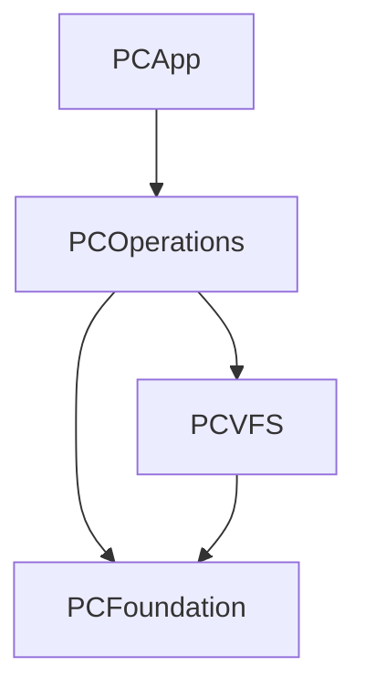

# PCOperations

`PCOperations` is the **file-operation engine**: copy, move, delete, mkdir, plus
the higher-level "file utility" operations (attribute/permission changes,
checksums, duplicate detection, file splitting/combining, encode/decode, and
per-file comments). It owns *how work is actually performed on bytes and paths* —
progress reporting, cancellation/pause, conflict resolution, and the fast paths
(`clonefile(2)`, `rename(2)`) that make the common case instant.

It contains **no AppKit and no UI**. Everything here is driven by a caller
(normally `PCApp`) that supplies an [`OperationResolver`](#conflict--error-resolution)
for interactive decisions and a progress callback. Tests drive it directly with
non-interactive resolvers.

Design mandate: **Swift Concurrency, no GCD** (ADR-008) — actors + structured
concurrency for cancellation, `AsyncStream` for progress coalesced to ≤ 30 Hz.

---

## Purpose & responsibility

| Concern | Owned here? |
|---|---|
| Recursive copy/move/delete/mkdir on the local file system | Yes |
| clone/rename/cross-device fallbacks, symlink safety | Yes |
| Progress accounting, throughput, speed limiting | Yes |
| Cooperative cancel/pause (`OperationControl`) | Yes |
| Conflict & per-file error resolution *policy plumbing* | Yes (policy *decisions* are delegated to a resolver) |
| VFS-level file utilities (attrs, checksum, dup-find, split, encode, comments) | Yes |
| The actual conflict *dialog*, progress UI, transfer manager window | No — `PCApp` |
| The `VirtualFileSystem` protocol and concrete file systems | No — `PCVFS` and its providers |
| Hash algorithms, CRC32, Base64/UU codecs, `descript.ion` parsing, rename masks, `SplitInfo` | No — `PCFoundation` (this module orchestrates them) |

Two layers coexist in the module:

1. **Local POSIX fast-path engines** (`CopyEngine`, `MoveEngine`, `DeleteEngine`,
   `MkDirEngine`) operate on plain `String` paths and syscalls for maximum speed
   on local→local operations (SPEC-004 §1–§8).
2. **VFS-based utility engines** (`AttributeEngine`, `ChecksumEngine`,
   `DuplicateFinder`, `SplitCombineEngine`, `EncodeDecodeEngine`, `CommentStore`,
   `VFSTreeWalker`) operate over the abstract `VirtualFileSystem` from `PCVFS`,
   so they work uniformly on local disk, archives, and network file systems
   (SPEC-016, SPEC-008).

---

## Dependencies



**Needs (from `project.yml`):**
- `PCFoundation` — logging (`PCFoundationLogger`), `ChecksumHasher`/`ChecksumAlgorithm`/`CRC32`,
  `Base64Codec`, `UUCodec`, `CopyRenameMask`, `SplitInfo`, `ChecksumEntry`/`ChecksumFileFormat`,
  `DescriptionFile`.
- `PCVFS` — `VirtualFileSystem`, `VFSPath`, `VFSEntry`/`VFSEntryBatch`, `VFSAttributes`,
  `WriteOptions`, read/write streams. The VFS-based engines require these; the
  local POSIX engines do **not** touch the VFS.

**Depended on by:** only `PCApp` (`import PCOperations`) — via
`PanelController+Operations`, `PanelController+Clipboard`, `TransferManager`,
`TransferManagerWindowController`, `ProgressDialog`, `OverwriteResolver`,
`DuplicateFinderWindowController`, `AutomationRunner`, `InputDialog`. No engine
module depends on `PCOperations`.

---

## Public interfaces & key types

### Shared value types (`OperationTypes.swift`)

| Type | Kind | Role |
|---|---|---|
| `OpProgress` | struct | Live counts: files/bytes total & done, `currentItem`, `bytesPerSecond`. |
| `OpEvent` | enum | Stream event: `.progress`, `.log`, `.completed(processed:)`, `.failed`, `.cancelled`. |
| `OperationError` | enum | Typed errors (`cancelled`, `sourceNotFound`, `cannotCreateFile`, `readFailed`, `writeFailed`, `renameFailed`, `deleteFailed`, `aborted`, `invalidName`, …). Mapped to user text only in `PCApp`. |
| `OverwriteDecision` | enum | `.overwrite / .skip / .rename(String) / .append / .abort` (append = F-086). |
| `ErrorDecision` | enum | `.retry / .skip / .abort` (F-089). |
| `FileFacts` | struct | Minimal facts (path, name, size, modified, isDirectory) handed to a resolver. |
| `CopyOptions` | struct | `preserveMetadata`, `useCloneWhenPossible`, `followSymlinks`, `onlyNewer`, `chunkSize` (1 MiB default), `maxBytesPerSecond` (0 = unlimited), `renameMask` (F-080). |
| `OperationResolver` | protocol | Async `resolveOverwrite` / `resolveError`. |
| `OverwriteAllResolver`, `SkipAllResolver` | struct | Non-interactive defaults for tests/background runs. |
| `OperationControl` | **actor** | Cooperative cancel/pause/checkpoint. |

### `OperationControl` (actor)

The single cancellation/pause authority, shared between an engine and its caller:

```swift
public actor OperationControl {
    public func cancel(); public func pause(); public func resume()
    public var isCancelled: Bool; public var isPaused: Bool
    public func checkpoint() async throws   // throws .cancelled, else blocks while paused
}
```

Engines call `await control.checkpoint()` at every natural boundary (per item,
per directory child, per read chunk). Pause is implemented as a 20 ms poll loop
inside `checkpoint()` that still honours cancellation.

### `TransferQueue` (`TransferQueue.swift`)

The public entry point that runs *one* operation and exposes its event stream.

> **Naming note / open question.** The architecture overview and SPEC-004 refer
> to an `OperationQueue` actor with a plan → execute → verify pipeline and
> multiple queues. In the current source the runner is **`TransferQueue`**, a
> `final class` marked `@unchecked Sendable` (not an `actor`), the only actor is
> `OperationControl`, and there is no distinct verify phase or multi-queue
> scheduler in this module. "Planning" today means `CopyEngine.planTotals` /
> `DeleteEngine.countItems`. Multi-queue/verify behaviour is either handled in
> `PCApp`'s `TransferManager` or still unbuilt.

```swift
public enum OperationKind {              // copy / move / trash / delete / custom
    case copy(items:[String], toDirectory:String, options:CopyOptions)
    case move(items:[String], toDirectory:String, options:CopyOptions)
    case trash(items:[String])
    case delete(items:[String])
    case custom(run: @Sendable (OperationControl,
                                @Sendable (OpProgress)->Void) async throws -> [String])
}

public final class TransferQueue: @unchecked Sendable {
    public let control = OperationControl()
    public func run(_ kind: OperationKind,
                    resolver: OperationResolver = OverwriteAllResolver()) -> AsyncStream<OpEvent>
    public func runToCompletion(_ kind: OperationKind,
                    resolver: OperationResolver = OverwriteAllResolver()) async throws -> [String]
}
```

- `run` starts the work in a **detached task** (heavy I/O never touches the
  caller's actor, e.g. `@MainActor`) and returns a live `AsyncStream<OpEvent>`.
- Progress is coalesced by an internal `ProgressThrottle` (default 30 Hz,
  `NSLock`-guarded) — the ≤ 30 Hz rule of ADR-008.
- Cancelling the stream, or `control.cancel()`, stops the operation: the
  stream's `onTermination` calls `control.cancel()` and cancels the task.
- `.custom` lets `PCApp` push pack/unpack (PCArchive) or other work through the
  same queue so it backgrounds and appears in the transfer manager.

### Local POSIX engines

| Type | Kind | Notes |
|---|---|---|
| `CopyEngine` | `final class` | Recursive copy; clone/stream/metadata; append (F-086); rename mask (F-080); only-newer; speed limit. |
| `MoveEngine` | `final class` | `rename(2)` fast path; cross-device / dir-merge → `CopyEngine` + `DeleteEngine`. |
| `DeleteEngine` | `final class` | `moveToTrash` (via `FileManager.trashItem`) and recursive `permanentDelete` (`unlink`/`rmdir`). |
| `MkDirEngine` | `enum` (static) | `create(spec:in:)` — nested `a/b/c` and `|`-separated multi-create. |
| `OverwriteRules` | `enum` (static) | Pure decision functions: overwrite-if-newer / -if-larger, `autoRenameName`. |
| `FSLowLevel` | `enum` (internal) | `lstat`-based `kind`/`size`/`facts`/`sameDevice`/`readSymlink`. Symlink-safe throughout. |

### VFS utility engines

| Type | Kind | Purpose |
|---|---|---|
| `AttributeEngine` | `enum` (static) | Apply `VFSAttributes` (posix mode, mtime, BSD flags, owner/group) to paths, optionally recursive; returns `(changed, failed)`. |
| `ChecksumEngine` | `enum` (static) | `compute`/`create`/`verify` digests over a VFS; `VerifyResult`/`EntryStatus`; extension→algorithm guess. |
| `DuplicateFinder` | `enum` (static) | Two-tier (size bucket → content digest) exact-duplicate detection; `DuplicateGroup`; sorted by wasted space. |
| `SplitCombineEngine` | `enum` (static) | Stream a file into `.001/.002/…` parts + `<name>.crc` sidecar; recombine and CRC-verify; `SplitCombineError`. |
| `EncodeDecodeEngine` | `enum` (static) | Base64 / uu / xx encode; `decodeAuto` (uu/xx frame → hex → Base64); `EncodeDecodeError`. |
| `CommentStore` | `enum` (static) | Read/write per-file comments in `descript.ion` via the VFS. |
| `VFSTreeWalker` | `enum` (static) | Recursively collect regular-file paths in a VFS subtree; symlink-skipping, depth-guarded (default `maxDepth: 16`). |

---

## Inputs & outputs

- **Local engines** take `[String]` source paths + a destination directory
  string, and produce side effects on disk plus a `[String]` of *fully
  processed* source paths (the return value / `.completed(processed:)`). Progress
  flows out through the injected `@Sendable (OpProgress) -> Void` callback.
- **VFS engines** take `VFSPath`s plus a `VirtualFileSystem` and stream data
  through `openRead`/`openWrite`. Outputs are typed results
  (`[VerifyResult]`, `[DuplicateGroup]`, `SplitInfo`, `[String: String]` comment
  maps, `(changed, failed)` counts) rather than events.
- The public boundary for a running job is `AsyncStream<OpEvent>` from
  `TransferQueue.run`.

---

## Lifecycle

A `TransferQueue`-driven operation:

```mermaid
sequenceDiagram
  participant UI as PCApp
  participant TQ as TransferQueue
  participant E as Engine (Copy/Move/…)
  participant C as OperationControl (actor)
  UI->>TQ: run(kind, resolver)
  TQ-->>UI: AsyncStream<OpEvent>
  TQ->>E: execute() in Task.detached
  loop per item / chunk
    E->>C: await checkpoint()  (cancel? pause?)
    E->>TQ: progress(OpProgress)  --coalesced 30Hz--> UI
    E-->>UI: resolveOverwrite/resolveError (on conflict/error)
  end
  E-->>TQ: processed [String]  or  throws
  TQ-->>UI: .completed / .failed / .cancelled ; stream.finish()
```

`CopyEngine.run` first computes totals (`planTotals`, a stack walk with
`FileManager.contentsOfDirectory`) so the UI has a denominator, then copies each
top-level item, appending to `processed` only on success.

---

## Threading / concurrency assumptions

- **ADR-008.** Actors + structured concurrency; cancellation via
  `OperationControl` + `Task`; progress via `AsyncStream` coalesced to ≤ 30 Hz.
- `OperationControl` is the **only** shared mutable state and is an `actor`, so
  cancel/pause are race-free across the worker task and the caller.
- Each engine instance (`CopyEngine`, `MoveEngine`, `DeleteEngine`) is
  single-consumer: it mutates its own `state`/`processed` from within one task.
  They are **not** designed for concurrent `run` calls on the same instance.
- `TransferQueue` is `@unchecked Sendable`; the unchecked-ness is justified by
  running the body in a single `Task.detached` and guarding progress emission
  with `ProgressThrottle`'s `NSLock`.
- The progress callback may be invoked from the detached worker task; callers
  that touch UI must hop to `@MainActor` themselves (as `PCApp` does).

---

## Error handling

- Engines throw typed `OperationError`. `.cancelled` always propagates
  immediately and is never routed to the resolver.
- **Conflicts** (target exists): the engine builds `FileFacts` for source and
  target and calls `resolver.resolveOverwrite`. Decisions:
  - `.overwrite` → remove target (or, for files, let `rename(2)` replace it),
  - `.skip` → count as done, continue,
  - `.rename(newLeaf)` → retarget,
  - `.append` (F-086) → keep target, stream source onto its end (regular files
    only; treated as overwrite for dirs/symlinks; on move, appends then deletes
    the source),
  - `.abort` → throw `.aborted`.
- **Per-file errors** (F-089): the copy/move loop calls `resolver.resolveError`
  and honours `.retry` (loop again), `.skip` (continue with next item), `.abort`
  (rethrow). This gives "continue on error" semantics.
- **Partial-write safety:** a failed *new* target is `unlink`ed in the
  `copyFileData` catch; an **append** target is never unlinked (that would
  destroy pre-existing data).
- **Symlink safety:** `FSLowLevel` uses `lstat` throughout, and delete/copy never
  descend *through* a symlinked directory — `unlink` removes the link, not its
  target; `VFSTreeWalker` skips `symlinkDir`/`symlinkFile`.
- VFS utility engines favour partial success: `AttributeEngine` returns
  `(changed, failed)` counts, `ChecksumEngine.create` skips unreadable files,
  `VFSTreeWalker` swallows listing errors and returns what it has.

---

## Fast paths (why the code is shaped this way)

- **Copy:** try `clonefile(2)` (same volume, target absent) — instant,
  copy-on-write, preserves metadata. On `EXDEV`/`ENOTSUP`/`EEXIST` fall through
  to a chunked `read`/`write` loop (cancellable, pausable, speed-limited via
  `CopyOptions.maxBytesPerSecond`) then `copyfile(3)` with `COPYFILE_METADATA`.
- **Move:** `rename(2)` when same-device and not a dir-into-dir merge (atomic,
  replaces a file target). Otherwise copy the whole tree then delete the source
  — and only delete after a successful copy.
- **Duplicate find:** size bucket first (cheap `stat`), hash only same-size
  candidates — avoids hashing unique files.

These mirror SPEC-004's requirement that the common local→local case be as fast
as the OS allows, while still supporting arbitrary VFS→VFS transfers elsewhere.

---

## How it is tested

Target `PCOperationsTests` (~61 test functions across 13 files) exercises the
module directly, with no UI, using `OverwriteAllResolver` / `SkipAllResolver` or
bespoke resolvers:

- `PCOperationsTests.swift` — core copy/move/delete/mkdir behaviour.
- `CopyAppendTests`, `CopyContinueOnErrorTests`, `CopyMaskCopyTests` —
  F-086 append, F-089 continue-on-error, F-080 rename masks.
- `OverwriteRulesTests` — the pure decision functions.
- `AttributeEngineTests`, `ChecksumEngineTests`, `DuplicateFinderTests`,
  `SplitCombineEngineTests`, `EncodeDecodeEngineTests`, `CommentStoreTests`,
  `VFSTreeWalkerTests` — the VFS utility engines against in-memory/local VFS
  fixtures.
- `CustomOperationTests` — the `.custom` `OperationKind` path through
  `TransferQueue`.

Part of the repo-wide ~1304-test suite; run via `Tools/test.sh`.

---

## Extension points

- **New operation type:** add a case to `OperationKind` and a branch in
  `TransferQueue.execute`. For app-specific work (pack/unpack, sync) prefer
  `.custom` — it needs no engine changes and still backgrounds + reports through
  the same stream.
- **New conflict/error policy:** implement `OperationResolver`. The interactive
  GUI resolver lives in `PCApp` (`OverwriteResolver`); tests supply their own.
- **New blanket overwrite rule:** add a pure function to `OverwriteRules` and
  have a resolver call it (keeps policy unit-testable without the GUI).
- **New file-utility operation** over the VFS: follow the existing static-`enum`
  pattern (`ChecksumEngine`, `EncodeDecodeEngine`, …) — read/transform/write via
  `VirtualFileSystem`, keep algorithms in `PCFoundation`, keep orchestration
  here. Reuse `VFSTreeWalker` for recursion.
- **New copy behaviour toggle:** extend `CopyOptions` (it is the single options
  bag threaded through copy/move).

---

## Open questions

- The `OperationQueue` actor + plan/execute/**verify** pipeline and the
  multi-queue scheduler described in SPEC-004 / the architecture overview are not
  present in this module today (see the naming note above). Whether "verify" and
  multi-queue scheduling land in `PCOperations` or stay in `PCApp`'s
  `TransferManager` is undecided.
- `CopyOptions.followSymlinks = true` resolves via `resolvingSymlinksInPath` and
  copies the target; cycle protection on followed links is not explicit.
