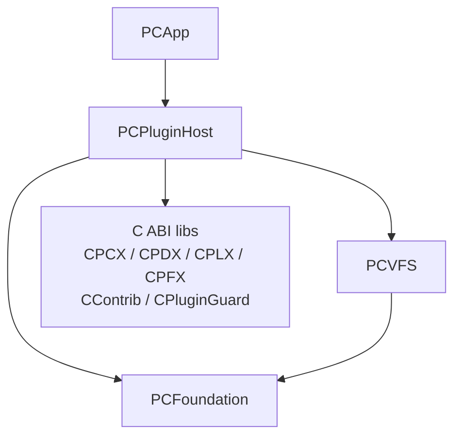
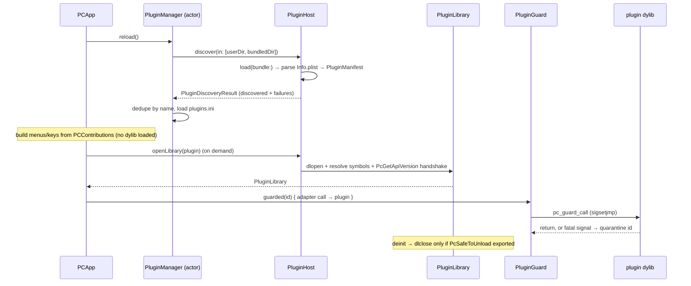

# PCPluginHost

`PCPluginHost` is the host-side runtime for Peach Commander's in-process plugin system. It discovers plugin bundles, validates their manifests, loads their dylibs with `dlopen`/`dlsym`, wraps every fatal-signal-prone C call in a crash guard, and adapts each of the five plugin ABIs to the host's Swift protocols (`VirtualFileSystem`, `ContentFieldProvider`, viewer, packer, contribution UI).

This page is a **host-architecture overview**. The C ABI itself (the exact function prototypes plugin authors implement, in `Plugins/SDK/*.h`) is the subject of the separate plugin SDK reference.

## Purpose and responsibility

`PCPluginHost` owns the whole lifecycle of a plugin from "a directory on disk" to "a live Swift object the rest of the app can call":

1. **Discovery** — scan plugin directories for `*.pcxplugin`/`*.pfxplugin`/`*.plxplugin`/`*.pdxplugin`/`*.ptxplugin` bundles (`PluginHost.discover`).
2. **Validation** — parse and validate each bundle's `Contents/Info.plist` into a `PluginManifest`, confirm the dylib exists (`PluginManifestParser`, `PluginHost.load`).
3. **State & association** — track which plugins are enabled and which packer plugin handles which extension, persisted to `plugins.ini` (`PluginManager`, `PluginConfig`).
4. **Loading** — `dlopen` the dylib, resolve the symbol table for the plugin's type, run the optional API-version handshake (`PluginLibrary`).
5. **Isolation** — run each synchronous plugin call under an in-process fatal-signal guard with per-plugin quarantine (`PluginGuard`).
6. **Adaptation** — bridge the raw C entry points to host-native types (`PCXArchive`/`PCXArchiveFS`, `PDXPlugin`/`PDXContentProvider`, `PFXPlugin`/`PFXFileSystem`, `PLXLister`, `ContribPlugin`).
7. **Declarative UI** — parse a plugin's `PCContributions` (commands, menus, keybindings, views) and evaluate `when` visibility expressions **without ever loading the dylib** (`ContributionModel`, `WhenExpression`, `DetectString`).

The five plugin types derive from the Total Commander model (see `PluginType`):

| Native | TC analog | Purpose | Host adapter |
|--------|-----------|---------|--------------|
| `pcx`  | wcx | Packer / archive format | `PCXArchive`, `PCXArchiveFS` |
| `pfx`  | wfx | File-system (virtual drive) | `PFXPlugin`, `PFXFileSystem` |
| `plx`  | wlx | Lister / viewer | `PLXLister` |
| `pdx`  | wdx | Content field / detector | `PDXPlugin`, `PDXContentProvider` |
| `ptx`  | — (Peach extension) | Tool / action plugin | `ContribPlugin` |

`PluginType.fromTCType(_:)` accepts both the native names and the TC descriptor names (`wcx`/`wfx`/`wlx`/`wdx`), so TC `pluginst.inf` install descriptors map cleanly.

### Why in-process C dylibs (ADR-004)

Plugins are macOS bundles containing a dylib that exports flat C functions with TC-preserved names (`OpenArchive`, `ContentGetValue`, `ListLoad`, …). This was a deliberate decision (ADR-004): it enables near function-for-function porting of existing TC plugins and maximum speed — content plugins are called once per row per column. The tradeoff, also per ADR-004, is that a crashing plugin can in principle take down the app (as in TC); `PluginGuard` mitigates this for the common signal-crash case but is explicitly **not** a sandbox. Out-of-process/XPC hosting is deferred as post-1.0 hardening.

## Public interfaces and key types

### Discovery and manifests

- **`PluginHost`** (`PluginHost.swift`) — an enum namespace, the non-loading half of the host. `discover(in:)` walks directories and returns a `PluginDiscoveryResult` (validated `[DiscoveredPlugin]` plus per-bundle `failures`). `load(bundle:)` validates a single bundle. `bundleExtensions` is the recognized extension list. Missing directories are skipped silently; entries are sorted for deterministic order.
- **`DiscoveredPlugin`** — a `Sendable`, `Equatable` value: `bundlePath`, `manifest`, and the absolute `binaryPath` to `Contents/MacOS/<name>` (the dylib to `dlopen`).
- **`PluginManifest`** (`PluginManifest.swift`) — the validated manifest: `type`, `apiVersion`, `name`, default `extensions` (lowercased, dot-stripped), optional `detectString`, optional `minHostVersion`.
- **`PluginManifestParser`** — validates an `Info.plist` dict into a manifest. Reads keys `PCPluginType`, `PCPluginName`, `PCPluginAPIVersion`, `PCPluginExtensions` (array **or** `;`/`,`/whitespace-delimited string), `PCPluginDetectString`, `PCPluginMinHostVersion`. `currentAPIVersion = 1`.
- **`PluginLoadError`** / **`PluginManifestError`** — structured failure enums (`notABundle`, `missingInfoPlist`, `invalidType`, `unsupportedAPIVersion(Int, current:)`, `missingBinary(String)`, …). Failures are collected, never thrown, so one bad bundle can't hide the rest.
- **`PluginInstallInfo`** / **`PluginInstallInfoParser`** — parser for the TC `pluginst.inf` `[plugininstall]` install descriptor (`type`/`file`/`description`/`defaultdir`), used when installing a downloaded plugin `.zip` (F-235).

### Manager and configuration

- **`PluginManager`** (`PluginManager.swift`) — a Swift **`actor`**. Ties discovery to persisted state. Scans a user-writable `pluginsDir` first and an optional read-only `bundledPluginsDir` (the app's `Contents/PlugIns`) second, so a user-installed plugin overrides a bundled one of the same `manifest.name`. Exposes `reload()`, `enabledPlugins()`, `isEnabled`/`setEnabled`, `packerPlugin(forExtension:)`, `setAssociation(ext:plugin:)`, `install(bundleURL:)`, `installFromZip(zipURL:)` (shells out to `/usr/bin/unzip`, then `locatePluginBundle`), and `remove(name:)` (deletes a user bundle; only disables a bundled one, since the file can't be removed).
- **`PluginConfig`** (`PluginConfig.swift`) — the pure, IO-free, `Sendable` model of `plugins.ini`. Two sections: `[Plugins] Disabled=` (plugins are enabled by default; only disabled ones are listed) and `[PackerAssoc]` (lowercased extension → plugin name). Parses/serializes via `INIDocument` from `PCFoundation`, with deterministic key ordering.
- **`PluginInstallError`** — `.unzipFailed` / `.noPluginFound`.

### Dynamic loading

- **`PluginLibrary`** (`PluginLibrary.swift`) — a loaded dylib. `open(path:required:optional:expectedAPIVersion:)` calls `dlopen(path, RTLD_NOW | RTLD_LOCAL)`, resolves the required symbols (failing with `.missingRequiredSymbols` if any are absent), then the optional ones, then runs the version handshake via the optional `PcGetApiVersion` export (mismatch → `.apiVersionMismatch(found:expected:)`). `symbol(_:)` returns a raw pointer for `unsafeBitCast` to a `@convention(c)` function type. **`RTLD_LOCAL`** keeps plugin symbols from polluting the global namespace and colliding across plugins.
- **`PluginLibraryError`** — `.dlopenFailed(String)`, `.missingRequiredSymbols([String])`, `.apiVersionMismatch(found:expected:)`.
- Per-type symbol tables: `PCXSymbols`, `PDXSymbols`, `PLXSymbols`, `PFXSymbols`, `ContribSymbols` — each a `required`/`optional` name list. `PluginHost.openLibrary(_:)` picks the right table by `manifest.type`; `PluginHost.openContribLibrary(_:)` opens any plugin for the contribution behavior ABI regardless of its file-op type.

### Crash guard

- **`PluginGuard`** (`PluginGuard.swift`) — an `@unchecked Sendable` class (shared singleton `PluginGuard.shared`). `guarded(_ id:_ work:)` runs a synchronous closure under a fatal-signal guard implemented in the `CPluginGuard` C shim (`pc_guard_call`, a `sigsetjmp`-based trampoline catching `SIGSEGV`/`SIGBUS`/`SIGILL`/`SIGFPE`/`SIGTRAP`, the last covering every Swift runtime trap — overflow, index out of range, nil force-unwrap, `fatalError` — which is how a Swift plugin actually crashes. `SIGABRT` is deliberately excluded: on Darwin its usual caller is malloc's corruption detector, where recovering trades a clean crash for silent corruption). On a crash it returns `nil`, **quarantines** the plugin id (`quarantine`/`isQuarantined`/`quarantinedIDs`, guarded by an `NSLock`), logs via `PCFoundationLogger`, and skips all future calls to that id for the session (F-230).

### Type adapters

- **`PCXArchive`** (`PCXArchive.swift`) — drives a PCX packer via `pcx.h`/`CPCX`: `list`, `extract`, `pack`, `delete`, capability probes (`packerCaps`, `canPack`, `canDelete`, `canHandle`). Every public call is wrapped in a `guarded { … }` that throws `PCXError.crashed` if the plugin faults. Progress and change-volume callbacks (F-231) are routed through the process-wide `PCXCallbackRouter` because the C prototypes carry no user-context pointer (PCX calls are serialized, so a single "current handlers" pair suffices).
- **`PCXArchiveFS`** (`PCXArchiveFS.swift`) — a read-only `VirtualFileSystem` (scheme `"pcx"`) backed by a `PCXArchive`. Builds an in-memory tree from the flat entry list (synthesizing intermediate directories) so plugin archives browse like the built-in zip support; reads extract an entry to a temp file.
- **`PDXPlugin`** (`PDXPlugin.swift`) — drives a PDX content plugin via `pdx.h`/`CPDX`: `supportedFields()` (enumerates `ContentGetSupportedField` until `PC_FT_NOMOREFIELDS`, with a runaway backstop), `value(fileName:fieldIndex:…)`, optional `setValue` (F-234) and `compareFiles`. `PDXFieldKind` maps the `PC_FT_*` codes; `decode(type:buffer:)` interprets the plugin's out-buffer.
- **`PDXContentProvider`** — bridges a `PDXPlugin` into the PCVFS `ContentFieldProvider` registry so plugin fields become custom columns, search criteria, and multi-rename placeholders exactly like built-in providers.
- **`PFXPlugin`** / **`PFXFileSystem`** (`PFXFileSystem.swift`) — the WFX-style file-system ABI (`CPFX`). `PFXPlugin` is a facet-probing wrapper (`capabilities`, `isVolatile`, `volumes()`, `connect`, `contentFields()`, `lookup`). `PFXFileSystem` is a full async streaming `VirtualFileSystem`: directory enumeration maps to `PfxFindFirst`/`Next` (metadata only, streamed in batches of 128), `openRead` materializes the whole file via `PfxGetFile`, `openWrite` buffers to a temp file uploaded by `PfxPutFile` on close. It also publishes per-entry content columns (`PFXContentField`, qualified as `<qualifier>.<leaf>`, cached per listing) and drive-bar volumes (`PFXVolume`).
- **`PLXLister`** (`PLXLister.swift`) — a viewer/lister via `plx.h`/`CPLX`: `load`/`loadNext`/`close`, `searchText`, `send(_:to:)` viewer commands (`PLXCommand`), `printFile`, `previewBitmap` (window-less PNG thumbnail, 512 KiB ceiling). View handles are opaque `PLXHandle` (`UnsafeMutableRawPointer`, an `NSView*` on the app side); the adapter never touches AppKit itself, keeping it headlessly testable. `handles(_:)` dispatches via the shared `DetectString` engine.
- **`ContribPlugin`** (`ContribPlugin.swift`) — the contribution *behavior* ABI (`contrib.h`/`CContrib`): `runCommand(_:services:)`, `makeView`/`closeView`/`notifyView`, passing a host-provided `PcHostServices` table. Nothing is strictly required — a plugin may contribute only commands, only views, or both. This is the behavior side; *placement* is declarative (below).

### Declarative contributions (no dylib loaded)

- **`PluginContributions`** and its element types **`CommandContribution`**, **`MenuContribution`**, **`ContextMenuContribution`**, **`KeybindingContribution`**, **`ViewContribution`**, **`HideContribution`** (`ContributionModel.swift`) — the typed, `Sendable` model of what a plugin adds to the UI and where.
- **`ContributionParser`** — parses the `PCContributions` `Info.plist` dict. Tolerant: a malformed entry is skipped and recorded in `warnings` rather than failing the whole plugin. This runs at discovery from the plist alone, so a **disabled or removed plugin contributes nothing and no plugin code runs to decide menu presence** (SPEC-013).
- **`WhenExpression`** (`WhenExpression.swift`) — a small boolean expression language (`==`, `!=`, `=~`, `startswith`/`endswith`/`contains`, `<`/`>`/`<=`/`>=`, `in (…)`, `&&`/`||`/`!`) evaluated by the **host** against a `ContributionContext` snapshot (`WhenValue` map). Never evaluated by the plugin, so it works for disabled plugins and on every menu-open with no IPC. Fail-closed: a malformed expression evaluates to `false` (hides its item); an empty/absent `when` is `true`.
- **`DetectString`** (`DetectString.swift`) — a TC-compatible detect-string parser/evaluator (`EXT`, `SIZE`, `FORCE`, `MULTIMEDIA`, byte probes `[N]`, boolean `& | !`), evaluated against a pure `DetectContext` (extension, size, first ≤8192 bytes, multimedia flag). Decides whether a plugin claims a file (F-238). A malformed detect string never matches; `isValid(_:)` validates user-entered overrides.

## Dependencies

**Needs (points down):**

- **`PCFoundation`** — logging (`PCFoundationLogger`), `INIDocument` (config parse/serialize).
- **`PCVFS`** — the `VirtualFileSystem`, `VFSEntry`, `VFSPath`, `VFSCapabilities`, `ContentFieldProvider`, `ContentValue`, `ContentField` types the adapters conform to and produce.
- **C static libs** (per `project.yml`) — `CPCX`, `CPDX`, `CPLX`, `CPFX`, `CContrib` (the five ABI header modules) and `CPluginGuard` (the `sigsetjmp` crash-guard shim, linked via `-lCPluginGuard`). `SWIFT_INCLUDE_PATHS` points at each `include/` dir. The module is built with `CODE_SIGNING_ALLOWED: NO`.

**Depended on by:** `PCApp` only. `PCApp` owns everything AppKit — it turns `PLXHandle`/view raw pointers into real `NSView`s, drives `PluginManager` from the settings UI, builds menus/keybindings from `PluginContributions`, and manages plugin lifetimes. No other module depends on `PCPluginHost`.

## Inputs and outputs

- **Inputs:** plugin bundle directories (user + bundled); each bundle's `Contents/Info.plist` (`PCPlugin*` keys, `PCContributions`); the plugin dylib and its C exports; a `plugins.ini` config file; downloaded plugin `.zip` archives with an optional `pluginst.inf`.
- **Outputs:** `DiscoveredPlugin`/`PluginManifest` values; `PluginContributions` for the UI builder; live adapter objects (`PCXArchiveFS`, `PFXFileSystem`, `PDXContentProvider`, `PLXLister`, `ContribPlugin`); a rewritten `plugins.ini` on enable/disable/associate; log entries for load failures and crash quarantines.

## Lifecycle

Key points:

- **Discovery/validation is eager and cheap; loading is lazy.** The dylib is opened only when a plugin's function is actually needed (e.g. a `.pak` is opened, or a `ptx` command runs).
- **Unload policy:** `PluginLibrary` calls `dlclose` on `deinit` **only if** the plugin exports `PcSafeToUnload`. Otherwise the library stays resident — pragmatic parity with TC, avoiding unload-time crashes in plugins that register non-removable callbacks.
- **Quarantine is session-scoped.** A crashed plugin id stays quarantined until the app restarts.

## Threading and concurrency

- **`PluginManager` is an `actor`** — all discovery/config mutation is serialized on its executor.
- **`PluginConfig`, `PluginManifest`, `DiscoveredPlugin`, and the contribution/expression models are pure `Sendable` value types** — no IO, no shared state.
- **`PFXFileSystem` runs every blocking C call on one dedicated serial `DispatchQueue`** (`pcx.pfx.<fsID>`), off the Swift concurrency cooperative pool, giving the per-connection serialization the WFX ABI assumes. `list(_:)` yields batches from an `AsyncThrowingStream` and honors early termination via a thread-safe `CancelFlag` so navigating away aborts a slow/remote enumeration instead of draining it.
- **The connection handle is lock-guarded and taken, not read** (`connLock` / `withConnection` / `takeConnection`). `PFXFileSystem` conforms to `DisconnectableFileSystem`, so `PfxDisconnect` is an explicit, awaited act — the drive chip's Disconnect, `cm_FtpDisconnect`, walking up out of the mount, or `applicationShouldTerminate` — rather than a side effect of `deinit`. Three properties follow, and `pfx.h` promises all three to plugin authors: it is called **exactly once** (whoever takes the handle calls it; `deinit` then finds nil, so there is no double free), **never concurrently with another call on that connection** (`withConnection` holds the lock across the C call — including content-column reads, which come straight off the main thread and previously did not honour the ABI's serialization), and **never before an open find handle is closed** (the whole enumeration runs inside one `withConnection`; `closing` is what stops it early so a disconnect is not held up by a slow remote directory). Calls after a disconnect throw `VFSError.connectionLost(retryable: false)` instead of reaching freed memory.
- **`PCXArchive` calls are serialized**, which is why its progress/change-volume callbacks can safely route through the single process-wide `PCXCallbackRouter` (the C prototypes carry no context pointer).
- **`PluginGuard` is thread-safe** (`NSLock`-guarded quarantine set) but runs `work` synchronously on the calling thread; `pc_guard_call` invokes the closure inline, so it never truly escapes.
- The `@unchecked Sendable` adapters (`PDXPlugin`, `PLXLister`, `PFXPlugin`, `PFXFileSystem`) opt out of automatic checking because they hold raw C handles; their safety rests on the serialization described above.

## Error handling

- **Discovery never throws.** `PluginHost.discover` returns validated plugins and a `failures` list of `(bundlePath, PluginLoadError)`; the UI surfaces these. Contribution parsing collects `warnings` instead of failing.
- **Loading returns `Result`.** `PluginLibrary.open` yields `.failure(PluginLibraryError)` for `dlopen` failure, missing required symbols, or a version mismatch.
- **Adapter calls throw typed errors** (`PCXError`, `PDXError`) or return `nil`/`false` for absent optional exports (capability-by-symbol-presence).
- **`PFXFileSystem` maps `PC_E_*` return codes to `VFSError`** (`.notFound`, `.permissionDenied`, `.unsupported`, `.cancelled`, `.underlying`).
- **Fatal signals are caught, not propagated.** A crash inside a guarded call becomes `PCXError.crashed` (or a `nil` from `PluginGuard.guarded`), the plugin is quarantined, and the app keeps running. This is best-effort, not isolation: recovering from memory corruption can leave host state inconsistent, which is precisely why the offending plugin is treated as untrusted for the rest of the session (see the `PluginGuard.swift` header note).

## Testing

`PCPluginHostTests` (per `project.yml`; depends on `PCFoundation`, `PCVFS`, `PCPluginHost`) covers the module extensively — the pure logic directly and the ABI adapters against tiny purpose-built C plugins compiled at test time:

- **Pure/model:** `PluginManifestTests`, `PluginConfigTests`, `ContributionModelTests`, `DetectStringTests`, `PluginHostTests`, `PluginInstallZipTests`.
- **Loading & guard:** `PluginLibraryTests`; `PluginGuardTests` compiles a dylib exporting a `raise(SIGSEGV)` function and asserts the guard catches the crash, returns `nil`, and quarantines the plugin while letting a well-behaved call through — without taking down the test process.
- **Adapters against sample plugins:** `PCXArchiveTests`, `PCXArchiveFSTests`, `SamplePackerTests`, `SampleListerTests`, `SampleCSVListerTests`, `SampleContentPluginTests`, `PFXFileSystemTests`, `TaskManagerPluginTests`.

Because `PLXLister` and the adapters keep AppKit and the filesystem out (view handles are opaque raw pointers), the call choreography is unit-testable headlessly with fake plugins; the app layer owns the `NSView` bridging that can't be tested here.

## Extension points

- **A new plugin type** would add a `PluginType` case, a symbol table, an `openLibrary` branch, and an adapter — mirroring the existing five.
- **New declarative UI surfaces** extend `PluginContributions` + `ContributionParser` (and the app's UI builder); the `when`/detect languages are already reusable.
- **Adapters plug into existing host protocols**, so new file-system, content, or viewer plugins need no host changes beyond the adapter — `PFXFileSystem` conforms to `VirtualFileSystem` and `PDXContentProvider` to `ContentFieldProvider`, and the rest of the app consumes them uniformly.
- **Plugin authors** implement the flat C exports in `Plugins/SDK/*.h`; see the plugin SDK reference for the full ABI.

## Open questions / notes

- **Out-of-process isolation** (XPC) is explicitly deferred (ADR-004). Until then, `PluginGuard` is the only crash containment, and it does not protect against non-signal corruption.
- **`minHostVersion`** is parsed into the manifest but the host does not yet appear to enforce it during load — enforcement is a candidate follow-up.
- **`PFXSymbols.required` is empty** and PFX facets are entirely capability-probed, so a PFX bundle with no usable exports loads "successfully" and simply offers nothing; validation there is looser than for `pcx`/`pdx`/`plx`.
