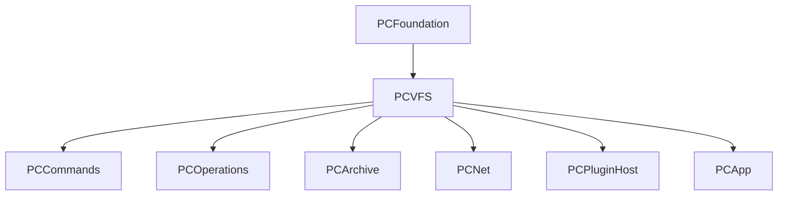

# PCVFS

`PCVFS` is the virtual-file-system layer of Peach Commander. It defines the
`VirtualFileSystem` protocol that every panel data source implements — local
disks, archives, network servers, plugin file systems, and synthetic panels
such as search results — and ships the reference local-disk implementation
(`LocalFS`) plus the directory model, navigation, volume, watching, sizing and
content-column machinery that the app and higher layers build on.

The VFS is the load-bearing abstraction of the whole product (SPEC-006): a
panel's location is always a `VFSPath = (filesystemId, path)`, and every file
operation is expressed as VFS→VFS so that, e.g., copying out of a ZIP onto SFTP
is just stream composition (see the PCOperations module).

## Purpose and responsibility

- Define the `VirtualFileSystem` contract and its value types (`VFSPath`,
  `VFSEntry`, `VFSCapabilities`, `VFSError`, read/write stream protocols).
- Provide `LocalFS`, the single place in the codebase that touches the local
  file system directly (it is intentionally self-contained so that lower-level
  FS access is not scattered across modules).
- Hold and transform directory listings (`DirectoryModel` → immutable
  `DirectorySnapshot`), with sorting, filtering and directory watching.
- Manage cross-filesystem navigation (`VFSNavigator`) and scheme resolution
  (`VFSRegistry`).
- Enumerate volumes (`VolumeManager`, `Volume`, cloud providers) and compute
  directory sizes/statistics.
- Support the built-in viewer and search with random-access file reads
  (`FileSlice`), line/hex/encoding utilities, and a generic content-field
  (extra-column) provider system.

## Dependencies



- **Depends on:** `PCFoundation` only (logging via `PCFoundationLogger`, byte
  formatting via `ByteSize`, `WildcardMask`, `PathUtils`, `naturalCompare`).
  There is **no AppKit dependency** — `PCVFS` is pure Foundation/Darwin so it is
  testable headless and reusable from any layer.
- **Depended on by:** `PCCommands`, `PCOperations`, `PCArchive`, `PCNet`,
  `PCPluginHost`, and `PCApp`. Archive and network file systems implement the
  same `VirtualFileSystem` protocol defined here (ADR-011: FTP/SFTP are PFX
  plugins in PCNet that conform to this protocol, not core code).

## Public interfaces and key types

### The protocol

`VirtualFileSystem` (in `PCVFS.swift`) is `AnyObject, Sendable`:

```swift
protocol VirtualFileSystem: AnyObject, Sendable {
    var scheme: String { get }                // "file", "archive", "ftp", "results", …
    var capabilities: VFSCapabilities { get }

    func list(_ dir: VFSPath) -> AsyncThrowingStream<VFSEntryBatch, Error>
    func stat(_ path: VFSPath) async throws -> VFSEntry
    func openRead(_ path: VFSPath) async throws -> VFSReadStream
    func openWrite(_ path: VFSPath, options: WriteOptions) async throws -> VFSWriteStream
    func mkdir(_ path: VFSPath) async throws
    func delete(_ path: VFSPath) async throws
    func rename(_ from: VFSPath, to: VFSPath) async throws
    func setAttributes(_ path: VFSPath, attributes: VFSAttributes) async throws
    func watch(_ dir: VFSPath) -> AsyncStream<VFSChangeEvent>?
    func localFileIfAvailable(_ path: VFSPath) async throws -> URL?
}
```

`DisconnectableFileSystem` is a companion protocol implemented only by
connection-backed file systems (FTP/SFTP): its `disconnect() async` is called
when a panel leaves the mount so control connections, keep-alive tasks and SSH
sessions are not leaked. `LocalFS` and archive file systems do not conform.

### Value types (`PCVFS.swift`)

| Type | Description |
| --- | --- |
| `VFSPath` | `(filesystemId, path)` pair. `Hashable`. Helpers: `parent()`, `lastComponent()`, `joining(_:)`. |
| `VFSEntry` | One listing row: `name` (NFC-normalized), `ext`, `kind`, `size` (`-1` = unknown), `modified`/`created`, `posixMode`, `bsdFlags`, `isHidden`, `linkTarget`, and a lazy `extra: ContentFieldsRef` (`[String:String]`) for plugin columns. |
| `VFSEntry.Kind` | `directory`, `file`, `symlinkDir`, `symlinkFile`, `appBundle`, `package`. |
| `VFSEntryBatch` | `entries: [VFSEntry]` + `isLastBatch: Bool`; the streaming unit of `list`. |
| `VFSCapabilities` | `OptionSet`: `read`, `write`, `rename`, `watch`, `execute`, `seekableStreams`. |
| `WriteOptions` | `create`/`truncate`/`append` flags for `openWrite`. |
| `VFSAttributes` | Optional `posixMode`, `modified`, `bsdFlags` (chflags, F-094), `ownerName`, `groupName`; a `nil` field is left unchanged. |
| `VFSChangeEvent` | `path` + `type` (`added`/`modified`/`removed`) for `watch`. |
| `VFSReadStream` / `VFSWriteStream` | `AsyncSequence`-based read stream and chunked write stream protocols. |

`VFSEntry.attrColumnString` computes the panel "Attr" column (type char +
`rwxrwxrwx` + a BSD-flags suffix `u/s/h/a` for immutable/hidden/append flags,
F-038).

### Errors (`VFSError.swift`)

`VFSError` is a `Sendable, Equatable` enum: `notFound`, `permissionDenied(needsElevation:)`,
`exists`, `noSpace`, `connectionLost(retryable:)`, `cancelled`, `unsupported`,
`underlying(code:message:)`. `VFSError.fromErrno(_:path:)` maps POSIX `errno`
(`ENOENT`, `EACCES`/`EPERM`, `EEXIST`, `ENOSPC`, …) into these cases — the
single conversion point used across the module.

### Local file system

- **`LocalFS`** (`LocalFS.swift`) — `scheme = "file"`, all capabilities. Uses
  low-level Darwin calls: `open`/`read`/`write` fds via `LocalReadStream` (1 MB
  chunks, seekable) and `LocalWriteStream`; `FileManager.contentsOfDirectory`
  yielding batches of up to 4096 entries; `lstat`-based entry construction in
  the private `LocalStat` enum. `LocalStat` also detects macOS Finder **aliases**
  (F-036) via a cheap `getattrlist` `kIsAlias` check, resolving the target only
  for files that actually are aliases, and `.app` bundles by suffix.
  `setAttributes` clears BSD flags before applying mode/owner/date and re-applies
  flags last so immutable files can be modified.
- **`LocalDirectoryLister`** (`PCVFS.swift`) — an older `actor`-based lister
  retained for tests and non-streaming callers; `DirectoryModel.load(_:fs:)` is
  the current path.

> **Note (open item):** `LocalStat` currently uses `lstat`/`FileManager`
> per-entry, not the batched `getattrlistbulk(2)` enumerator specified in
> ADR-009. The fast enumerator remains a performance TODO (see the inline
> comment in `PCVFS.swift` and docs/architecture/performance.md).

### Directory model

- **`DirectoryModel`** (`actor`, `DirectoryModel.swift`) — holds the full
  `[VFSEntry]` and produces an immutable `DirectorySnapshot` (entries + path) for
  the main thread. Applies sorting and filtering in `createSnapshot()`.
  - `SortDescriptor` (`name`/`ext`/`size`/`date`, each with ascending flag) and
    `SortSpec` (`descriptor` + `dirsFirst`). Directories sort first when
    `dirsFirst` is set; ties fall back to natural name comparison.
  - `naturalSort` toggles numeric-aware ordering (F-026, via
    `PCFoundation.naturalCompare`).
  - `setFilter(_:)` accepts a Total-Commander wildcard mask (`*.c;*.h|*.bak`)
    wrapped in `PCFoundation.WildcardMask`.
  - `load(_:fs:)` drains the VFS `list` stream into the model; `reload(lister:)`
    re-reads. Auto-refresh (`startAutoRefresh`/`stopAutoRefresh`) drives a
    `DirectoryWatcher`.

### Navigation and registry

- **`VFSNavigator`** (`VFSNavigator.swift`) — a per-panel/tab stack of
  `(filesystem, path)` frames. `push(fs:at:path:)` enters a nested filesystem
  (e.g. opening an archive) recording the host display base; `pop()` leaves it
  and returns the mount point to reselect; `go(to:)` moves within the current
  frame; `displayPath()` composes the whole stack (`/Users/x/a.zip/dir/file`).
  Not thread-safe by itself; owned by its panel.
- **`VFSRegistry`** (`VFSRegistry.swift`) — a lock-guarded `scheme →
  VirtualFileSystem` map (`@unchecked Sendable`). `register`, `filesystem(scheme:)`,
  `schemes`. `VFSRegistry.shared` is a process-wide instance pre-registered with
  a `LocalFS`; tests should prefer a fresh `VFSRegistry()`.

### Volumes and cloud

- **`Volume`** — a mounted-volume value type (id, name, path, removable/ejectable
  flags, capacity/free space, `fsType`, plugin-supplied `icon`/`sortOrder`), with
  formatting helpers.
- **`VolumeManager`** (`actor`) — enumerates real mounted volumes via
  `FileManager.mountedVolumeURLs` (boot disk, externals, mounted DMGs; skips
  non-browsable pseudo-volumes), `getVolume(for:)`, cloud providers
  (`getCloudVolumes`, `getVolumesIncludingCloud`), and `eject`/`mount` via
  `diskutil`. `fsType` is read from the free `volumeLocalizedFormatDescription`
  resource value (no per-refresh `diskutil` fork).
- **`CloudProvider` / `CloudProviderRegistry`** — iCloud Drive and similar,
  surfaced as `Volume`s for the drive bar.
- **`DriveBarModel`** — pure ordering/index helpers for the drive-bar UI.

### Watching

- **`DirectoryWatcher`** (`actor`, `FSEventsWatcher.swift`) — monitors a single
  directory. **It currently POLLS the directory's mtime every ~2 seconds**; it is
  not a true FSEvents watcher. `FSChangeEvent`/`FSChangeType` are defined here.
  `LocalFS.watch(_:)` returns `nil` — real FSEvents/change-event delivery is a
  placeholder wired later during the panel migration.

> **Open question:** the watcher only tracks the top directory's mtime and logs
> changes; it does not yet emit `VFSChangeEvent`s or diff entries. True
> FSEvents-backed, coalesced watching (≤ ~10 Hz) is planned but not implemented.

### Synthetic file systems

- **`ResultsFS`** (`ResultsFS.swift`) — a flat, read-only `VirtualFileSystem`
  (`scheme = "results"`) over a fixed list of real absolute paths (the "Feed to
  Listbox" search-results target). Entry `name`s are the real absolute paths so
  they double as unique keys; all mutating operations throw `VFSError.unsupported`.

### Sizing and statistics

- **`DirectorySizeCalculator`** (`actor`) — cancellable recursive byte-size of a
  tree using a manual stack (never follows symlinks), with per-path caching keyed
  on the directory's mtime. `sizes(of:maxConcurrency:)` fans out with bounded
  concurrency (default 4). Cancellation returns the partial sum; partial results
  are never cached.
- **`DirectoryStatistics` / `DirectoryStats`** and **`OccupiedSpaceCalculator` /
  `OccupiedSpace`** — file/folder counts and total bytes for a directory or a
  selection.

### Viewer, search and content columns

These support the built-in file viewer (I07) and search (SPEC-012):

- **`FileSlice`** — read-only `mmap` view of a local file for random access
  without loading it fully; `bytes(at:length:)`, `data(at:length:)`,
  `withUnsafeBytes`. Reference type owning an fd + mapping released in `deinit`;
  **not `Sendable` — main-thread viewer use only.**
- **`LineIndexer`**, **`HexFormatter`**/`HexAddress`, **`BinaryHeuristic`**,
  **`BinaryDiff`**, **`EncodingDetector`**/`TextEncodingChoice`,
  **`ImageInfoProvider`** — viewer building blocks.
- **`FileSearchEngine`** (`actor`), **`ChunkSearcher`**, **`SearchTemplate`**/
  `SearchTemplateStore` — content/name search (mmap + parallel chunk scan).
- **Content fields** (`ContentField.swift`): `ContentValue`, `ContentField`,
  the `ContentFieldProvider` protocol, `ContentFieldRegistry` (resolves
  `"provider.field"` qualified ids), and `ContentFieldPredicate` for search.
  Built-in providers: `ImageInfoContentProvider` (namespace `fileinfo`) and
  `BuiltinContentProvider` (namespace `builtin`). This is the internal analogue
  of a WDX/PDX content plugin (see the PCPluginHost module for the plugin side).
- **`LinkMaker`** / `LinkKind`, **`SpecialDirectories`**, **`FileProperties`** /
  `FilePropertiesReader` — link creation, standard-folder discovery, and the
  file-properties sheet backing model.

## Inputs and outputs

- **Inputs:** `VFSPath`s and byte streams (`Data`) from callers; the local file
  system and mounted volumes; wildcard/sort/filter specs from the UI and config.
- **Outputs:** `AsyncThrowingStream<VFSEntryBatch>` listings, immutable
  `DirectorySnapshot`s, `VFSReadStream`/`VFSWriteStream`, `VFSEntry`/`Volume`/
  `DirectoryStats` value types, and typed `VFSError`s. All output value types are
  `Sendable`, so they cross actor/thread boundaries safely.

## Lifecycle

- `VirtualFileSystem` instances are long-lived and registered in a `VFSRegistry`.
  Connection-backed ones implement `DisconnectableFileSystem` and are torn down
  when the panel leaves their mount.
- A panel owns one `VFSNavigator`; pushing/popping frames tracks entry into and
  exit from nested file systems.
- A `DirectoryModel` is created per panel, loaded via `load(_:fs:)`, and produces
  fresh snapshots on each sort/filter/reload. `DirectoryWatcher` starts/stops
  with auto-refresh.
- `FileSlice` maps at `init?` and unmaps at `deinit`; read/write streams must be
  `close()`d (streams also close their fd in `deinit` as a backstop).

## Threading and concurrency

Consistent with ADR-008 (Swift Concurrency, no GCD in new code):

- Mutable state lives in **actors**: `DirectoryModel`, `LocalDirectoryLister`,
  `VolumeManager`, `DirectoryWatcher`, `DirectorySizeCalculator`,
  `DirectoryStatistics`, `OccupiedSpaceCalculator`, `FileSearchEngine`.
- Listing is a **streamed `AsyncThrowingStream`** so huge directories render
  progressively (`VFSEntryBatch` ≈ 4096 entries).
- Immutable `DirectorySnapshot`s are handed to the main thread; the table never
  touches the live model, which eliminates data races on listing state.
- `VFSRegistry`, `ContentFieldRegistry`, and the stream classes are
  `@unchecked Sendable` — lock-guarded or fd-owning types that manage their own
  safety. `FileSlice` is the deliberate exception (main-thread only).

## Error handling

- All FS access funnels POSIX errors through `VFSError.fromErrno`, giving callers
  a small, `Equatable`, typed error surface instead of raw `errno`/`NSError`.
- Read-only file systems (`ResultsFS`) throw `VFSError.unsupported` from
  mutating methods; `LocalFS.watch` returns `nil` to signal "no watch support"
  rather than throwing.
- `DirectorySizeCalculator` treats cancellation as a first-class, non-error
  outcome (returns partial, does not cache).

## How it is tested

`PCVFS` has the module's largest test suite (`Tests/PCVFSTests`, ~30 files),
including:

- **`VFSConformanceTests.runVFSConformance(_:root:test:)`** — a reusable protocol
  conformance **battery** (SPEC-006 §6) that exercises the whole
  `VirtualFileSystem` contract end-to-end (batched listing incl. dotfiles, stat,
  nested mkdir, chunked write/read round-trips, rename, delete, unicode names,
  missing-path errors, capability flags). It is deliberately non-`private` and
  makes no `LocalFS`-specific assumptions so archive/FTP/plugin file systems
  reuse it verbatim.
- Focused suites: `ResultsFSTests`, `VFSNavigatorTests`, `DriveBarModelTests`,
  `DirectorySizeCalculatorTests`, `DirectoryStatisticsTests`,
  `OccupiedSpaceCalculatorTests`, `FileSearchEngineTests`,
  `SearchMmapParallelTests`, `ContentField(Predicate)Tests`, `HexFormatterTests`,
  `LineIndexerStreamTests`, `BinaryDiff/HeuristicTests`, `ImageInfoProviderTests`,
  `AliasDetectionTests`, and more.
- Performance fixtures are generated by `Tools/make-fixtures.sh`
  (`Tests/PCVFSTests` also carries perf tests).

## Extension points

- **New backing store:** implement `VirtualFileSystem` (and
  `DisconnectableFileSystem` if connection-backed), advertise the right
  `VFSCapabilities`, register it in a `VFSRegistry` under a scheme, and run the
  conformance battery against it. This is exactly how archive (PCArchive) and
  network (PCNet, ADR-011) file systems plug in.
- **New content column:** implement `ContentFieldProvider` and register it with a
  `ContentFieldRegistry`; fields become available to custom columns, search
  (`ContentFieldPredicate`) and multi-rename. PDX plugins hook the same way via
  the plugin host.
- **Capabilities as feature gates:** the operation engine reads `capabilities`
  (e.g. `seekableStreams`, same-FS `rename`) to choose fast paths, so accurate
  capability flags on a new FS immediately enable/disable optimizations without
  changing callers.

## Related design decisions

- **ADR-008** — Swift Concurrency for engine/model code; PCVFS uses actors +
  `AsyncStream`, no GCD.
- **ADR-009** — `getattrlistbulk`-based enumerator for fast listing (target;
  current `LocalStat` is a simpler `lstat` implementation — see open item above).
- **ADR-011** — FTP/SFTP as PFX file-system plugins conforming to this module's
  protocol, not core code.

See also `docs/architecture/architecture.md` (VFS as the load-bearing
abstraction) and `docs/architecture/performance.md` (listing/enumerator
performance).
