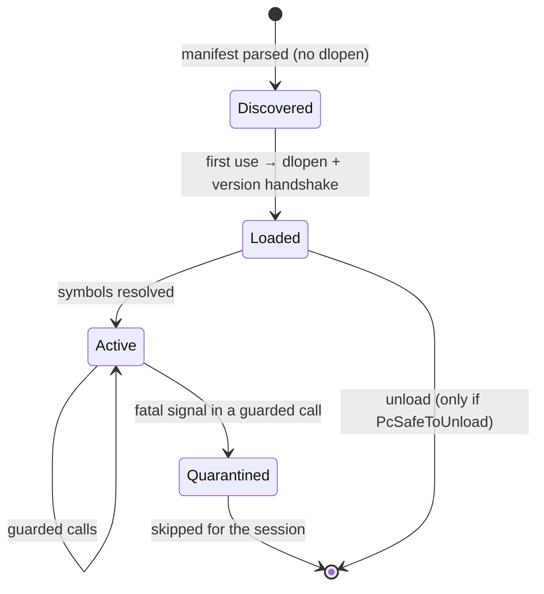

This guide explains how Peach Commander loads and talks to plugins, and every
extension point you can hook. For the exact symbols, see the
[API reference](api-overview.md); for step-by-step builds, the
[tutorials](plugin-tutorials.md).

## How plugins are loaded

Plugins are native macOS bundles loaded **in-process** with `dlopen`. There is no
out-of-process host; isolation is provided by a fatal-signal crash guard (below),
not a sandbox. The host (`PCPluginHost`) scans two locations — a user-writable
plugins folder and the app's bundled `Contents/PlugIns` — and the user copy wins on
a name collision.

Loading is two-phase:

1. **Discovery & manifest** — the host reads each bundle's `Contents/Info.plist`
   and parses the manifest **without loading the binary**, so disabled or removed
   plugins contribute nothing and no plugin code runs to decide menu placement.
2. **Bind & handshake** — when the plugin is actually used, the host `dlopen`s it
   (`RTLD_NOW | RTLD_LOCAL`), resolves the required symbols for its type, and runs
   the version handshake: if `PcGetApiVersion` disagrees with the host, the load
   fails with an API-version mismatch.

The library is `dlclose`d on release **only if** the plugin exports
`PcSafeToUnload` and returns true; otherwise it stays resident (avoids unload
crashes in libraries that register callbacks) — the same pragmatism as TC.

### Bundle layout

```
MyPlugin.<type>plugin/
  Contents/
    Info.plist            # manifest (see below)
    MacOS/MyPlugin        # the dylib; base name == bundle name without extension
    Resources/            # optional: <lang>.lproj localization, assets
```

## Manifest keys (`Info.plist`)

| Key | Required | Meaning |
|-----|----------|---------|
| `PCPluginType` | yes | `pcx` / `pfx` / `plx` / `pdx` / `ptx` (TC `wcx/wfx/wlx/wdx` are accepted and mapped) |
| `PCPluginName` | yes | display name |
| `PCPluginAPIVersion` | yes | must match the host (`1`) |
| `PCPluginExtensions` | no | default file-extension associations (list or `;`-separated) |
| `PCPluginDetectString` | no | a [detect string](#detect-strings) for claim dispatch |
| `PCPluginMinHostVersion` | no | minimum host version |
| `PCContributions` | no | declarative commands / menus / views (below) |

A TC-style `pluginst.inf` (`[plugininstall]` with `type` / `file` / `description` /
`defaultdir`) is honored when installing from a `.zip`.

## Lifecycle & crash guard

Plugin calls run inside `PluginGuard`, a per-thread `sigsetjmp`/`siglongjmp` guard
that catches `SIGSEGV/SIGBUS/SIGILL/SIGFPE`. If a plugin crashes inside a guarded
call, the call returns an error and the plugin is **quarantined** for the rest of
the session (not called again). Outside guarded calls the original handlers are
restored, so ordinary crashes still reach the crash reporter. This is a safety net,
**not a security boundary** — only load plugins you trust.



## Extension points

| To add… | Use |
|---------|-----|
| an archive format | **PCX** — `OpenArchive`/`ReadHeaderEx`/`ProcessFile`/`CloseArchive` (+ optional `PackFiles`/`DeleteFiles`); mounted as a read-only VFS |
| a remote/virtual file system | **PFX** — static volumes and/or a connect facet with `PfxFindFirst`/`Next`/`Stat`/`GetFile`/`PutFile`/… |
| a viewer for a file type | **PLX** — `ListLoad` returns an `NSView*`; optional search/print/preview-thumbnail |
| custom columns / search fields | **PDX** — `ContentGetSupportedField`/`ContentGetValue`; bridged into panels, search, and multi-rename |
| a command, menu item, or view | **contributions** — declare it in `PCContributions`, implement behavior via `PcRunCommand` / `PcMakeView` |

## Declarative contributions

`PCContributions` lets any plugin add UI declaratively; the host places it and only
calls your behavior ABI (`contrib.h`) when the user triggers it.

- **commands** — `{ id, title, category?, needsLocalPath }`. `needsLocalPath` makes
  the host materialize the cursor's VFS path to a temp file before dispatch.
- **menus** / **contextMenus** — place a command in a menu path or on a surface
  (`panel.item`, `panel.background`, `tab`, `drivebar`), gated by a `when` expression.
- **keybindings** — bind a command to a key (`cmd+shift+u`), optionally `when`-gated.
- **views** — embed an `NSView` in a container (`sidebar`, `preview`, `bottombar`,
  `titlebar`); built lazily via `PcMakeView(viewId, containerId, services)`.
- **hides** — hide a built-in or other command, `when`-gated.

### `when` expressions

Evaluated by the **host** against a context snapshot (so they work for unloaded
plugins, on every menu-open, with no IPC). Grammar: `|| && !`, comparisons
(`== != =~ startswith endswith contains > < >= <=`), `in (list)`, parens.
Malformed ⇒ false; empty ⇒ true. Context keys include `cursorPath`, `cursorName`,
`cursorExt`, `cursorIsApp`, `hasSelection`, `selectionCount`, `dir`, `panelScheme`.

### Detect strings

For PCX/PLX claim dispatch (TC-compatible): a boolean expression over `EXT`,
`SIZE`, `FORCE`, `MULTIMEDIA`, and `[N]` byte probes, e.g. `EXT="CSV" | EXT="TSV"`.
Malformed strings never match.

## Talking to the host

Every callback table carries an opaque `host` token you pass back. The unified
`PcHostServices` (contrib) is a superset that also covers the file-system and
packer service tables. Highlights:

- **Cursor & selection** — `cursorPath`, `localCursorPath` (VFS→temp),
  `selectionCount`, `selectionPath`.
- **Mutations** (routed through the host op engine) — `moveToTrash`,
  `deletePermanently`, `reloadActivePanel`.
- **Navigation & UI** — `openPath`, `openPathInPanel(side, path)`, `presentInfo`,
  `getContext(key)`, `invokeCommand(id)`, `presentSidebarView`/`dismissSidebarView`,
  `registerToolWindow(window, editMenu, contentMenu, title)`.
- **Credentials** — `crypt(mode, store, …)`, backed by the macOS Keychain.
- **Progress / multi-volume** — `PcProcessDataProc` / `PcChangeVolProc` (PCX),
  `PfxHostServices.progress` (PFX).

Virtual entries that can share a name (e.g. one file per process) encode identity
**in the name** (the host derives an entry's path from its name); the plugin parses
its identity back out. See the Task Manager plugin (PID-in-name).

## Configuration & localization

- **Config root** — a plugin runs in-process, so it reads the host's launch
  arguments: resolve your config directory as `-ConfigRoot <path>` →
  `PEACHCMD_CONFIG_ROOT` → `~/Library/Application Support/PeachCommander`, then a
  per-plugin subfolder. **Do not use `UserDefaults`** (it ignores `-ConfigRoot` and
  pollutes the real app domain). The C ABIs also pass a config dir to
  `*SetDefaultParams`.
- **Localization** — localize through your **own** bundle with the `L()` helper
  (`Plugins/SDK/PluginLoc.swift`); never `NSLocalizedString` (that resolves in the
  host bundle). Ship `en.lproj` plus translations; the English literal is the key.

## Managing plugins

Users enable/disable plugins, set per-extension associations, and install a plugin
from a `.zip` in **Configuration ▸ Plugins**. State persists in `plugins.ini`
(`[Plugins] Disabled=…`, `[PackerAssoc] ext=Name`). A bundled plugin can be
disabled but not deleted; a user-installed one can be removed.
